# Robust Species Delimitation Pipeline for the *Packera dubia* Complex
### Integrating Automated Morphometrics, Deep Learning, Ecological Niches, and Multi-Tiered Herbarium Misidentification Mitigation

[](https://doi.org/10.5281/zenodo.xxxxxx)
[](https://opensource.org/licenses/MIT)
[](https://www.python.org/downloads/)
[](https://www.r-project.org/)

---

## 🌿 Project Overview

This repository houses the end-to-end computational and statistical pipeline for the taxonomic revision and species delimitation of the ***Packera dubia* (Spreng.) Trock & Mabb. complex** (Asteraceae: Senecioneae) across Eastern and Central North America.

Developed as part of doctoral research at the **University of North Carolina at Chapel Hill** in collaboration with the **UNC Herbarium (NCU)**, this project couples automated high-throughput morphometrics, native-DPI deep vision segmentation (YOLOv8-seg + SAM 2), deterministic artifact gatekeeping, and ecological niche modeling with a formal **Six-Tiered Herbarium Misidentification Mitigation Architecture**.

- **Principal Investigator:** J. Brandon Fuller (PhD Candidate, Department of Biology, UNC-CH)
- **Faculty Advisor:** Dr. Alan S. Weakley (Director, NCU Herbarium; UNC Biology)
- **Standard Operating Procedure:** `UNC-BOT-SOP-2026-04-REV2`
- **Target Taxa:** *Packera dubia* (formerly *P. tomentosa* / *Senecio tomentosus*), *P. anonyma*, *P. plattensis*, *P. paupercula* (including var. *paupercula* and var. *savannarum*), and allied southeastern lineages.

---

## 🎯 The Herbarium Misidentification Challenge

In complex, hybridizing aster clades such as *Packera*, botanical audits reveal that **20% to 40% of digital herbarium occurrence records** in aggregators (GBIF, iDigBio, SEINet) suffer from misidentification, outdated nomenclature, or misapplied keys. In *P. dubia* and its allies, this rate is exacerbated by:

1. **Phenotypic Plasticity & Foliar Wear:** The diagnostic arachnoid foliar tomentum of *P. dubia* is easily abraded or shed late in the season, causing glabrescent specimens to be misidentified as *P. anonyma* or *P. paupercula*.
2. **Asynchronous Phenology:** Early-flowering vouchers often lack expanded basal leaves, whereas late-fruiting sheets have decayed rosettes, confounding single-character keys.
3. **Nomenclatural Synonymy Shifts:** Historical transfers from *Senecio tomentosus* Michx. $\rightarrow$ *Packera tomentosa* (Michx.) C. Jeffrey $\rightarrow$ *Packera dubia* (Spreng.) Trock & Mabb. leave legacy determinations un-updated.
4. **Label Noise Pollution:** Training supervised machine learning and discriminant models on raw aggregator labels injects noise that distorts canonical axes and obscures genuine evolutionary discontinuities.
5. **Non-Botanical Specimen Artifacts:** Mounting tape, institutional stamps, calibration color bars, and printed accession labels can trigger false-positive segmentation and corrupt contour morphometrics without deterministic layout safeguards.

---

## 🛡️ Six-Tiered Misidentification & Hierarchical Extraction Architecture

```mermaid
flowchart TD
    subgraph Phase1["Phase 1: Ingestion & Authority Stratification"]
        A["Raw Specimen Sheet Ingestion\n(GBIF / iDigBio / SEINet)"] --> B["Determiner Authority Stratification\n(🥇 Tier 1: Specialists | 🥈 Tier 2: Herbaria | 🥉 Tier 3: Unverified)"]
    end

    subgraph Phase2["Phase 2: Human-Guided Annotation & Dataset Engineering"]
        B --> C["Interactive SAM 2 Ground-Truth Annotation\n(Multi-Modal Prompts: Points, Exclusion, Boxes, Knife, Lasso)"]
        C --> D["Artifact-Robust Dataset Construction\n(7 Botanical Classes + 9% Hard-Negative Non-Botanical Sheets)"]
        D --> E["Native-DPI Patch Tiling\n(1024x1024 Overlapping Tiles + Dynamic Coordinate Reprojection)"]
    end

    subgraph Phase3["Phase 3: Deep Vision Training & Full-Sheet Inference"]
        E --> F["Fine-Tune YOLOv8m-seg Model\n(Disk-Cached PyTorch 2.0 Mixed Precision Training)"]
        F --> G["Full-Sheet Sliced Inference via SAHI\n(Gigapixel Sheet Organ Detection & Segmentation)"]
    end

    subgraph Phase4["Phase 4: Hierarchical Extraction & Artifact Gatekeeping"]
        G --> H["Stage 1: Pre-Emptive Layout Sterilization\n(Hard-Mask Labels, Rulers & Color Charts with 10px Padding)"]
        H --> I["Stage 2 & 3: EDT Peak Seeding & SAM 2 Disentanglement\n(Disentangle Overlapping Basal Rosettes & Petioles)"]
        I --> J["Stage 4: Deterministic Artifact Gatekeeper\n(Rectangularity < 0.86 | Solidity >= 0.72 | Spectral Saturation | Typography)"]
        J --> K["Stage 5: Botanical Topology Classifier\n(Skeleton Geometry: Petiole vs Cauline Stem vs Root)"]
        K --> L["4-Tier Silhouette Routing\n(Tier 1: Intact | Tier 2: Reflected | Tier 3: Open Curves | Tier 4: Dense Clumps)"]
    end

    subgraph Phase5["Phase 5: Label-Blind Morphometrics & Discriminant Analysis"]
        L --> M["Tier 2 Mitigation: Label-Blind Morphometrics\n(Momocs EFA + DINOv2 Embeddings + GMM mclust Clustering)"]
        M --> N["Tier 3 Mitigation: Passive Sample Projection\n(MorphoTools2 CDA: Verified Anchors Define Axes, Suspects Projected Passively)"]
    end

    subgraph Phase6["Phase 6: Multi-Modal Consensus, XAI & Expert Triage"]
        N --> O["Tier 4 Mitigation: Cross-Modal Consensus\n(Morphology + Phenological Harmonics + SoilGrids 250m & WorldClim)"]
        O --> P["Tier 5 Mitigation: Confident Learning & XAI\n(Cleanlab Joint Noise Matrix + Captum Grad-CAM Saliency)"]
        P --> Q["Tier 6 Mitigation: Digital Triage Queue\n(Interactive Specialist Re-Determination for Ambiguous Vouchers)"]
        Q --> R["Validated Species Delimitation & Taxonomic Revision"]
    end
```



### End-to-End Pipeline & Workflow Sequence:
1. **Specimen Ingestion & Authority Stratification (`01_voucher_harvester.py`):**
   Harvests high-resolution voucher imagery across aggregators (GBIF, iDigBio, SEINet), filters spatial uncertainty ($\le 5000\,\text{m}$), and stratifies determinations into Gold, Silver, and Bronze authority tiers.
2. **Human-Guided Ground-Truth Annotation with SAM 2 (`annotate_with_sam2.py`):**
   Specialist botanists generate pixel-precise ground-truth polygon annotations across the 7-class botanical schema using an interactive GUI equipped with multi-modal SAM 2 controls (positive/negative point prompts, bounding boxes, knife-cut segmentation, and freehand lasso contours).
3. **Artifact-Robust Dataset Construction (`build_artifact_robust_dataset.py`):**
   Pairs annotated botanical instances with hard-negative non-botanical background patches (~9% non-botanical tape, accession labels, color charts, scale bars) to eliminate false-positive background detections. Stratifies data into 70/15/15 train/val/test splits.
4. **Native-DPI Patch Tiling (`run_dpi_tiler.py`):**
   Tiles multi-megapixel herbarium scans into $1024 \times 1024$ native-DPI windows with 20% overlap, dynamic polygon clipping, and background paper sub-sampling.
5. **Deep Vision Model Training (`train_yolo.py`):**
   Fine-tunes `YOLOv8m-seg` on native-DPI tiles using PyTorch 2.0 mixed precision AMP and botanical organ class weighting.
6. **Full-Sheet Sliced Inference (`run_sahi_inference.py`):**
   Executes Sliced Aided Hyper Inference (SAHI) across full-resolution gigapixel sheets to detect and segment all candidate organs.
7. **Hierarchical Extraction, Disentanglement & Gatekeeping (`02_hierarchical_leaf_extractor.py`):**
   Sterilizes non-botanical artifacts with layout hard-masking, performs Euclidean Distance Transform (EDT) peak seeding for automated SAM 2 rosette disentanglement, evaluates geometric/spectral gatekeeper metrics, classifies linear organ topology, and routes silhouettes into 4 leaf quality tiers.
8. **Label-Blind Morphometrics & Multivariate Delimitation (`03_fourier_extractor.R` & `04_gmm_morphotools.R`):**
   Extracts Elliptic Fourier Analysis (EFA) harmonics via `Momocs`, models natural clusters with Gaussian Mixture Models (`mclust`), and runs Canonical Discriminant Analysis with passive sample projection (`MorphoTools2`).
9. **Multi-Modal Validation, Confident Learning & Expert Triage (`05_cleanlab_vision_xai.py` & `06_multimodal_spatial_rf.R`):**
   Validates models with DINOv2 self-supervised embeddings, `cleanlab` label noise estimation, `Captum` Grad-CAM saliency heatmaps, and spatial Random Forests incorporating SoilGrids 250m pedology and WorldClim climate layers to populate a digital triage queue for expert re-determination.

---

### The Six-Tiered Misidentification Mitigation Framework:
* **Tier 1 — Taxonomic Authority Stratification:**
  - **Tier 1 (Gold Standard / Anchor Vouchers):** Nomenclatural types or determinations signed by recognized *Packera* / Senecioneae specialists (T.M. Barkley, D.K. Trock, R.R. Kowal, A.S. Weakley, J.F. Bain, A.M. Mahoney, J.B. Fuller).
  - **Tier 2 (Silver Standard / Institutional Vouchers):** Vouchers curated at major herbaria (NCU, GA, US, NY, BRIT, MO, WIS) with complete reproductive/vegetative structures.
  - **Tier 3 (Bronze Standard / Candidate Vouchers):** Unverified general floristic collections. Withheld from initial training seeds.
* **Tier 2 — Label-Blind Unsupervised Phenotypic Discovery:**
  Elliptic Fourier Analysis (EFA) and DINOv2 vision embeddings are extracted without prior taxonomic labels. Gaussian Mixture Modeling (`mclust`) detects natural morphological clusters; label discordances against Tier 1 anchors are flagged automatically.
* **Tier 3 — Passive Sample Projection in Discriminant Analyses (`MorphoTools2`):**
  Unverified and discordant vouchers are designated as `passiveSamples` in `MorphoTools2::cda.calc()`. Canonical axes are computed strictly on verified Tier 1/2 anchors, preventing corrupted specimens from biasing covariance matrices.
* **Tier 4 — Multi-View Cross-Modal Consensus & Niche Sanity Verification:**
  Triangulates morphology, circular phenological harmonics ($\sin / \cos \text{DOY}$), and pedological niche profiles (SoilGrids 250m: pH, CEC, sand %) to catch ecological impossibilities.
* **Tier 5 — Confident Learning & Explainable AI (XAI):**
  Uses `cleanlab` to estimate the joint distribution matrix of noisy labels versus true latent classes, pruning label errors ($C_{\text{error}} > 0.85$). `Captum` Grad-CAM heatmaps confirm models focus on botanical traits (tomentum, margins) rather than mounting artifacts.
* **Tier 6 — Digital Triage Queue & Expert Re-Determination:**
  Discordant and high-entropy vouchers ($H(p) \ge 0.50$) are exported to an interactive triage dashboard for manual visual re-determination by project botanists.

---

### Deterministic Botanical Extraction & Artifact Gatekeeper Details:
* **7-Class Botanical Taxonomy:**
  Standardized 7-class organ ontology: `basal_leaf_blade` (0), `leaf_petiole` (1), `cauline_leaf` (2), `cauline_stem` (3), `root_rhizome` (4), `basal_rosette_clump` (5), `capitulum` (6).
* **Deterministic Layout Sterilization & Geometric Gatekeeper (`gatekeeper_engine.py` & `gatekeeper_metrics.py`):**
  - **Pre-Segmentation Hard-Masking:** Automatically zero-fills bounding boxes of accession labels, calibration color charts, and scale rulers to solid white (`RGB [255, 255, 255]`) with a 10-pixel padding boundary prior to segmentation.
  - **Post-Extraction Morphological Filter:** Discards rectangular tape ($\text{Rectangularity} > 0.86$), rejects 4-vertex orthogonal quadrilaterals with angles $\in [80^\circ, 100^\circ]$, and requires $\text{Solidity} \ge 0.72$ for intact single leaves.
  - **Spectral Saturation Reclassification:** Flags vibrant swatches ($S > 0.45$ on $>15\%$ of area) as `color_chart`.
  - **Laplacian Text Verification:** Detects high-frequency typographic glyphs and routes label patches to `data/cropped_patches/annotations/`.
* **Botanical Topology Classifier (`botanical_topology_classifier.py`):**
  Linear organ skeleton classifier evaluating tortuosity, endpoint connectivity, orientation, and sheet position to separate `leaf_petiole`, `cauline_stem`, and `root_rhizome`.
* **Rosette Disentanglement via EDT + SAM 2 (`02_hierarchical_leaf_extractor.py`):**
  Euclidean Distance Transform (EDT) local peak detection generates spatial coordinate prompts for Segment Anything 2 (SAM 2) or marker-controlled watershed segmentation.
* **Four-Tiered Precision Leaf Extraction Hierarchy:**
  - **Tier 1 (Direct Intact Leaf):** High-confidence, unbroken silhouettes ($\text{UCS} \ge 0.85, \text{Solidity} \ge 0.72$). Horizontally aligned (apex left, petiole right) for standard Fourier decomposition.
  - **Tier 2 (Hemi-Blade Bilateral Reflection):** Single undamaged half-blade reflected bilaterally across the midrib axis to reconstruct occluded leaves.
  - **Tier 3 (Open Margin Curves):** Traces continuous unoccluded margin coordinates $(x, y)$ and scalar caliper dimensions.
  - **Tier 4 (Dense-Rosette Patches):** Crops dense rosette clumps for DINOv2 self-supervised feature extraction.

---

## 📁 Repository Structure

```text
packera-dubia-morphometrics/
├── data/
│   ├── raw_vouchers/              # High-resolution specimen sheet imagery (.jpg)
│   ├── raw_annotations/           # Ground-truth human polygon annotations (.txt, .json)
│   ├── yolo_dataset/              # 7-class annotated dataset for YOLOv8-seg training
│   ├── tiled_dataset/             # 1024x1024 native-DPI cropped voucher patches
│   ├── cropped_patches/           # Extracted ROIs (basal leaves, rosettes, capitula)
│   │   ├── annotations/           # Routed text annotation slips and label patches
│   │   └── rosettes_dense/        # Tier 4 unsegmented dense rosette clumps
│   ├── masks/                     # Binarized leaf silhouettes
│   │   ├── tier1_intact/          # Tier 1 intact leaf silhouettes
│   │   ├── tier2_reflected/       # Tier 2 bilateral symmetry reflected masks
│   │   ├── tier3_open_curves/     # Tier 3 continuous margin curve CSVs
│   │   └── capitula/              # Involucre / flower head crops
│   ├── environmental/             # SoilGrids 250m and WorldClim 2.1 GeoTIFF rasters
│   └── tables/
│       ├── curated_vouchers.csv   # Cleaned Darwin Core metadata with Determiner Tiers
│       ├── leaf_extraction_qc.csv # Quality control log for hierarchical leaf extraction
│       ├── dataset_manifest.csv   # Specimen partition manifest
│       └── label_noise_audit.csv  # Cleanlab & discordance error logs
├── models/
│   ├── yolov8_leaf_best.pt        # Fine-tuned YOLOv8m-seg weights for organ segmentation
│   ├── checkpoints/               # Pretrained foundation weights (SAM 2 Hiera Large)
│   └── dinov2_backbone.pth        # Self-supervised vision transformer feature weights
├── scripts/
│   ├── core/                      # Modular library classes & mathematical algorithms (<500 SLOC)
│   │   ├── artifact_harvester.py  # Detects and extracts tape, labels, and rulers
│   │   ├── augmentation.py        # Occlusion copy-paste and background negative extraction
│   │   ├── botanical_annotations.py # 7-Class label parsing and format normalization
│   │   ├── botanical_topology_classifier.py # Linear organ skeleton classifier (petiole/stem/root)
│   │   ├── config.py              # Centralized ontology definitions, paths, and color maps
│   │   ├── data_structures.py     # Reusable dataclasses for telemetry and geometry
│   │   ├── dataset_builder.py     # 7-Class YOLO dataset builder & synthetic suite
│   │   ├── dataset_utils.py       # Data partitioning and QC overlay rendering
│   │   ├── gatekeeper_engine.py   # Deterministic layout mask and text routing algorithm
│   │   ├── gatekeeper_metrics.py  # Mathematical geometric, spectral, and texture metrics
│   │   ├── harvester.py           # GBIF/DwC pipeline download orchestrator
│   │   ├── harvester_utils.py     # Circular phenology and metadata parsing
│   │   ├── leaf_cv_utils.py       # Low-level OpenCV, EDT peak seeding, and SAM 2 prompting
│   │   ├── leaf_extraction.py     # 5-Stage precision extraction & 4-tier routing engine
│   │   ├── leaf_morphometrics.py  # Longitudinal midrib alignment and symmetry reflection
│   │   ├── leaf_spine_tracer.py   # Frangi vesselness filter & 3-point anatomical spine tracing
│   │   ├── logger.py              # Standardized multi-stream logging configuration
│   │   ├── sahi_inference.py      # Full-sheet SAHI sliced inference engine
│   │   ├── tiling_geometry.py     # Polygon coordinate reprojection and clipping
│   │   └── tiling_utils.py        # Sliding window patch tiling library classes
│   ├── data_prep/                 # Data harvesting and dataset creation CLI scripts
│   │   ├── 01_voucher_harvester.py
│   │   ├── annotate_with_sam2.py
│   │   └── build_artifact_robust_dataset.py
│   ├── vision/                    # Deep learning & vision execution entrypoints
│   │   ├── 02_hierarchical_leaf_extractor.py
│   │   ├── artifact_filter_gatekeeper.py
│   │   ├── run_dpi_tiler.py
│   │   └── run_sahi_inference.py
│   ├── morphometrics/             # R morphometrics and statistical scripts
│   │   ├── 03_fourier_extractor.R
│   │   └── 04_gmm_morphotools.R
│   ├── analysis/                  # Machine learning and spatial modeling scripts
│   │   ├── 05_cleanlab_vision_xai.py
│   │   └── 06_multimodal_spatial_rf.R
│   ├── tests/                     # Unified unittest test suite
│   │   ├── test_botanical_topology_classifier.py
│   │   ├── test_gatekeeper.py
│   │   ├── test_hierarchical_leaf_extractor.py
│   │   └── test_native_dpi_patch_tiler.py
│   ├── train/                     # Modular YOLOv8 fine-tuning package
│   │   ├── config.py              # Training hyperparameters and argument parsing
│   │   ├── dataset.py             # Tiled dataset partitioning logic
│   │   ├── evaluator.py           # Validation and cross-classification metrics
│   │   ├── trainer.py             # Model initialization and PyTorch 2.0 compile
│   │   └── train_yolo.py          # Production YOLOv8 fine-tuning CLI runner
├── outputs/
│   ├── extraction_qc/             # Visual extraction QC overlays
│   ├── dataset_qc/                # Multi-class dataset bounding overlays
│   ├── figures/                   # CDA biplots, Grad-CAM saliency panels, EFA contours
│   └── reports/                   # BIC summaries, dataset manifests & taxonomic keys
└── README.md
```

---

## 📊 Ingestion & Curation Benchmark

Summary metrics from initial quality-controlled voucher ingestion (`01_voucher_harvester.py`):

| Metric | Count | Percentage |
| :--- | :--- | :--- |
| **Total Quality-Filtered Vouchers** | **6,610** | **100.0%** |
| 🥇 **Tier 1 (Gold Standard Anchors)** | **2,592** | **39.2%** |
| 🥈 **Tier 2 (Silver Standard Institutional)** | **171** | **2.6%** |
| 🥉 **Tier 3 (Bronze Standard Candidates)** | **3,847** | **58.2%** |
| 📸 **High-Resolution Images Downloaded** | **6,610** | **100.0%** |

### Taxonomic Distribution (Raw Ingested Determinations):
* *Packera anonyma*: 1,808 records (27.4%)
* *Packera paupercula*: 1,221 records (18.5%)
* *Packera plattensis*: 1,188 records (18.0%)
* *Packera tomentosa*: 845 records (12.8%)
* *Packera paupercula* var. *paupercula*: 255 records (3.9%)
* *Packera dubia*: 225 records (3.4%)
* *Senecio plattensis*: 223 records (3.4%)
* *Packera paupercula* var. *savannarum*: 208 records (3.1%)

---

## 🚀 Execution & Workflow Guide

### 1. Ingestion & Authority Stratification (`01_voucher_harvester.py`)
Harvest specimen records from GBIF, filter spatial coordinate uncertainty ($\le 5000\,\text{m}$), parse taxonomic authority slips into Gold/Silver/Bronze tiers, compute circular phenological metrics, and download high-resolution sheets:
```bash
python scripts/data_prep/01_voucher_harvester.py --download-images --max-records-per-taxon 5000 --concurrency 15
```

### 2. Interactive Annotation with SAM 2 (`annotate_with_sam2.py`)
Interactively segment botanical organs on voucher sheets with zero-shot SAM 2 point prompts:
```bash
python scripts/data_prep/annotate_with_sam2.py --image data/raw_vouchers/NCU00012345.jpg --class-name basal_leaf_blade
```

### 3. Build 7-Class Artifact-Robust YOLO Dataset (`build_artifact_robust_dataset.py`)
Construct the 7-class instance segmentation training set with hard negative background sheet patches (~9%) and human annotations. Stratifies into 70/15/15 train/val/test splits and exports dataset YAML:
```bash
python scripts/data_prep/build_artifact_robust_dataset.py --output-dir data/yolo_dataset --limit 1500
```
Run the synthetic verification suite to test format compliance:
```bash
python scripts/data_prep/build_artifact_robust_dataset.py --test
```

### 4. High-Throughput Native-DPI Patch Tiling (`run_dpi_tiler.py`)
Tile full-resolution specimen scans ($1024 \times 1024$, 20% overlap) across multi-core CPU workers with dynamic polygon clipping and background paper sub-sampling:
```bash
python scripts/vision/run_dpi_tiler.py --input-dir data/yolo_dataset/images --labels-dir data/yolo_dataset/labels --output-dir data/tiled_dataset --num-workers 16 --tile-size 1024 --overlap 0.20
```

### 5. Fine-Tune Artifact-Robust YOLOv8m-seg (`train_yolo.py`)
Train `YOLOv8m-seg` on native-DPI tiles with mixed precision AMP, botanical loss weighting, and disk caching:
```bash
# Fresh training run on sliced tiles (150 epochs, batch 12, disk caching)
python scripts/train/train_yolo.py --data data/tiled_dataset_config.yaml --epochs 150 --batch 12 --imgsz 1024 --cache disk --workers 16

# Resume interrupted training from last checkpoint
python scripts/train/train_yolo.py --resume --cache disk --workers 16

# Run a 1-epoch dry-run verification
python scripts/train/train_yolo.py --dry-run
```

### 6. Full-Sheet Sliced Inference with SAHI (`run_sahi_inference.py`)
Execute Sliced Aided Hyper Inference (SAHI) on full-resolution gigapixel sheets using fine-tuned weights:
```bash
python scripts/vision/run_sahi_inference.py --weights models/yolov8_leaf_best.pt --input-dir data/raw_vouchers --output-dir outputs/sahi_detections --conf 0.25 --iou 0.45 --slice-size 1024 --overlap 0.20
```

### 7. 5-Stage Precision Leaf Extraction & Disentanglement (`02_hierarchical_leaf_extractor.py`)
Execute the precision botanical extraction pipeline with EDT peak seeding, SAM 2 point prompting, gatekeeper filtering, and 4-tier routing:
```bash
python scripts/vision/02_hierarchical_leaf_extractor.py --weights models/yolov8_leaf_best.pt --conf-threshold 0.25 --use-sam2
```

### 8. Run Unified Automated Test Suite
Execute the full test suite verifying all 4 test modules (32 tests across gatekeeper, topology classifier, leaf extractor, and patch tiler):
```bash
python -m unittest discover -s scripts/tests
```

### 9. Label-Blind Elliptic Fourier Analysis (`03_fourier_extractor.R`)
Extract normalized harmonic coefficients (EFA) on binarized Tier 1 and Tier 2 leaf silhouettes via `Momocs`:
```bash
Rscript scripts/morphometrics/03_fourier_extractor.R --input data/masks/tier1_intact/ --harmonics 12
```

### 10. GMM Cluster Testing & Passive Sample CDA (`04_gmm_morphotools.R`)
Model natural morphospace clusters via Gaussian Mixture Models (`mclust`) and execute Canonical Discriminant Analysis with passive sample projection (`MorphoTools2`):
```bash
Rscript scripts/morphometrics/04_gmm_morphotools.R --metadata data/tables/curated_vouchers.csv
```

### 11. Confident Learning Label Pruning & Grad-CAM XAI (`05_cleanlab_vision_xai.py`)
Extract DINOv2 visual embeddings, identify mislabeled vouchers via `cleanlab`, and generate Grad-CAM visual explanation heatmaps:
```bash
python scripts/analysis/05_cleanlab_vision_xai.py --backbone dinov2_vitb14 --cleanlab-threshold 0.85
```

### 12. Multi-View Spatial Random Forest & Niche Modeling (`06_multimodal_spatial_rf.R`)
Integrate SoilGrids pedology (pH, CEC, sand fraction) and WorldClim climate variables to detect cross-modal conflicts and train spatial random forest models:
```bash
Rscript scripts/analysis/06_multimodal_spatial_rf.R --env-dir data/environmental/
```

---

## 📦 System Requirements & Dependencies

### Python Environment
- Python $\ge 3.10$
- Dependencies: `pygbif`, `requests`, `pandas`, `numpy`, `tqdm`, `ultralytics` (YOLOv8), `torch`, `torchvision`, `cleanlab`, `captum`, `opencv-python`, `scikit-learn`, `matplotlib`, `seaborn`, `shapely`, `pyyaml`
- SAM 2 (Segment Anything 2): `hydra-core`, `omegaconf`

```bash
pip install pygbif requests pandas numpy tqdm ultralytics torch torchvision cleanlab captum opencv-python scikit-learn matplotlib seaborn shapely pyyaml hydra-core omegaconf
```

### R Environment
- R $\ge 4.3.0$
- CRAN / GitHub packages: `Momocs`, `MorphoTools2`, `mclust`, `spatialRF`, `terra`, `ENMTools`, `tidyverse`, `sf`, `ggplot2`, `patchwork`

Install from R console or terminal:
```R
install.packages(c("Momocs", "mclust", "terra", "tidyverse", "sf", "ggplot2", "patchwork", "remotes"))
remotes::install_github(c("V-Z/MorphoTools2", "danlwarren/ENMTools", "blasbenito/spatialRF"))
```

---

## 📚 Key Literature & References

1. **Barkley, T. M.** (1988). Variation among the Senecioneae (Asteraceae) in North America. *Brittonia*, 40(2), 211–221.
2. **Gaem, D. G., et al.** (2025). Herbarium specimen misidentifications and their consequences for machine learning biodiversity models. *Applications in Plant Sciences*, e11582.
3. **Mabberley, D. J., Trock, D. K., & Weakley, A. S.** (2020). The nomenclature of *Packera dubia* (Asteraceae: Senecioneae). *Taxon*, 69(6), 1334–1337.
4. **Northcutt, C. G., Jiang, L., & Chuang, I. L.** (2021). Confident Learning: Estimating Uncertainty in Dataset Labels. *Journal of Artificial Intelligence Research*, 70, 1373–1411.
5. **Ravi, N., et al.** (2024). SAM 2: Segment Anything in Images and Videos. *arXiv preprint arXiv:2408.00714*.
6. **Šlenker, M., et al.** (2022). MorphoTools2: an R package for multivariate morphometric analysis. *Bioinformatics*, 38(10), 2954–2955.
7. **Trock, D. K.** (2006). *Packera*. In Flora of North America Editorial Committee (Eds.), *Flora of North America North of Mexico* (Vol. 20, pp. 570–602). Oxford University Press.
8. **Weakley, A. S.** (2026). *Flora of the Southeastern United States*. University of North Carolina Herbarium (NCU), North Carolina Botanical Garden.

---

## 📄 License & Attribution

This project is licensed under the **MIT License**. Herbarium specimen images harvested through the pipeline remain subject to the individual institutional data and copyright policies of the contributing herbaria (NCU, WIS, MIN, WILLI, CSCN, NY, BRIT, ODU).
