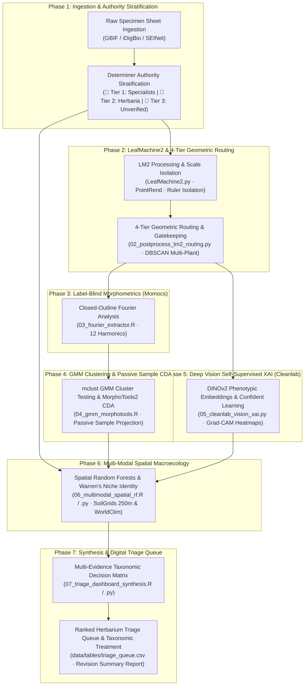

# Robust Species Delimitation Pipeline for the *Packera dubia* Complex
### Integrating Automated Morphometrics, LeafMachine2, Ecological Niches, and Multi-Tiered Herbarium Misidentification Mitigation

[](https://doi.org/10.5281/zenodo.xxxxxx)
[](https://opensource.org/licenses/MIT)
[](https://www.python.org/downloads/)
[](https://www.r-project.org/)
[]()

---

## 🌿 Project Overview

This repository houses the end-to-end computational and statistical pipeline for the taxonomic revision and species delimitation of the ***Packera dubia* (Spreng.) Trock & Mabb. complex** (Asteraceae: Senecioneae) across Eastern and Central North America.

Developed as part of doctoral research at the **University of North Carolina at Chapel Hill** in collaboration with the **UNC Herbarium (NCU)**, this project couples automated high-throughput morphometrics via **LeafMachine2**, deterministic specimen quality control, and ecological niche modeling with a formal **Six-Tiered Herbarium Misidentification Mitigation Architecture**.

- **Principal Investigator:** J. Brandon Fuller (PhD Candidate, Department of Biology, UNC-CH)
- **Faculty Advisor:** Dr. Alan S. Weakley (Director, NCU Herbarium; UNC Biology)
- **Standard Operating Procedure:** [`UNC-BOT-SOP-2026-04-REV4`](docs/TAXONOMIC_SOP.md)
- **Comprehensive Workflow Guide:** [`docs/WORKFLOW_GUIDE.md`](docs/WORKFLOW_GUIDE.md)
- **Target Taxa:** *Packera dubia* (formerly *P. tomentosa* / *Senecio tomentosus*), *Packera anonyma*, *Packera plattensis*, *Packera paupercula* (including var. *paupercula* and var. *savannarum*), and allied southeastern lineages.

> **Note on Architecture Modernization:** Organ detection, segmentation, and leaf extraction are powered by **LeafMachine2 (LM2)** (Weaver et al. 2024), providing a pre-trained detection framework purpose-built for herbarium specimens. Legacy custom YOLOv8m-seg and SAM 2 prototype scripts are preserved in [`scripts/_archive/`](scripts/_archive/README_ARCHIVE.md).

---

## 🎯 The Herbarium Misidentification Challenge

In complex, hybridizing aster clades such as *Packera*, botanical audits reveal that **20% to 40% of digital herbarium occurrence records** in aggregators (GBIF, iDigBio, SEINet) suffer from misidentification, outdated nomenclature, or misapplied keys. In *P. dubia* and its allies, this rate is exacerbated by:

1. **Phenotypic Plasticity & Foliar Wear:** The diagnostic arachnoid foliar tomentum of *P. dubia* is easily abraded or shed late in the season, causing glabrescent specimens to be misidentified as *P. anonyma* or *P. paupercula*.
2. **Asynchronous Phenology:** Early-flowering vouchers often lack expanded basal leaves, whereas late-fruiting sheets have decayed rosettes, confounding single-character keys.
3. **Nomenclatural Synonymy Shifts:** Historical transfers from *Senecio tomentosus* Michx. $\rightarrow$ *Packera tomentosa* (Michx.) C. Jeffrey $\rightarrow$ *Packera dubia* (Spreng.) Trock & Mabb. leave legacy determinations un-updated.
4. **Label Noise Distortions:** Training supervised machine learning and discriminant models on raw aggregator labels injects noise that distorts canonical axes and obscures genuine evolutionary discontinuities.
5. **Specimen Layout Artifacts:** Mounting tape, institutional stamps, calibration color bars, and printed accession labels can trigger false-positive segmentation and corrupt contour morphometrics without deterministic layout safeguards.

---

## 🛡️ Seven-Phase End-to-End Pipeline Architecture



### Seven Pipeline Phases:
1. **Specimen Ingestion & Authority Stratification ([`01_voucher_harvester.py`](scripts/data_prep/01_voucher_harvester.py)):**
   Harvests voucher imagery across GBIF and iDigBio, enforces geographic exclusion filters (excluding states west of TX/OK), calculates circular phenology ($\sin / \cos \text{DOY}$), and stratifies determinations into Gold (Tier 1), Silver (Tier 2), and Bronze (Tier 3) authority tiers.
2. **LeafMachine2 Extraction & 4-Tier Geometric Routing ([`02_postprocess_lm2_routing.py`](scripts/vision/02_postprocess_lm2_routing.py)):**
   Executes high-throughput organ detection in LM2, partitions sheets with DBSCAN spatial clustering, isolates ruler scale references, and routes leaves through 4 tiers: (1) Pristine silhouettes, (2) Hemi-blade bilateral reflections, (3) Open-curve Chebyshev polynomials, and (4) Whole-rosette contextual crops.
3. **Label-Blind Elliptic Fourier Analysis ([`03_fourier_extractor.R`](scripts/morphometrics/03_fourier_extractor.R)):**
   Extracts normalized harmonic coefficients (12 harmonics) on leaf silhouettes via `Momocs`.
4. **GMM Cluster Testing & Passive Sample CDA ([`04_gmm_morphotools.R`](scripts/morphometrics/04_gmm_morphotools.R)):**
   Models natural morphospace clusters via Gaussian Mixture Models (`mclust`, $\Delta\text{BIC}$) and executes Canonical Discriminant Analysis with passive sample projection (`MorphoTools2`) so unverified vouchers never distort canonical axes.
5. **Deep Vision Embeddings, Confident Learning & Grad-CAM XAI ([`05_cleanlab_vision_xai.py`](scripts/analysis/05_cleanlab_vision_xai.py)):**
   Extracts 768-dimensional visual feature vectors via DINOv2-ViT-B/14, estimates joint label noise matrices via `cleanlab`, and renders Grad-CAM saliency heatmaps to confirm models attend to botanical traits rather than herbarium artifacts.
6. **Multi-Modal Spatial Random Forests & Niche Modeling ([`06_multimodal_spatial_rf.R`](scripts/analysis/06_multimodal_spatial_rf.R) / [`.py`](scripts/analysis/06_multimodal_spatial_rf.py)):**
   Integrates SoilGrids 250m pedology (pH, CEC, sand %, bulk density) and WorldClim v2.1 bioclimatics to evaluate Warren's Niche Identity tests and identify cross-modal conflicts.
7. **Multi-Evidence Synthesis & Triage Dashboard Engine ([`07_triage_dashboard_synthesis.R`](scripts/analysis/07_triage_dashboard_synthesis.R) / [`.py`](scripts/analysis/07_triage_dashboard_synthesis.py)):**
   Applies the Multi-Evidence Taxonomic Decision Matrix across all six evidence streams to populate a prioritized digital triage queue for expert re-determination and exports publication-ready 6-panel synthesis figures and taxonomic treatments.

---

## 📁 Clean & Nested Repository Structure

```text
Packera_dubia_morphometrics/
├── LeafMachine2/                      # LeafMachine2 submodule (organ detection engine)
│   ├── LeafMachine2.py                # Main LM2 runner entrypoint
│   ├── LeafMachine2.yaml              # LM2 default configuration
│   └── leafmachine2/                  # LM2 core library
├── LM2_Project/                       # Packera-specific LM2 workspace
│   ├── configs/
│   │   └── lm2_packera_highperf.yaml  # Optimized config (Batch 50, 8 workers, CUDA)
│   └── Data/
│       ├── images/                    # Staged voucher images (LM2 input)
│       └── output/                    # LM2 structured outputs (crops, CSVs, overlays)
├── data/
│   ├── raw_vouchers/                  # High-resolution specimen sheet imagery (.jpg)
│   ├── environmental/                 # SoilGrids 250m and WorldClim 2.1 GeoTIFF rasters
│   ├── cropped_patches/               # Contextual whole-rosette crops (DINOv2 input)
│   ├── tables/                        # Curated Darwin Core tables, flags & triage queues
│   │   ├── curated_vouchers.csv       # Harvested vouchers with Determiner Tiers
│   │   ├── leaf_efa_harmonics.csv     # 12-harmonic EFA coefficients (Momocs)
│   │   ├── morphometrics_misidentification_flags.csv # CDA predictions & GMM clusters
│   │   ├── label_noise_audit.csv      # Cleanlab label error scores (C_error)
│   │   ├── multimodal_conflict_flags.csv # Cross-modal environmental & spatial flags
│   │   └── triage_queue.csv           # Final prioritized expert triage queue
│   └── _archive/                      # Legacy YOLOv8 datasets, SAM2 masks & annotations
├── scripts/
│   ├── core/                          # Active shared core libraries
│   │   ├── config.py                  # Central settings, taxonomic synonyms & authority rules
│   │   ├── harvester.py               # GBIF/iDigBio voucher download engine
│   │   ├── harvester_utils.py         # Authority tier parsing & circular phenology
│   │   └── logger.py                  # Structured logging utility
│   ├── data_prep/                     # Data harvesting & LM2 staging
│   │   ├── 01_voucher_harvester.py    # Phase 1: Specimen ingestion & authority stratification
│   │   └── prepare_lm2_dataset.py     # Stages images and generates manifest for LM2
│   ├── vision/                        # LM2 configuration & 4-tier routing
│   │   ├── 02_postprocess_lm2_routing.py # Phase 2: LM2 post-processing & 4-tier routing
│   │   ├── configure_leafmachine2.py  # Programmatic LM2 YAML config generator
│   │   ├── geometric_gatekeeper.py    # Solidity, convexity & midrib pose calculator
│   │   ├── lm2_data_loader.py         # LM2 output candidate loader & scale reader
│   │   ├── morphometric_router.py     # 4-tier routing implementation
│   │   └── spatial_clustering.py      # DBSCAN multi-plant sheet clusterer
│   ├── morphometrics/                 # R statistical morphometrics
│   │   ├── 03_fourier_extractor.R     # Phase 3: 12-harmonic EFA extraction (Momocs)
│   │   └── 04_gmm_morphotools.R       # Phase 4: mclust GMMs & MorphoTools2 CDA
│   ├── analysis/                      # Machine learning, spatial modeling & synthesis
│   │   ├── 05_cleanlab_vision_xai.py  # Phase 5: DINOv2, Cleanlab & Grad-CAM XAI
│   │   ├── 06_multimodal_spatial_rf.R # Phase 6 (R): Spatial RF & SoilGrids/WorldClim
│   │   ├── 06_multimodal_spatial_rf.py# Phase 6 (Python): Cross-modal spatial random forest
│   │   ├── 07_triage_dashboard_synthesis.R # Phase 7 (R): Multi-evidence synthesis & plate
│   │   └── 07_triage_dashboard_synthesis.py# Phase 7 (Python): Decision matrix & triage queue
│   ├── tests/                         # Full automated unit test suite (24 tests)
│   │   ├── test_voucher_harvester.py  # Tests for Step 01
│   │   ├── test_postprocess_lm2_routing.py # Tests for Step 02
│   │   ├── test_gmm_morphotools.py    # Tests for Step 03/04
│   │   ├── test_cleanlab_vision_xai.py# Tests for Step 05
│   │   ├── test_multimodal_spatial_rf.py   # Tests for Step 06
│   │   └── test_triage_dashboard_synthesis.py # Tests for Step 07
│   └── _archive/                      # Archived legacy YOLO/SAHI/SAM 2 scripts & models
│       ├── README_ARCHIVE.md          # Comprehensive archive documentation
│       ├── core/                      # Legacy SAHI tiler geometry & artifact gatekeepers
│       ├── data_prep/                 # Legacy SAM 2 annotation GUI & YOLO dataset builder
│       ├── vision/                    # Legacy 02_hierarchical_leaf_extractor & SAHI runner
│       ├── train/                     # Legacy YOLO fine-tuning package
│       ├── tests/                     # Legacy test suites
│       └── root_artifacts/            # Legacy YOLO weights and runs
├── outputs/
│   ├── figures/                       # Publication figures & synthesis plates
│   │   ├── Figure_Integrative_Packera_dubia_Revision.pdf # 6-panel synthesis plate
│   │   ├── GradCAM_audit_panel.png    # DINOv2 / Grad-CAM visual explanation panel
│   │   ├── cda_passive_projection.pdf # MorphoTools2 CDA biplot
│   │   ├── spatial_rf_niche_importance.pdf # Spatial RF variable importance & MEMs
│   │   └── qc_leaf_extractions/       # Specimen overlay QC images
│   ├── reports/                       # Formal reports, summaries & manifests
│   │   ├── Packera_dubia_Taxonomic_Revision_Summary.md # Taxonomic revision & key
│   │   ├── gmm_bayes_factors_summary.csv # Model selection across K=1..6 components
│   │   ├── multimodal_spatial_rf_summary.csv # Warren's Niche Identity statistics
│   │   └── voucher_ingestion_summary.log # Ingestion and quality filter telemetry
│   └── _archive/                      # Archived legacy detection benchmarks & logs
├── docs/                              # Project documentation & operational SOPs
│   ├── WORKFLOW_GUIDE.md              # Exhaustive step-by-step execution guide
│   ├── TAXONOMIC_SOP.md               # Standard Operating Procedure (UNC-BOT-SOP-2026-04-REV4)
│   ├── SAM2_Precision_Botanical_Annotation_Guide.txt # Legacy SAM 2 guide
│   └── Transfer pc intrusctions.md   # Hardware transfer & cluster guide
├── requirements.txt                   # Primary Python dependencies
├── setup_leafmachine2.sh              # LeafMachine2 environment setup script
└── README.md                          # Main repository documentation
```

---

## 📊 Ingestion & Curation Benchmark

Summary metrics from initial quality-controlled voucher ingestion ([`01_voucher_harvester.py`](scripts/data_prep/01_voucher_harvester.py)):

| Metric | Count | Percentage |
| :--- | :--- | :--- |
| **Total Quality-Filtered Vouchers** | **6,610** | **100.0%** |
| 🥇 **Tier 1 (Gold Standard Specialists)** | **2,592** | **39.2%** |
| 🥈 **Tier 2 (Silver Standard Herbaria)** | **171** | **2.6%** |
| 🥉 **Tier 3 (Bronze Standard Candidates)** | **3,847** | **58.2%** |
| 📸 **High-Resolution Specimen Images** | **6,610** | **100.0%** |

### Ingested Determinations (Raw Baseline):
- *Packera anonyma*: 1,808 records (27.4%)
- *Packera paupercula*: 1,221 records (18.5%)
- *Packera plattensis*: 1,188 records (18.0%)
- *Packera tomentosa* (*P. dubia*): 845 records (12.8%)
- *Packera paupercula* var. *paupercula*: 255 records (3.9%)
- *Packera dubia*: 225 records (3.4%)
- *Senecio plattensis*: 223 records (3.4%)
- *Packera paupercula* var. *savannarum*: 208 records (3.1%)

---

## 🚀 Step-by-Step Execution Guide

For comprehensive parameter details, input/output schemas, and advanced troubleshooting, refer to [`docs/WORKFLOW_GUIDE.md`](docs/WORKFLOW_GUIDE.md).

### 1. Ingestion & Authority Stratification
```bash
source .venv/bin/activate
python scripts/data_prep/01_voucher_harvester.py \
    --download-images --max-records-per-taxon 5000 --concurrency 15
```

### 2. LeafMachine2 Preparation, Execution & 4-Tier Routing
```bash
# A. Stage images and generate LM2 manifest
python scripts/data_prep/prepare_lm2_dataset.py \
    --vouchers data/tables/curated_vouchers.csv \
    --image-src data/raw_vouchers/ \
    --output LM2_Project/Data/images/

# B. Execute LeafMachine2
source .venv_LM2/bin/activate
cd LeafMachine2 && python LeafMachine2.py && cd ..

# C. Post-process LM2 detections with DBSCAN and 4-tier routing
source .venv/bin/activate
python scripts/vision/02_postprocess_lm2_routing.py \
    --lm2-dir LM2_Project/Data/output/Packera_dubia_LM2/ \
    --min-solidity 0.72 --min-ucs 0.85
```

### 3. Label-Blind Elliptic Fourier Analysis
```bash
Rscript scripts/morphometrics/03_fourier_extractor.R \
    --input LM2_Project/Data/output/Packera_dubia_LM2/ --harmonics 12
```

### 4. GMM Cluster Testing & Passive Sample CDA
```bash
Rscript scripts/morphometrics/04_gmm_morphotools.R \
    --metadata data/tables/curated_vouchers.csv \
    --harmonics data/tables/leaf_efa_harmonics.csv
```

### 5. Confident Learning Label Pruning & Grad-CAM XAI
```bash
source .venv/bin/activate
python scripts/analysis/05_cleanlab_vision_xai.py \
    --rosette-dir data/cropped_patches/rosettes_dense \
    --cleanlab-threshold 0.85
```

### 6. Multi-Modal Spatial Random Forests & Niche Modeling
```bash
# Execute in R
Rscript scripts/analysis/06_multimodal_spatial_rf.R --env-dir data/environmental/

# Or execute in Python
source .venv/bin/activate
python scripts/analysis/06_multimodal_spatial_rf.py --env-dir data/environmental/
```

### 7. Multi-Evidence Synthesis & Triage Queue Generation
```bash
# Execute in R
Rscript scripts/analysis/07_triage_dashboard_synthesis.R

# Or execute in Python
source .venv/bin/activate
python scripts/analysis/07_triage_dashboard_synthesis.py
```

### 8. Run Automated Test Suite
```bash
source .venv/bin/activate
python -m unittest discover -s scripts/tests
```

---

## 📦 System Requirements & Dependencies

### Python Environments
- **Primary Pipeline (`.venv`):** Python $\ge 3.10$ with `pandas`, `numpy`, `opencv-python`, `scikit-learn`, `scipy`, `matplotlib`, `pyyaml`, `pygbif`, `requests`, `torch`, `torchvision`, `cleanlab`, `captum`.
- **LeafMachine2 (`.venv_LM2`):** Managed via `setup_leafmachine2.sh`.

### R Statistical Computing
- R $\ge 4.3.0$ with `Momocs`, `MorphoTools2`, `mclust`, `spatialRF`, `terra`, `tidyverse`, `sf`, `ggplot2`, `patchwork`, `gridExtra`, `optparse`.

---

## 📚 Key Literature & Citations

1. **Barkley, T. M.** (1988). Variation among the Senecioneae (Asteraceae) in North America. *Brittonia*, 40(2), 211–221.
2. **Gaem, D. G., et al.** (2025). Herbarium specimen misidentifications and their consequences for machine learning biodiversity models. *Applications in Plant Sciences*, e11582.
3. **Mabberley, D. J., Trock, D. K., & Weakley, A. S.** (2020). The nomenclature of *Packera dubia* (Asteraceae: Senecioneae). *Taxon*, 69(6), 1334–1337.
4. **Northcutt, C. G., Jiang, L., & Chuang, I. L.** (2021). Confident Learning: Estimating Uncertainty in Dataset Labels. *Journal of Artificial Intelligence Research*, 70, 1373–1411.
5. **Šlenker, M., et al.** (2022). MorphoTools2: an R package for multivariate morphometric analysis. *Bioinformatics*, 38(10), 2954–2955.
6. **Trock, D. K.** (2006). *Packera*. In Flora of North America Editorial Committee (Eds.), *Flora of North America North of Mexico* (Vol. 20, pp. 570–602). Oxford University Press.
7. **Weakley, A. S.** (2026). *Flora of the Southeastern United States*. University of North Carolina Herbarium (NCU), North Carolina Botanical Garden.
8. **Weaver, W. N., et al.** (2024). LeafMachine2: Using machine learning to rapidly measure plant traits captured in herbarium specimens. *Applications in Plant Sciences*, 12(1), e11545.

---

## 📄 License & Attribution

This project is licensed under the **MIT License**. Herbarium specimen images harvested through the pipeline remain subject to the individual institutional data and copyright policies of the contributing herbaria (NCU, GA, US, NY, BRIT, MO, WIS, VDB, FLAS, TEX, TENN, F).
