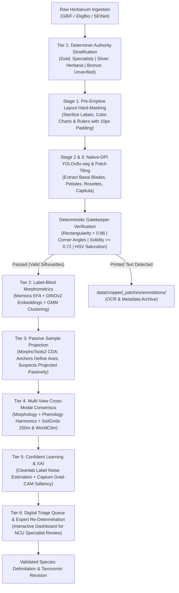

# Robust Species Delimitation Pipeline for the *Packera dubia* Complex
### Integrating Automated Morphometrics, Deep Learning, Ecological Niches, and Multi-Tiered Herbarium Misidentification Mitigation

[](https://doi.org/10.5281/zenodo.xxxxxx)
[](https://opensource.org/licenses/MIT)
[](https://www.python.org/downloads/)
[](https://www.r-project.org/)

---

## 🌿 Project Overview

This repository houses the end-to-end computational and statistical pipeline for the taxonomic revision and species delimitation of the ***Packera dubia* (Spreng.) Trock & Mabb. complex** (Asteraceae: Senecioneae) across Eastern and Central North America.

Developed as part of doctoral research at the **University of North Carolina at Chapel Hill** in collaboration with the **UNC Herbarium (NCU)**, this project couples automated high-throughput morphometrics, native-DPI deep vision segmentation, deterministic artifact gatekeeping, and ecological niche modeling with a formal **Six-Tiered Herbarium Misidentification Mitigation Architecture**.

- **Principal Investigator:** J. Brandon Fuller (PhD Candidate, Department of Biology, UNC-CH)
- **Faculty Advisor:** Dr. Alan S. Weakley (Director, NCU Herbarium; UNC Biology)
- **Standard Operating Procedure:** `UNC-BOT-SOP-2026-04-REV2`
- **Target Taxa:** *Packera dubia* (formerly *P. tomentosa* / *Senecio tomentosus*), *P. anonyma*, *P. plattensis*, *P. paupercula* (including var. *paupercula* and var. *savannarum*), and allied southeastern lineages.

---

## 🎯 The Herbarium Misidentification Challenge

In complex, hybridizing aster clades such as *Packera*, botanical audits reveal that **20% to 40% of digital herbarium occurrence records** in aggregators (GBIF, iDigBio, SEINet) suffer from misidentification, outdated nomenclature, or misapplied keys. In *P. dubia* and its allies, this rate is exacerbated by:

1. **Phenotypic Plasticity & Foliar Wear:** The diagnostic arachnoid foliar tomentum of *P. dubia* is easily abraded or shed late in the season, causing glabrescent specimens to be misidentified as *P. anonyma* or *P. paupercula*.
2. **Asynchronous Phenology:** Early-flowering vouchers often lack expanded basal leaves, whereas late-fruiting sheets have decayed rosettes, confounding single-character keys.
3. **Nomenclatural Synonymy Shifts:** Historical transfers from *Senecio tomentosus* Michx. $\rightarrow$ *Packera tomentosa* (Michx.) C. Jeffrey $\rightarrow$ *Packera dubia* (Spreng.) Trock & Mabb. leave legacy determinations un-updated.
4. **Label Noise Pollution:** Training supervised machine learning and discriminant models on raw aggregator labels injects noise that distorts canonical axes and obscures genuine evolutionary discontinuities.
5. **Non-Botanical Specimen Artifacts:** Mounting tape, institutional stamps, calibration color bars, and printed accession labels can trigger false-positive segmentation and corrupt contour morphometrics without deterministic layout safeguards.

---

## 🛡️ Six-Tiered Misidentification & Extraction Architecture



### Detailed Mitigation & Extraction Protocols:
* **Tier 1 — Determination History & Taxonomic Authority Stratification:**
  Vouchers are classified into authority tiers based on annotator expertise:
  - **Tier 1 (Gold Standard / Anchor Vouchers):** Nomenclatural types or determinations signed by recognized *Packera* / Senecioneae specialists (T.M. Barkley, D.K. Trock, R.R. Kowal, A.S. Weakley, J.F. Bain, A.M. Mahoney, J.B. Fuller).
  - **Tier 2 (Silver Standard / Institutional Vouchers):** Vouchers curated at major herbaria (NCU, GA, US, NY, BRIT, MO, WIS) with complete reproductive/vegetative structures.
  - **Tier 3 (Bronze Standard / Candidate Vouchers):** Unverified general floristic collections. Withheld from initial training seeds.
* **Deterministic Layout Sterilization & Geometric Gatekeeper (`artifact_filter_gatekeeper.py`):**
  - **Pre-Segmentation Hard-Masking:** Automatically zero-fills bounding boxes of accession labels, calibration color charts, and scale rulers to solid white (`RGB [255, 255, 255]`) with a 10-pixel padding boundary prior to segmentation.
  - **Post-Extraction Morphological Filter:** Discards rectangular tape ($\text{Rectangularity} > 0.86$), rejects 4-vertex orthogonal quadrilaterals with angles $\in [80^\circ, 100^\circ]$, and requires $\text{Solidity} \ge 0.72$ for intact single leaves.
  - **Spectral Saturation Reclassification:** Flags vibrant swatches ($S > 0.45$ on $>15\%$ of area) as `color_chart`.
  - **Laplacian Text Verification:** Detects high-frequency typographic glyphs and routes label patches to `data/cropped_patches/annotations/`.
* **Four-Tiered Precision Leaf Extraction Hierarchy (`02_hierarchical_leaf_extractor.py`):**
  - **Tier 1 (Direct Intact Leaf):** High-confidence, unbroken silhouettes ($\text{UCS} \ge 0.85, \text{Solidity} \ge 0.72$). Horizontally aligned (apex left, petiole right) for standard Fourier decomposition.
  - **Tier 2 (Hemi-Blade Bilateral Reflection):** Single undamaged half-blade reflected bilaterally across the midrib axis to reconstruct occluded leaves.
  - **Tier 3 (Open Margin Curves):** Traces continuous unoccluded margin coordinates $(x, y)$ and scalar caliper dimensions.
  - **Tier 4 (Dense-Rosette Patches):** Crops dense rosette clumps for DINOv2 self-supervised feature extraction.
* **Tier 2 — Label-Blind Unsupervised Phenotypic Discovery:**
  Elliptic Fourier Analysis (EFA) and DINOv2 vision embeddings are extracted without prior taxonomic labels. Gaussian Mixture Modeling (`mclust`) detects natural morphological clusters; label discordances against Tier 1 anchors are flagged automatically.
* **Tier 3 — Passive Sample Projection in Discriminant Analyses (`MorphoTools2`):**
  Unverified and discordant vouchers are designated as `passiveSamples` in `MorphoTools2::cda.calc()`. Canonical axes are computed strictly on verified Tier 1/2 anchors, preventing corrupted specimens from biasing covariance matrices.
* **Tier 4 — Multi-View Cross-Modal Consensus & Niche Sanity Verification:**
  Triangulates morphology, circular phenological harmonics ($\sin / \cos \text{DOY}$), and pedological niche profiles (SoilGrids 250m: pH, CEC, sand %) to catch ecological impossibilities (e.g., coastal sandhill *P. dubia* collected on high-elevation granite flatrocks).
* **Tier 5 — Confident Learning & Explainable AI (XAI):**
  Uses `cleanlab` to estimate the joint distribution matrix of noisy labels versus true latent classes, pruning label errors ($C_{\text{error}} > 0.85$). `Captum` Grad-CAM heatmaps confirm models focus on botanical traits (tomentum, margins) rather than mounting artifacts.
* **Tier 6 — Digital Triage Queue & Expert Re-Determination:**
  Discordant and high-entropy vouchers ($H(p) \ge 0.50$) are exported to an interactive triage dashboard for manual visual re-determination by project botanists.

---

## 📁 Repository Structure

```text
packera-dubia-morphometrics/
├── data/
│   ├── raw_vouchers/              # High-resolution specimen sheet imagery (.jpg)
│   ├── yolo_dataset/              # 9-class annotated dataset for YOLOv8x-seg training
│   ├── native_dpi_tiles/          # 1024x1024 native-DPI cropped voucher patches
│   ├── cropped_patches/           # Extracted ROIs (basal leaves, rosettes, capitula)
│   │   └── annotations/           # Routed text annotation slips and label patches
│   ├── masks/                     # Binarized leaf silhouettes (Tier 1 intact, Tier 2 reflected)
│   ├── environmental/             # SoilGrids 250m and WorldClim 2.1 GeoTIFF rasters
│   └── tables/
│       ├── curated_vouchers.csv   # Cleaned Darwin Core metadata with Determiner Tiers
│       ├── leaf_extraction_qc.csv # Quality control log for hierarchical leaf extraction
│       ├── label_noise_audit.csv  # Cleanlab & discordance error logs
│       └── triage_queue.csv       # High-entropy vouchers prioritized for expert review
├── docs/
│   └── Transfer pc intrusctions.md    # System setup and transfer instructions
├── models/
│   ├── yolov8_leaf_best.pt        # Fine-tuned YOLOv8x-seg weights for organ segmentation
│   └── dinov2_backbone.pth        # Self-supervised vision transformer feature weights
├── scripts/
│   ├── core/                      # Shared utility classes, metrics, and models
│   │   ├── config.py              # Centralized hyperparameters and class schema mapping
│   │   ├── data_structures.py     # Reusable dataclasses for telemetry and geometric metrics
│   │   ├── dataset_builder.py     # YOLO dataset generation worker logic
│   │   ├── gatekeeper_engine.py   # Deterministic layout mask and text routing algorithm
│   │   ├── harvester.py           # GBIF/DwC pipeline download engine
│   │   ├── leaf_extraction.py     # 5-Stage precision extraction hierarchy logic
│   │   ├── logger.py              # Standardized multi-stream logging configuration
│   │   └── tiling_utils.py        # Core sliding window geometry & SAHI helper module
│   ├── data_prep/
│   │   ├── 01_voucher_harvester.py
│   │   └── build_artifact_robust_dataset.py
│   ├── vision/
│   │   ├── 02_hierarchical_leaf_extractor.py
│   │   ├── artifact_filter_gatekeeper.py
│   │   ├── run_dpi_tiler.py
│   │   └── run_sahi_inference.py
│   ├── morphometrics/
│   │   ├── 03_fourier_extractor.R
│   │   └── 04_gmm_morphotools.R
│   ├── analysis/
│   │   ├── 05_cleanlab_vision_xai.py
│   │   └── 06_multimodal_spatial_rf.R
│   ├── tests/
│   │   └── test_native_dpi_patch_tiler.py
│   └── train_artifact_robust_yolo.py # Production YOLOv8x-seg fine-tuning engine (RAM caching, AMP)
├── outputs/
│   ├── figures/                   # CDA biplots, Grad-CAM saliency panels, EFA contours
│   ├── training_evaluation/       # YOLOv8x class mAP curves, confusion matrices, loss telemetry
│   └── reports/                   # BIC model summaries & taxonomic revision keys
└── README.md
```

---

## 📊 Ingestion & Curation Benchmark

Summary metrics from initial quality-controlled voucher ingestion (`01_voucher_harvester.py`):

| Metric | Count | Percentage |
| :--- | :--- | :--- |
| **Total Quality-Filtered Vouchers** | **1,581** | **100.0%** |
| 🥇 **Tier 1 (Gold Standard Anchors)** | **898** | **56.8%** |
| 🥈 **Tier 2 (Silver Standard Institutional)** | **60** | **3.8%** |
| 🥉 **Tier 3 (Bronze Standard Candidates)** | **623** | **39.4%** |
| 📸 **High-Resolution Images Downloaded** | **1,330** | **84.1%** |

### Taxonomic Distribution (Raw Ingested Determinations):
* *Packera anonyma*: 413 records (26.1%)
* *Packera plattensis*: 250 records (15.8%)
* *Packera paupercula*: 206 records (13.0%)
* *Packera tomentosa*: 164 records (10.4%)
* *Packera dubia*: 147 records (9.3%)
* *Packera paupercula* var. *savannarum*: 134 records (8.5%)
* *Packera paupercula* var. *paupercula*: 79 records (5.0%)
* *Senecio smallii*: 68 records (4.3%)

### Primary Contributing Herbarium Repositories:
* **NCU** (Univ. of North Carolina Herbarium): 418 records (26.4%)
* **WIS** (Univ. of Wisconsin Herbarium): 296 records (18.7%)
* **MIN** (Univ. of Minnesota Herbarium): 105 records (6.6%)
* **WILLI** (William & Mary Herbarium): 90 records (5.7%)
* **CSCN** (Chadron State College Herbarium): 71 records (4.5%)
* **NY** (New York Botanical Garden): 63 records (4.0%)
* **BRIT** (Botanical Research Institute of Texas): 35 records (2.2%)
* **ODU** (Old Dominion University): 34 records (2.2%)

---

## 🚀 Execution & Workflow Guide

### 1. Ingestion & Authority Stratification
Harvest specimen records from GBIF, filter spatial coordinate uncertainty ($\le 5000\,\text{m}$), parse taxonomic authority slips into Gold/Silver/Bronze tiers, compute circular phenological metrics, and download high-resolution sheets:
```bash
python scripts/data_prep/01_voucher_harvester.py --download-images --max-records-per-taxon 1000 --concurrency 15
```

### 2. Build Artifact-Robust YOLO Segmentation Dataset
Construct the 9-class instance segmentation training set with negative background sheet patches and bounding polygons for botanical organs and mounting hardware:
```bash
python scripts/data_prep/build_artifact_robust_dataset.py --output-dir data/yolo_dataset --imgsz 1024
```

### 3. High-Throughput Native-DPI Patch Tiling (`run_dpi_tiler.py`)
Tile full-resolution specimen scans ($1024 \times 1024$, 20% overlap) across multi-core CPU workers with dynamic polygon clipping and background paper sub-sampling:
```bash
python scripts/vision/run_dpi_tiler.py --input-dir data/raw_vouchers --labels-dir data/yolo_dataset/labels --output-dir data/tiled_dataset --num-workers 32 --tile-size 1024 --overlap 0.20
```

### 4. Fine-Tune Artifact-Robust YOLOv8x-seg on Sliced DPI Tiles
Train the `YOLOv8x-seg` instance segmentation model on the sliced $1024 \times 1024$ native-DPI tiles (`data/tiled_dataset_config.yaml`) with mixed precision AMP, botanical loss weighting, and RAM dataset caching:

Fresh training run on sliced tiles (100 epochs, batch 8, RAM caching):
```bash
python scripts/train_artifact_robust_yolo.py --data data/tiled_dataset_config.yaml --epochs 100 --batch 8 --imgsz 1024 --cache ram --workers 0
```

Resume interrupted training from last saved checkpoint (`last.pt`):
```bash
python scripts/train_artifact_robust_yolo.py --resume --cache ram --workers 0
```

Explicitly re-partition tiled dataset by specimen sheets:
```bash
python scripts/train_artifact_robust_yolo.py --split-tiled-dataset --train-ratio 0.70 --val-ratio 0.15 --test-ratio 0.15
```

### 5. Sliced Aided Hyper Inference (`run_sahi_inference.py`)
Run SAHI sliced inference on full-resolution gigapixel sheets using fine-tuned YOLOv8 segmentation weights with automatic checkpoint resumption:
```bash
python scripts/vision/run_sahi_inference.py --weights models/yolov8_leaf_best.pt --input-dir data/raw_vouchers --output-dir outputs/sahi_detections --conf 0.25 --iou 0.45 --slice-size 1024 --overlap 0.20
```

### 6. Hierarchical Precision Leaf Extraction & Gatekeeper Validation
Execute the 5-stage precision extraction framework with pre-emptive hard-masking and post-extraction validation:
```bash
python scripts/vision/02_hierarchical_leaf_extractor.py --weights models/yolov8_leaf_best.pt --conf-threshold 0.25
```

Run the standalone unit test suite for the deterministic gatekeeper:
```bash
python scripts/vision/artifact_filter_gatekeeper.py --test
```

### 7. Label-Blind Elliptic Fourier Analysis (Momocs)
Extract normalized harmonic coefficients (EFA) on binarized Tier 1 and Tier 2 leaf silhouettes via `Momocs`:
```bash
Rscript scripts/morphometrics/03_fourier_extractor.R --input data/masks/tier1_intact/ --harmonics 12
```

### 8. GMM Cluster Testing & Passive Sample CDA (MorphoTools2)
Model natural morphospace clusters via Gaussian Mixture Models (`mclust`) and execute Canonical Discriminant Analysis with passive sample projection (`MorphoTools2`):
```bash
Rscript scripts/morphometrics/04_gmm_morphotools.R --metadata data/tables/curated_vouchers.csv
```

### 9. Confident Learning Label Pruning & Grad-CAM XAI
Extract DINOv2 visual embeddings, identify mislabeled vouchers via `cleanlab`, and generate Grad-CAM visual explanation heatmaps:
```bash
python scripts/analysis/05_cleanlab_vision_xai.py --backbone dinov2_vitb14 --cleanlab-threshold 0.85
```

### 10. Multi-View Spatial Random Forest & Niche Modeling
Integrate SoilGrids pedology (pH, CEC, sand fraction) and WorldClim climate variables to detect cross-modal conflicts and train spatial random forest models with Moran's Eigenvector Maps:
```bash
Rscript scripts/analysis/06_multimodal_spatial_rf.R --env-dir data/environmental/
```

---

## 📦 System Requirements & Dependencies

### Python Environment
- Python $\ge 3.10$
- Dependencies: `pygbif`, `requests`, `pandas`, `numpy`, `tqdm`, `ultralytics` (YOLOv8), `torch`, `torchvision`, `cleanlab`, `captum`, `opencv-python`, `scikit-learn`, `matplotlib`, `seaborn`, `shapely`

```bash
pip install pygbif requests pandas numpy tqdm ultralytics torch torchvision cleanlab captum opencv-python scikit-learn matplotlib seaborn shapely
```

### R Environment
- R $\ge 4.3.0$
- CRAN / GitHub packages: `Momocs`, `MorphoTools2`, `mclust`, `spatialRF`, `terra`, `ENMTools`, `tidyverse`, `sf`, `ggplot2`, `patchwork`

Install from R console or terminal:
```R
install.packages(c("Momocs", "mclust", "terra", "tidyverse", "sf", "ggplot2", "patchwork", "remotes"))
```
```R
remotes::install_github(c("V-Z/MorphoTools2", "danlwarren/ENMTools", "blasbenito/spatialRF"))
```

---

## 📚 Key Literature & References

1. **Barkley, T. M.** (1988). Variation among the Senecioneae (Asteraceae) in North America. *Brittonia*, 40(2), 211–221.
2. **Gaem, D. G., et al.** (2025). Herbarium specimen misidentifications and their consequences for machine learning biodiversity models. *Applications in Plant Sciences*, e11582.
3. **Mabberley, D. J., Trock, D. K., & Weakley, A. S.** (2020). The nomenclature of *Packera dubia* (Asteraceae: Senecioneae). *Taxon*, 69(6), 1334–1337.
4. **Northcutt, C. G., Jiang, L., & Chuang, I. L.** (2021). Confident Learning: Estimating Uncertainty in Dataset Labels. *Journal of Artificial Intelligence Research*, 70, 1373–1411.
5. **Šlenker, M., et al.** (2022). MorphoTools2: an R package for multivariate morphometric analysis. *Bioinformatics*, 38(10), 2954–2955.
6. **Trock, D. K.** (2006). *Packera*. In Flora of North America Editorial Committee (Eds.), *Flora of North America North of Mexico* (Vol. 20, pp. 570–602). Oxford University Press.
7. **Weakley, A. S.** (2026). *Flora of the Southeastern United States*. University of North Carolina Herbarium (NCU), North Carolina Botanical Garden.

---

## 📄 License & Attribution

This project is licensed under the **MIT License**. Herbarium specimen images harvested through the pipeline remain subject to the individual institutional data and copyright policies of the contributing herbaria (NCU, WIS, MIN, WILLI, CSCN, NY, BRIT, ODU).
