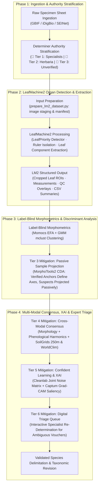

# Robust Species Delimitation Pipeline for the *Packera dubia* Complex
### Integrating Automated Morphometrics, LeafMachine2, Ecological Niches, and Multi-Tiered Herbarium Misidentification Mitigation

[](https://doi.org/10.5281/zenodo.xxxxxx)
[](https://opensource.org/licenses/MIT)
[](https://www.python.org/downloads/)
[](https://www.r-project.org/)

---

## 🌿 Project Overview

This repository houses the end-to-end computational and statistical pipeline for the taxonomic revision and species delimitation of the ***Packera dubia* (Spreng.) Trock & Mabb. complex** (Asteraceae: Senecioneae) across Eastern and Central North America.

Developed as part of doctoral research at the **University of North Carolina at Chapel Hill** in collaboration with the **UNC Herbarium (NCU)**, this project couples automated high-throughput morphometrics via **LeafMachine2**, deterministic specimen quality control, and ecological niche modeling with a formal **Six-Tiered Herbarium Misidentification Mitigation Architecture**.

- **Principal Investigator:** J. Brandon Fuller (PhD Candidate, Department of Biology, UNC-CH)
- **Faculty Advisor:** Dr. Alan S. Weakley (Director, NCU Herbarium; UNC Biology)
- **Standard Operating Procedure:** `UNC-BOT-SOP-2026-04-REV2`
- **Target Taxa:** *Packera dubia* (formerly *P. tomentosa* / *Senecio tomentosus*), *P. anonyma*, *P. plattensis*, *P. paupercula* (including var. *paupercula* and var. *savannarum*), and allied southeastern lineages.

> **Note on Workflow Transition:** Organ detection, segmentation, and leaf extraction were previously handled by a custom-trained YOLOv8m-seg + SAM 2 pipeline. This has been replaced by **LeafMachine2 (LM2)**, which provides a pre-trained, actively maintained detection framework purpose-built for herbarium specimens. The old pipeline scripts are preserved in [`scripts/_archive/`](scripts/_archive/README_ARCHIVE.md).

---

## 🎯 The Herbarium Misidentification Challenge

In complex, hybridizing aster clades such as *Packera*, botanical audits reveal that **20% to 40% of digital herbarium occurrence records** in aggregators (GBIF, iDigBio, SEINet) suffer from misidentification, outdated nomenclature, or misapplied keys. In *P. dubia* and its allies, this rate is exacerbated by:

1. **Phenotypic Plasticity & Foliar Wear:** The diagnostic arachnoid foliar tomentum of *P. dubia* is easily abraded or shed late in the season, causing glabrescent specimens to be misidentified as *P. anonyma* or *P. paupercula*.
2. **Asynchronous Phenology:** Early-flowering vouchers often lack expanded basal leaves, whereas late-fruiting sheets have decayed rosettes, confounding single-character keys.
3. **Nomenclatural Synonymy Shifts:** Historical transfers from *Senecio tomentosus* Michx. $\rightarrow$ *Packera tomentosa* (Michx.) C. Jeffrey $\rightarrow$ *Packera dubia* (Spreng.) Trock & Mabb. leave legacy determinations un-updated.
4. **Label Noise Pollution:** Training supervised machine learning and discriminant models on raw aggregator labels injects noise that distorts canonical axes and obscures genuine evolutionary discontinuities.
5. **Non-Botanical Specimen Artifacts:** Mounting tape, institutional stamps, calibration color bars, and printed accession labels can trigger false-positive segmentation and corrupt contour morphometrics without deterministic layout safeguards.

---

## 🛡️ Six-Tiered Misidentification & Hierarchical Extraction Architecture



### End-to-End Pipeline & Workflow Sequence:
1. **Specimen Ingestion & Authority Stratification (`01_voucher_harvester.py`):**
   Harvests high-resolution voucher imagery across aggregators (GBIF, iDigBio, SEINet), filters spatial uncertainty ($\le 5000\,\text{m}$), and stratifies determinations into Gold, Silver, and Bronze authority tiers.
2. **LeafMachine2 Input Preparation (`prepare_lm2_dataset.py`):**
   Stages downloaded voucher images into the LM2 input directory structure and generates a run manifest linking specimens to their authority tier metadata.
3. **LeafMachine2 Organ Detection & Leaf Extraction (`LeafMachine2.py`):**
   Runs the LM2 pipeline with Packera-optimized configuration (`lm2_packera_highperf.yaml`). LM2 automatically detects plant components (leaves, rulers, labels, color charts), isolates ruler scale references, crops individual leaf ROIs, and outputs structured CSV measurement summaries and QC overlay images.
4. **Label-Blind Elliptic Fourier Analysis (`03_fourier_extractor.R`):**
   Extracts normalized harmonic coefficients (EFA) on LM2-extracted leaf silhouettes via `Momocs`, models natural clusters with Gaussian Mixture Models (`mclust`), and runs Canonical Discriminant Analysis with passive sample projection (`MorphoTools2`).
5. **GMM Cluster Testing & Passive Sample CDA (`04_gmm_morphotools.R`):**
   Models natural morphospace clusters via Gaussian Mixture Models (`mclust`) and executes Canonical Discriminant Analysis with passive sample projection (`MorphoTools2`).
6. **Multi-Modal Validation, Confident Learning & Expert Triage (`05_cleanlab_vision_xai.py` & `06_multimodal_spatial_rf.R`):**
   Validates models with DINOv2 self-supervised embeddings, `cleanlab` label noise estimation, `Captum` Grad-CAM saliency heatmaps, and spatial Random Forests incorporating SoilGrids 250m pedology and WorldClim climate layers to populate a digital triage queue for expert re-determination.

---

### The Six-Tiered Misidentification Mitigation Framework:
* **Tier 1 — Taxonomic Authority Stratification:**
  - **Tier 1 (Gold Standard / Anchor Vouchers):** Nomenclatural types or determinations signed by recognized *Packera* / Senecioneae specialists (T.M. Barkley, D.K. Trock, R.R. Kowal, A.S. Weakley, J.F. Bain, A.M. Mahoney, J.B. Fuller).
  - **Tier 2 (Silver Standard / Institutional Vouchers):** Vouchers curated at major herbaria (NCU, GA, US, NY, BRIT, MO, WIS) with complete reproductive/vegetative structures.
  - **Tier 3 (Bronze Standard / Candidate Vouchers):** Unverified general floristic collections. Withheld from initial training seeds.
* **Tier 2 — Label-Blind Unsupervised Phenotypic Discovery:**
  Elliptic Fourier Analysis (EFA) and DINOv2 vision embeddings are extracted without prior taxonomic labels. Gaussian Mixture Modeling (`mclust`) detects natural morphological clusters; label discordances against Tier 1 anchors are flagged automatically.
* **Tier 3 — Passive Sample Projection in Discriminant Analyses (`MorphoTools2`):**
  Unverified and discordant vouchers are designated as `passiveSamples` in `MorphoTools2::cda.calc()`. Canonical axes are computed strictly on verified Tier 1/2 anchors, preventing corrupted specimens from biasing covariance matrices.
* **Tier 4 — Multi-View Cross-Modal Consensus & Niche Sanity Verification:**
  Triangulates morphology, circular phenological harmonics ($\sin / \cos \text{DOY}$), and pedological niche profiles (SoilGrids 250m: pH, CEC, sand %) to catch ecological impossibilities.
* **Tier 5 — Confident Learning & Explainable AI (XAI):**
  Uses `cleanlab` to estimate the joint distribution matrix of noisy labels versus true latent classes, pruning label errors ($C_{\text{error}} > 0.85$). `Captum` Grad-CAM heatmaps confirm models focus on botanical traits (tomentum, margins) rather than mounting artifacts.
* **Tier 6 — Digital Triage Queue & Expert Re-Determination:**
  Discordant and high-entropy vouchers ($H(p) \ge 0.50$) are exported to an interactive triage dashboard for manual visual re-determination by project botanists.

---

## 📁 Repository Structure

```text
packera-dubia-morphometrics/
├── LeafMachine2/                      # LeafMachine2 submodule (organ detection engine)
│   ├── LeafMachine2.py                # Main LM2 runner entrypoint
│   ├── LeafMachine2.yaml              # LM2 default configuration
│   └── leafmachine2/                  # LM2 core library
├── LM2_Project/                       # Packera-specific LM2 project files
│   ├── configs/
│   │   └── lm2_packera_highperf.yaml  # Optimized LM2 config (batch 50, 8 workers, CUDA)
│   └── Data/
│       ├── images/                    # Staged voucher images (LM2 input)
│       └── output/                    # LM2 structured outputs (crops, CSVs, QC overlays)
├── data/
│   ├── raw_vouchers/                  # High-resolution specimen sheet imagery (.jpg)
│   ├── environmental/                 # SoilGrids 250m and WorldClim 2.1 GeoTIFF rasters
│   └── tables/
│       ├── curated_vouchers.csv       # Cleaned Darwin Core metadata with Determiner Tiers
│       └── label_noise_audit.csv      # Cleanlab & discordance error logs
├── scripts/
│   ├── core/                          # Shared library classes (harvester utilities)
│   │   ├── harvester.py               # GBIF/DwC pipeline download orchestrator
│   │   ├── harvester_utils.py         # Circular phenology and metadata parsing
│   │   └── ...                        # Supporting utilities
│   ├── data_prep/                     # Data harvesting and LM2 input preparation
│   │   ├── 01_voucher_harvester.py    # Specimen record harvesting CLI
│   │   ├── configure_leafmachine2.py  # LM2 configuration helper
│   │   └── prepare_lm2_dataset.py     # Stages images for LM2 input
│   ├── vision/                        # LM2 configuration and execution scripts
│   │   └── configure_leafmachine2.py  # Programmatic LM2 YAML config generator
│   ├── morphometrics/                 # R morphometrics and statistical scripts
│   │   ├── 03_fourier_extractor.R     # EFA harmonic extraction (Momocs)
│   │   └── 04_gmm_morphotools.R       # GMM clustering & CDA (mclust, MorphoTools2)
│   ├── analysis/                      # Machine learning and spatial modeling scripts
│   │   ├── 05_cleanlab_vision_xai.py  # DINOv2 embeddings, Cleanlab, Grad-CAM XAI
│   │   └── 06_multimodal_spatial_rf.R # Spatial RF with SoilGrids & WorldClim
│   ├── tests/                         # Active test suite
│   │   └── test_voucher_harvester.py  # Voucher harvesting tests
│   └── _archive/                      # Archived custom CV/ML pipeline (pre-LM2)
│       ├── README_ARCHIVE.md          # Archive documentation
│       ├── vision/                    # Old hierarchical extractor, tiler, SAHI runner
│       ├── data_prep/                 # SAM 2 annotation GUI, dataset builder
│       ├── train/                     # Custom YOLOv8m-seg fine-tuning package
│       ├── tests/                     # Tests for archived pipeline components
│       └── root_artifacts/            # YOLO weights, runs, segment-anything-2
├── outputs/
│   ├── figures/                       # CDA biplots, Grad-CAM saliency panels, EFA contours
│   └── reports/                       # BIC summaries, dataset manifests & taxonomic keys
├── .venv_LM2/                         # LeafMachine2 Python virtual environment
├── setup_leafmachine2.sh              # LM2 environment setup script
└── README.md
```

---

## 📊 Ingestion & Curation Benchmark

Summary metrics from initial quality-controlled voucher ingestion (`01_voucher_harvester.py`):

| Metric | Count | Percentage |
| :--- | :--- | :--- |
| **Total Quality-Filtered Vouchers** | **6,610** | **100.0%** |
| 🥇 **Tier 1 (Gold Standard Anchors)** | **2,592** | **39.2%** |
| 🥈 **Tier 2 (Silver Standard Institutional)** | **171** | **2.6%** |
| 🥉 **Tier 3 (Bronze Standard Candidates)** | **3,847** | **58.2%** |
| 📸 **High-Resolution Images Downloaded** | **6,610** | **100.0%** |

### Taxonomic Distribution (Raw Ingested Determinations):
* *Packera anonyma*: 1,808 records (27.4%)
* *Packera paupercula*: 1,221 records (18.5%)
* *Packera plattensis*: 1,188 records (18.0%)
* *Packera tomentosa*: 845 records (12.8%)
* *Packera paupercula* var. *paupercula*: 255 records (3.9%)
* *Packera dubia*: 225 records (3.4%)
* *Senecio plattensis*: 223 records (3.4%)
* *Packera paupercula* var. *savannarum*: 208 records (3.1%)

---

## 🚀 Execution & Workflow Guide

### 1. Ingestion & Authority Stratification (`01_voucher_harvester.py`)
Harvest specimen records from GBIF, filter spatial coordinate uncertainty ($\le 5000\,\text{m}$), parse taxonomic authority slips into Gold/Silver/Bronze tiers, compute circular phenological metrics, and download high-resolution sheets:
```bash
python scripts/data_prep/01_voucher_harvester.py --download-images --max-records-per-taxon 5000 --concurrency 15
```

### 2. Prepare LeafMachine2 Input (`prepare_lm2_dataset.py`)
Stage downloaded voucher images into the LM2 project input directory and generate a specimen manifest:
```bash
python scripts/data_prep/prepare_lm2_dataset.py \
    --vouchers data/tables/curated_vouchers.csv \
    --image-src data/raw_vouchers/ \
    --output LM2_Project/Data/images/
```

### 3. Configure LeafMachine2 (`configure_leafmachine2.py`)
Generate or update the Packera-optimized LM2 YAML configuration (batch 50, 8 workers, CUDA, LeafPriority detector):
```bash
# Generate optimized config in LM2_Project/configs/
python scripts/vision/configure_leafmachine2.py

# Update LeafMachine2 default config in-place
python scripts/vision/configure_leafmachine2.py --update-main-config

# Custom batch size and worker count
python scripts/vision/configure_leafmachine2.py -o LM2_Project/configs/custom.yaml --batch-size 50 --num-workers 8
```

### 4. Run LeafMachine2 (`LeafMachine2.py`)
Execute the full LM2 pipeline on staged voucher images using the Packera-optimized configuration.
LM2 handles ruler isolation, color-chart exclusion, plant component detection, and leaf ROI cropping automatically:
```bash
# Activate the dedicated LM2 virtual environment
source .venv_LM2/bin/activate

# Run LM2 with the Packera high-performance config
cd LeafMachine2
python LeafMachine2.py
```
Outputs are written to `LM2_Project/Data/output/Packera_dubia_LM2/`, including:
- Cropped leaf ROI images
- Per-specimen CSV measurement tables
- QC overlay images with detected components annotated
- Run summary logs

### 5. Label-Blind Elliptic Fourier Analysis (`03_fourier_extractor.R`)
Extract normalized harmonic coefficients (EFA) on LM2-extracted leaf silhouettes via `Momocs`:
```bash
Rscript scripts/morphometrics/03_fourier_extractor.R --input LM2_Project/Data/output/Packera_dubia_LM2/ --harmonics 12
```

### 6. GMM Cluster Testing & Passive Sample CDA (`04_gmm_morphotools.R`)
Model natural morphospace clusters via Gaussian Mixture Models (`mclust`) and execute Canonical Discriminant Analysis with passive sample projection (`MorphoTools2`):
```bash
Rscript scripts/morphometrics/04_gmm_morphotools.R --metadata data/tables/curated_vouchers.csv
```

### 7. Run Active Test Suite
```bash
python -m unittest discover -s scripts/tests
```

### 8. Confident Learning Label Pruning & Grad-CAM XAI (`05_cleanlab_vision_xai.py`)
Extract DINOv2 visual embeddings, identify mislabeled vouchers via `cleanlab`, and generate Grad-CAM visual explanation heatmaps:
```bash
python scripts/analysis/05_cleanlab_vision_xai.py --backbone dinov2_vitb14 --cleanlab-threshold 0.85
```

### 9. Multi-View Spatial Random Forest & Niche Modeling (`06_multimodal_spatial_rf.R`)
Integrate SoilGrids pedology (pH, CEC, sand fraction) and WorldClim climate variables to detect cross-modal conflicts and train spatial random forest models:
```bash
Rscript scripts/analysis/06_multimodal_spatial_rf.R --env-dir data/environmental/
```

---

## 📦 System Requirements & Dependencies

### LeafMachine2 Environment
LeafMachine2 runs in its own dedicated virtual environment (`.venv_LM2`). Use the provided setup script:
```bash
bash setup_leafmachine2.sh
source .venv_LM2/bin/activate
```
See [`LeafMachine2/requirements.txt`](LeafMachine2/requirements.txt) for the full LM2 dependency list.

### Python Environment (Pipeline Scripts)
- Python $\ge 3.10$
- Dependencies: `pygbif`, `requests`, `pandas`, `numpy`, `tqdm`, `opencv-python`, `scikit-learn`, `matplotlib`, `seaborn`, `shapely`, `pyyaml`, `cleanlab`, `captum`, `torch`, `torchvision`

```bash
pip install pygbif requests pandas numpy tqdm opencv-python scikit-learn matplotlib seaborn shapely pyyaml cleanlab captum torch torchvision
```

### R Environment
- R $\ge 4.3.0$
- CRAN / GitHub packages: `Momocs`, `MorphoTools2`, `mclust`, `spatialRF`, `terra`, `ENMTools`, `tidyverse`, `sf`, `ggplot2`, `patchwork`

Install from R console or terminal:
```R
install.packages(c("Momocs", "mclust", "terra", "tidyverse", "sf", "ggplot2", "patchwork", "remotes"))
remotes::install_github(c("V-Z/MorphoTools2", "danlwarren/ENMTools", "blasbenito/spatialRF"))
```

---

## 📚 Key Literature & References

1. **Barkley, T. M.** (1988). Variation among the Senecioneae (Asteraceae) in North America. *Brittonia*, 40(2), 211–221.
2. **Gaem, D. G., et al.** (2025). Herbarium specimen misidentifications and their consequences for machine learning biodiversity models. *Applications in Plant Sciences*, e11582.
3. **Mabberley, D. J., Trock, D. K., & Weakley, A. S.** (2020). The nomenclature of *Packera dubia* (Asteraceae: Senecioneae). *Taxon*, 69(6), 1334–1337.
4. **Northcutt, C. G., Jiang, L., & Chuang, I. L.** (2021). Confident Learning: Estimating Uncertainty in Dataset Labels. *Journal of Artificial Intelligence Research*, 70, 1373–1411.
5. **Ravi, N., et al.** (2024). SAM 2: Segment Anything in Images and Videos. *arXiv preprint arXiv:2408.00714*.
6. **Šlenker, M., et al.** (2022). MorphoTools2: an R package for multivariate morphometric analysis. *Bioinformatics*, 38(10), 2954–2955.
7. **Trock, D. K.** (2006). *Packera*. In Flora of North America Editorial Committee (Eds.), *Flora of North America North of Mexico* (Vol. 20, pp. 570–602). Oxford University Press.
8. **Weakley, A. S.** (2026). *Flora of the Southeastern United States*. University of North Carolina Herbarium (NCU), North Carolina Botanical Garden.
9. **Weaver, W. N., et al.** (2024). LeafMachine2: Using machine learning to rapidly measure plant traits captured in herbarium specimens. *Applications in Plant Sciences*, 12(1), e11545.

---

## 📄 License & Attribution

This project is licensed under the **MIT License**. Herbarium specimen images harvested through the pipeline remain subject to the individual institutional data and copyright policies of the contributing herbaria (NCU, WIS, MIN, WILLI, CSCN, NY, BRIT, ODU).
