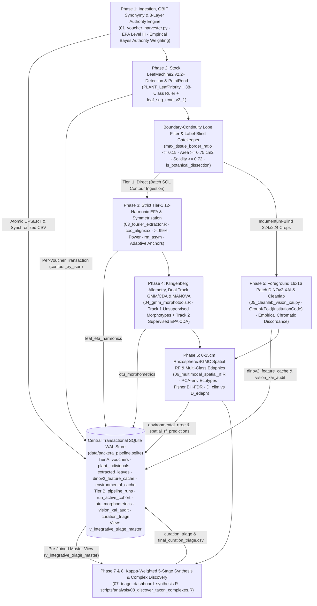

# Automated High-Throughput Vegetative Phenotyping and Herbarium Triage Pipeline for North American *Packera*

### Operationalizing Morphological Diagnosability under the Unified Species Concept

[](https://doi.org/10.5281/zenodo.xxxxxx) [](https://opensource.org/licenses/MIT) [](https://www.python.org/downloads/) [](https://www.r-project.org/)

---

## 🌿 Project Overview

This repository houses the computational and statistical pipeline for the automated high-throughput vegetative phenotyping, morphological diagnosability assessment, and herbarium triage of **North American *Packera* Á. Löve & D. Löve** (Asteraceae: Senecioneae), built around the ***Packera dubia*** **(Spreng.) Trock & Mabb. complex** as the primary Eastern North American dissertation baseline while supporting seamless, taxon-agnostic expansion to all western, boreal, and Mexican *Packera* congeners.

Developed as part of doctoral research at the **University of North Carolina at Chapel Hill** in collaboration with the **UNC Herbarium (NCU)**, this project operationalizes morphological diagnosability under the **Unified Species Concept (USC; de Queiroz 2007)**. Under the USC, species are conceptualized as separately evolving metapopulation lineages. In taxonomically complex plant clades characterized by ecophenotypic plasticity, polyploidy, reticulate hybridization, and historical misidentification, vegetative morphometrics serves as a high-throughput operational screen evaluated via **Integration by Congruence (Padial et al. 2010)** in concert with multiple independent lines of evolutionary evidence:
- **Reproductive Macro-Morphology:** Capitulum aspect ratios, phyllary series counts, ray/disc floret dimensions, and 3-tier optical anthesis staging.
- **Cytotaxonomic Cytotypes:** Known chromosome numbers and ploidy races ($2n = 44, 46, 88$; Kowal 1975).
- **Reduced-Representation Phylogenomics:** High-throughput nextRAD single nucleotide polymorphism (SNP) datasets resolving reticulate evolution and lineage boundaries.
- **Fine-Grain ($0\text{–}15\text{ cm}$ Rhizosphere, 10 m – 30 m Outcrop & Geologic) Niche Validation:** A persistent edaphic and bedrock stack (`data/environmental/fine_grain_edaphic_cache.csv`) combining $0\text{–}15\text{ cm}$ trapezoidal rhizosphere depth-weighted soil properties (`(5 * v_0_5 + 10 * v_5_15) / 15`), 50 m-buffered 1:24,000 USDA-NRCS SSURGO vector map units (`ssurgo_rock_outcrop_pct`, `ssurgo_bedrock_depth_cm`, `ssurgo_aws_0_50cm`), 30 m POLARIS probabilistic soil grids (`polaris_30m/`), 100 m SOLUS100 bedrock depth and coarse rock fragment volume (`solus_100m/`: `resdept`, `fragvol`), 6-class USGS SGMC bedrock lithology (`sgmc_lithology_class`), 10 m – 30 m USGS 3DEP micro-topography (`topo_tpi_30m`, `topo_roughness_30m`, `topo_slope_deg`, `topo_twi_30m`), and 250 m SoilGrids gap-free fallback with partitioned **Climatic ($D_{\text{clim}}, I_{\text{clim}}$) vs. Edaphic-Geologic ($D_{\text{edaph}}, I_{\text{edaph}}$)** Niche Equivalency and Background Similarity tests (Warren et al. 2008; Broennimann et al. 2012).

The computational infrastructure runs end-to-end using **stock LeafMachine2 v2.2+** (`PLANT_LeafPriority` + 38-class Ruler Detector + `leaf_seg_rcnn_v2_1` PointRend) out of the box without requiring manual annotation or custom PCD retraining, coupled with Otsu boundary-continuity lobe rejection (`max_tissue_border_ratio: 0.15`), ruler-calibrated physical area filtering (`min_blade_area_cm2: 0.75`), 100% label-blind classical dimensionless shape gatekeeping (`Solidity >= 0.72`, `Circularity >= 0.25`, `Extent >= 0.35`, plus pinnatifid and bipinnatisect dissection gates via `is_botanical_dissection()`), strict `Tier_1_Direct` closed-contour Elliptic Fourier Analysis (`Momocs`), uniform bilateral symmetrization (Claude 2008), unweighted Operational Taxonomic Unit (OTU) median aggregation, a **hierarchical Beta-Binomial Empirical Bayes authority weighting engine** (`scripts/morphometrics/authority_weighting_utils.R`) with adaptive Bronze anchor promotion for Gold-poor taxa, Klingenberg (2016) allometric slope homogeneity testing, taphonomic indumentum-blind `dinov2_vitb14_reg` foreground patch-token pooling with Cleanlab confident learning, and out-of-fold Cohen's $\kappa$ reliability-weighted multi-modal synthesis.

- **Principal Investigator:** J. Brandon Fuller (PhD Candidate, Department of Biology, UNC-CH)  
- **Faculty Advisor:** Dr. Alan S. Weakley (Director, NCU Herbarium; UNC Biology)  
- **Standard Operating Procedure:** `UNC-BOT-SOP-2026-04-REV5`  
- **Dissertation Baseline Taxa:** *Packera dubia* (formerly *P. tomentosa* / *Senecio tomentosus*), *Packera anonyma*, *Packera plattensis*, *Packera paupercula* (including var. *paupercula* and var. *savannarum*), and allied Eastern North American lineages (*P. aurea*, *P. obovata*, *P. glabella*, *P. schweinitziana*, *P. millefolium*, *P. crawfordii*, *P. serpenticola*), seamlessly expandable to all 50+ North American *Packera* taxa.

---

## ⚙️ Architecture & Fully Automated Production Workflow

The pipeline operates out of the box as a **fully automated, zero-manual-annotation production workflow** orchestrated via `./run_pipeline.sh` or `python main.py` under a **Canonical Two-Tier Storage Architecture**:

* **Tier A — Canonical Shared Store (`data/` at repository root):** Houses all invariant Step 01 and Step 02 specimen, environmental (`fine_grain_edaphic_cache.csv`), relational database (`data/packera_pipeline.sqlite`), and organ extraction assets (`raw_vouchers/`, `masks/{tier1_intact,tier2_reflected}/`, `contours/`, `cropped_patches/{rosettes_dense,basal_leaves_raw,capitula}/`, and the 5 Step 01–02 CSV manifests in `data/tables/`).
* **Tier B — Run-Scoped Analysis Directories (`runs/<RUN_ID>/` with `runs/latest` symlink):** Automatically registers `pipeline_runs` and populates `run_active_cohort` in `data/packera_pipeline.sqlite`, seeds Step 01–02 CSV inputs directly from canonical root `data/`, symlinks masks/contours/cropped_patches without referencing previous `runs/` directories, and isolates all Step 03–08 statistical tables, reports, logs, and figures inside `runs/<RUN_ID>/`.

### Empirical Phase-by-Phase Protocol Summary (Steps 01–08)

1. **Phase 1 — Taxonomic Ingestion, 3-Layer Authority Engine & EPA Level III Ecoregions (`01_voucher_harvester.py` & `scripts/core/harvester.py`):**
   - Harvests GBIF and iDigBio Darwin Core archives across North America, standardizing synonymy and historical *Senecio* / *Cineraria* basionyms dynamically across all North American *Packera* species via `expand_taxon_synonyms_gbif()`, caching synonyms in `taxon_synonyms` and performing atomic UPSERT transactions into `vouchers` in `data/packera_pipeline.sqlite` alongside the canonical 26-column CSV export (`data/tables/curated_vouchers.csv`).
   - **Geographic Scope Controls:** Governed by `--geographic-scope {eastern_na,north_america,global}` (default: `eastern_na`, excluding longitudes $< -106.65$ for Eastern NA dissertation runs; setting `north_america` or `global` disables the western filter), `--include-western` (retains occurrences west of $-106.65$ across western US, Canada, and Mexico), and `--countries` (default `["US"]`, expandable to `["US", "CA", "MX"]`).
   - **3-Layer Dynamic Expert & Herbarium Authority Engine (`parse_determiner_tier()`):**
     - *Layer 1 (Genus-Wide Monographer Heuristics):* Expanded `SPECIALIST_PATTERNS` covering North American *Packera* and *Senecioneae* monographers and flora authors (Barkley, Trock, Kowal, Weakley, Bain, Mahoney, Fuller, Freeman, Cronquist, Greenman, Weber, Á. Löve & D. Löve, Spellenberg, Pippen, Uttal, Fernald, Rydberg, Heller, Kral, Godfrey, Sorrie, Nesom, Strother, Turner, Golden).
     - *Layer 2 (Automatic Protologue Author Extraction):* `extract_protologue_authors()` parses basionym and combination authors directly from Darwin Core `scientificName` strings; sheets annotated by a nomenclatural author of that taxon are classified as `Tier_1_Gold`.
     - *Layer 3 (Corpus-Derived Multi-Herbarium & Institutional Scoring):* `discover_corpus_authorities()` promotes any determiner who has identified $\ge 5$ specimens of a *Packera* taxon across $\ge 3$ distinct herbaria (`institutionCode`s)—or annotated $\ge 1$ verified type specimen—to `dynamic_specialists` (`Tier_1_Gold`), and promotes herbaria holding $\ge 1$ type specimen or ranking in the top quartile of holdings ($\ge 10$ sheets with $\ge 70\%$ determiner attribution) to `dynamic_herbaria` (`Tier_2_Silver`).
   - Assigns `regional_group` strictly via spatial point-in-polygon intersection against official **US EPA Level III Ecoregions** (Omernik & Griffith 2014; `data/environmental/epa_ecoregions_l3/`), with county-centroid fallback strictly for counties $\ge 95\%$ contained within a single ecoregion.
2. **Phase 2 — Stock LeafMachine2 v2.2+ Segmentation, Label-Blind Gatekeeper & Botanical Geometry (`02_segment_and_extract.py`):**
   - **Stock LeafMachine2 v2.2+ Configuration (`configure_leafmachine2.py`):** Uses stock `PLANT_LeafPriority` (`minimum_confidence_threshold: 0.65`) and `leaf_seg_rcnn_v2_1` PointRend checkpoints with `treat_leaflet_as_leaf_whole: False`, `use_efds_for_png_masks: False`, and `do_apply_landmarks: False`.
   - **Per-Voucher Atomic SQLite Transactions & Resumption:** Executes per-voucher atomic SQLite transactions committing decomposing multi-plant vouchers to `plant_individuals`, foliar organs (with embedded 120-vertex `contour_xy_json`) into `extracted_leaves`, and reproductive structures into `voucher_reproductive_phenology`, enabling $O(1)$ SQL resumption checks (`qc_status IN ('PASS', 'FAILED_QC')`) that bypass already processed sheets.
   - **Otsu Boundary-Continuity Lobe Rejection & Calibrated Area Floor:** Rejects severed lobes or unattached fragments where non-paper plant tissue occupies $> 15\%$ of the bounding-box perimeter (`max_tissue_border_ratio: 0.15`), and enforces a ruler-calibrated physical area floor of `min_blade_area_cm2: 0.75` when `is_calibrated_mm == True`.
   - **100% Label-Blind Classical Dissection Gatekeeper (`Tier_1_Direct`):** Evaluates dimensionless morphological descriptors ($\text{Solidity} \ge 0.72$, $\text{Circularity} \ge 0.25$, $\text{Extent} \ge 0.35$, $\text{UCS} \ge 0.85$) with 100% label-blind bilateral sinus topology via `is_botanical_dissection()`, routing pinnatifid ($0.48 \le \text{Solidity} < 0.72$) and bipinnatisect ($0.18 \le \text{Solidity} < 0.48$, $\ge 4$ deep sinuses) blades into `Tier_1_Direct`. Step 02 figures use empirical per-taxon median aspect ratios, dynamic species lists (`present_sp`), and dynamic complex titles.
   - **Post-QC Basal-Leaf-Only Masking (`crop_dense_rosette_tier4`):** Executes after cauline/stem contaminant rejection (`is_cauline_or_stem_contaminant()`) and the `Tier_1_Direct` gatekeeper. Replaces non-basal-leaf tissue (roots, caudex, flowering stems, cauline bracts, rulers, labels, mounting tape) outside the 5-pixel dilated union of verified basal leaf masks with neutral herbarium mounting paper RGB `[242, 239, 230]`, saving crops and companion binary masks (`<catalogNumber>_p<pid>_rosette_mask.png`) in `data/cropped_patches/rosettes_dense/`.
   - **Anatomical Petiole & Flowering Height Approximations:** Approximates basal petiole length ($L_{\text{petiole}} = \max(d_{\text{geodesic}}(p_{\text{base}}, p_{\text{crown}}), \|p_{\text{base}} - p_{\text{crown}}\|_2)$, aggregated at the 75th percentile $P_{75}$ of outer-rosette leaves) and flowering plant scape height ($H_{\text{plant}} = \|p_{\text{bend}} - p_{\text{crown}}\|_2 + \|p_{\text{corymb}} - p_{\text{bend}}\|_2$).
   - **Post-QC Montage Regeneration (`--regenerate-figures-only`):** Invoked automatically after Step 04 in `run_pipeline.sh`, ensuring `fig02a_segmentation_qc_distributions.{pdf,png}` and `fig02b_silhouette_montage.{pdf,png}` display only downstream-QC-validated `Tier_1_Direct` segments dynamically scaled to active taxa.
3. **Phase 3 — Pure `Tier_1_Direct` Closed-Contour EFA, Symmetrization & OTU Medians (`03_fourier_extractor.R`):**
   - **Single-Query Batch Contour Ingestion & Tier 1 Closed Scope:** Ingests 120-vertex normalized contours directly from `extracted_leaves.contour_xy_json` via a single batch SQL query in `03_fourier_extractor.R` (eliminating 14,000+ separate `.csv` file reads on disk). Only intact `Tier_1_Direct` contours enter `Momocs::efourier` (folded/reflected `Tier_2_Reflected` leaves and open-curve approximations are never pooled into EFA).
   - **Inertial Axis Pre-Alignment & $\ge 99\%$ Harmonic Power Calibration:** Contours are centered and aligned along their major inertial axis (`Momocs::coo_alignxax` with circularity $> 0.75$ suborbicular guard), verified via `Momocs::calibrate_harmonicpower_efourier` to capture $\ge 99\%$ cumulative harmonic power at $H = 12$, and decomposed with `Momocs::efourier(..., nb.h = 12, norm = FALSE, start = FALSE)`.
   - **Uniform Symmetrization, MCD Outlier Gating & Persistence:** Applies `Momocs::rm_asym(ef)` uniformly (Claude 2008), removes anomalous contours via Minimum Covariance Determinant (MCD) Mahalanobis distance (`MASS::cov.rob`, $p < 0.001$) and `pct_asymmetry > 0.22 | harmonic_roughness > 0.15`, aggregates multi-leaf vouchers to the Specimen / Operational Taxonomic Unit (`(catalogNumber, plant_individual_id)`) via **unweighted coordinate-wise median** harmonics and PCs (`morph_tier_source = "Tier_1_Pure"`), and persists results into `leaf_efa_harmonics` in SQLite alongside `leaf_efa_harmonics.csv` and `fourier_pcs.csv`.
4. **Phase 4 — Klingenberg Allometry, Adaptive Anchor Promotion, Dual Track GMM/CDA & MANOVA (`04_gmm_morphotools.R`):**
   - **Adaptive Reference Anchor Selection (`authority_weighting_utils.R`):** `select_adaptive_reference_anchors()` starts with `Tier_1_Gold` and `Tier_2_Silver` `Tier_1_Pure` vouchers pruned at Mahalanobis $\chi^2_{0.95, p}$. When an under-annotated or rare *Packera* taxon has fewer than `min_anchors_per_taxon` (default 8, or $< 3$) clean Gold+Silver anchors, it automatically promotes the most central `Tier_3_Bronze` `Tier_1_Pure` vouchers within $\chi^2_{0.80, p}$ of the taxon medoid (`is_promoted_anchor = TRUE`) so PCA, allometry, GMM, and CDA never fail on Gold-poor species.
   - **Hierarchical Beta-Binomial Empirical Bayes Authority Weighting:** `compute_empirical_bayes_authority_weights()` unifies authority weights ($\alpha_0 = 5.0$, prior reliabilities $\pi_{\text{Gold}} = 0.95$, $\pi_{\text{Silver}} = 0.85$, $\pi_{\text{Promoted Bronze}} = 0.65$, $\pi_{\text{Unpromoted Bronze}} = 0.35$):
     $$w_{t, \text{tier}} = \frac{\alpha_0 \pi_{\text{tier}} + \sum_{i \in (t, \text{tier})} (1 - \hat{\epsilon}_i)}{\alpha_0 + n_{t, \text{tier}}}$$
     In `"active_passive"` mode, unpromoted `Tier_3_Bronze` receive $0.0$ (passive projection), while active anchors receive precision weights rescaled to mean $1.0$.
   - **Klingenberg (2016) Allometric Slope Homogeneity Testing:** Tests `PC ~ log_centsize * species_standardized` ($\alpha = 0.01$) on ruler-calibrated (`is_calibrated_mm == TRUE`) active anchors before applying common-slope within-group allometric correction.
   - **Dual Clustering Architecture, Relational Persistence & Parametric MANOVA:**
     - *Track 1 (Unsupervised Morphological Clustering):* Fits `mclust::Mclust` across $G = 1 \dots K_{\max}$ (`gmm_bayes_factors_summary.csv`), extracting the optimal mixture (`Morphotype_K1..Kn`) for unsupervised CDA and `fig04_gmm_cda_clustering.{pdf,png}`. Exports `cda_second_taxon`, `cda_second_posterior_prob`, and `cda_posterior_margin`.
     - *Track 2 (Supervised EPA Level III Ecoregion CDA):* Supervised CDA across polygon-verified EPA Level III Ecoregions (`ecoregion_supervised_cda_summary.csv`, `fig04c_supervised_ecoregion_cda.{pdf,png}`).
     - *Relational Persistence:* Persists complete OTU morphometrics, GMM clusters, canonical scores (`can1`, `can2`, `can3`), and misidentification flags into `otu_morphometrics` in SQLite and synchronizes `morphometric_flags.csv`.
     - *Parametric Omnibus & Pairwise MANOVA:* Exports `manova_group_significance.csv` (Pillai's Trace, Wilks' $\Lambda$, approx $F$, partial $\eta^2$, BH-adjusted $q$) and `manova_pairwise_posthoc.csv` (pairwise Hotelling's $T^2$ contrasts).
5. **Phase 5 — Taphonomic Indumentum-Blind Vision XAI, Dilated Masking & Cleanlab (`05_cleanlab_vision_xai.py`):**
   - **`Tier_1_Direct` Basal Leaf Linking & Masking (`load_and_link_rosette_patches`):** Links each specimen `(catalogNumber, plant_individual_id)` to verified `Tier_1_Direct` basal leaf crops (`data/cropped_patches/basal_leaves_raw/`) and binary masks (`data/masks/tier1_intact/` via `--manifest-csv data/tables/extracted_leaf_manifest.csv`), falling back to masked `rosettes_dense` crops with companion masks (`<cat>_p<pid>_rosette_mask.png`).
   - Applies a $\sigma = 1.0\text{ px}$ Gaussian low-pass filter on $224 \times 224$ crops (`apply_indumentum_blind_lowpass`) composited onto neutral herbarium paper (`[242, 239, 230]`) to attenuate taphonomic trichome abrasion and paper-edge bias. Foliar surface orientation (`classify_foliar_surface_orientation()`), CIE $L^*$ luminance, and HSV saturation are computed strictly inside the verified leaf lamina mask.
   - **Foreground Energy Attention Ratio & DINOv2 Feature Caching:** Extracts `dinov2_vitb14_reg` features via foreground-masked $16 \times 16$ spatial patch token average pooling (`compute_foreground_patch_mask`). Computes empirical `foreground_attention_ratio` for **every** specimen, flagging `foreground_attention_ratio < 0.65` as `is_artifact_driven = TRUE`. Caches 768-d float32 embeddings and attention ratios in `dinov2_feature_cache` in `data/packera_pipeline.sqlite`, completely bypassing redundant model loading and GPU forward passes in subsequent runs.
   - **Cleanlab Confident Learning & OOD Auditing:** Trains balanced L2 linear probes on Gold/Silver/promoted anchors using `institutionCode`-grouped `StratifiedGroupKFold` with Platt/temperature calibration, prunes label noise via class-conditional `prune_by_noise_rate`, computes feature-space Mahalanobis + cosine $k$-NN OOD scores (`vision_ood_score`, `vision_is_ood`), generates `GradCAM_audit_panel.pdf`, and persists out-of-fold predictions into `vision_xai_audit` and `label_noise_audit.csv`.
   - **Empirical Chromatic Vestiture Discordance Rule:** Generalizes `tomentum_taxon_discordance` to an empirical chromatic audit: flagged on abaxial sheets (`surface_orientation == "abaxial"`) with `given_label != predicted_label` and `c_error > error_threshold` when the predicted taxon has higher empirical median CIE $L^*$ luminance (`med_L[pred] >= med_L[given] + 2.0`) or lower HSV saturation (`med_S[pred] <= med_S[given] - 0.02`), or when `mean_luminance > Q75_L[given]`.
6. **Phase 6 — Multi-Class Substrate Contingency, Organic `PCA-env` Ecotypes & Spatial RF (`06_multimodal_spatial_rf.R`):**
   - **Multi-Scale Pedological/Lithological Caching & R*Tree Spatial Index:** Caches 0–15 cm rhizosphere SSURGO, 30m POLARIS, 100m SOLUS100, 30m 3DEP, and USGS SGMC bedrock lithology in `environmental_cache` with an SQLite R*Tree spatial index (`environmental_rtree`), enabling sub-millisecond bounding box and coordinate spatial queries.
   - **Strict Non-Blended Coalesce Hierarchy:** Integrates $0\text{–}15\text{ cm}$ trapezoidal rhizosphere depth-weighting (`(5 * v_0_5 + 10 * v_5_15) / 15`), 50m-buffered 1:24,000 USDA SSURGO, 30m POLARIS/gSSURGO, 100m SOLUS100 (`bdricm`/`resdept_r`, `cfvo`, `awc`, compositional log-ratio texture `alr_sand_clay`, `alr_silt_clay`), 6-class USGS SGMC bedrock lithology (`sgmc_lithology_class`), and 10m–30m USGS 3DEP micro-topography (`topo_tpi_30m`, `topo_roughness_30m`, `topo_slope_deg`, `topo_twi_30m`). 100% SSURGO / 30m POLARIS / 100m SOLUS100 in CONUS; 250m SoilGrids strictly non-CONUS fallback when both are `NA`.
   - **Exhaustive Multi-Class Substrate Contingency (`micro_edaphic_outcrop_contingency.csv`):** Exhaustive $2 \times 2$ Fisher's Exact Tests with Benjamini-Hochberg FDR correction across all 6 USGS SGMC lithological classes and SSURGO outcrop/drainage classes, reporting `Dominant_Lithology_Class`, `Top_Substrate_Odds_Ratio`, and omnibus $p$-values. Sets `substrate_specialist_flag` dynamically when empirical outcrop/azonal frequency $> 0.30$ or odds ratio $> 2.0$.
   - **Organic `PCA-env` Intraspecific Ecotypes:** In single-taxon intraspecific mode (`--intraspecific-mode`), partitions vouchers in standardized `PCA-env` space into $K = 2..3$ clusters via $k$-means, naming clusters dynamically after the top-loading environmental predictor (`Ecotype_1_<TopVar>_Low` and `Ecotype_2_<TopVar>_High`).
   - **Dynamic Top-Importance RF Plotting & Relational Persistence:** Panels B and C of `fig06_ecological_niche_phenology.{pdf,png}` dynamically plot top environmental predictors. Persists spatial Random Forest out-of-fold probabilities and Hopkins phenology metrics into `spatial_rf_predictions` in SQLite and synchronizes `multimodal_conflict_flags.csv`.
7. **Phase 7 & 8 — Taxon-Agnostic Decision Matrix, Master View Synthesis & Complex Discovery (`07_triage_dashboard_synthesis.R`, `08_discover_taxon_complexes.R`):**
   - **Unified Relational Master View (`v_integrative_triage_master`):** Step 07 queries the pre-joined SQL view `v_integrative_triage_master` in `data/packera_pipeline.sqlite`, seamlessly joining vouchers, plant individuals, reproductive traits, OTU morphometrics, vision XAI, spatial RF, and edaphic caches across active cohorts while guaranteeing 100% retention of non-georeferenced historical sheets.
   - **Taxon-Agnostic 5-Stage Decision Matrix:** Evaluates modalities weighted by out-of-fold Cohen's $\kappa_m$ dynamically renormalized over observed modalities (`98.4%` voucher completion) and Hopkins circular anthesis phenology (`atan2` residuals). Stage 1 vision-supported reassignments are gated on `!is_artifact_driven` (`foreground_attention_ratio >= 0.65`). Stage 2 (`Candidate_Taxonomic_Boundary_Zone`) resolves secondary morphological parents via `cda_second_taxon`. Stage 3 (`Putative_Cryptic_Species`) incorporates `vision_is_ood` / `vision_ood_score >= 0.65` as corroborating deep visual divergence. Stage 4/5 evaluate `Ecophenotypic_Plasticity` and `Subspecies_Ecotype`. Persists consensus calls into `curation_triage` and exports `final_curation_triage.csv`.
   - **Dynamic Map Bounding Boxes:** Computes `xlim_map` and `ylim_map` dynamically from observed North American voucher coordinates (`lon in [-170, -50]`, `lat in [14, 72]`) padded by 12% of the spatial span (minimum $8^\circ \text{ lon} \times 6^\circ \text{ lat}$).
   - **Dynamic Taxonomic Revision Summaries:** Step 07 dynamically generates per-species empirical treatments for every taxon in `active_taxa`, exporting `Packera_Taxonomic_Revision_Summary.md` and `Figure_Integrative_Packera_Revision.pdf` (or `<Focal_Taxon>_Taxonomic_Revision_Summary.md` and `Figure_Integrative_<Focal_Taxon>_Revision.pdf` when `--focal-taxon` is set).
   - **Step 08 Complex Discovery (`scripts/analysis/08_discover_taxon_complexes.R`):** Executed after Step 06 with `--multimodal "${RUN_DIR}/data/tables/multimodal_conflict_flags.csv"`, joining fine-scale SSURGO/SoilGrids edaphic and climatic distances (`edaphic_schoener_d`, `schoener_d`). Automatically resolves Taxon x GMM Morphotype subclusters when $N_{\text{taxa}} \le 2$, discovering species complexes via unsupervised Leiden/Louvain graph modularity and Ward.D2 clustering.


```mermaid
flowchart TD
    DB[("Central Transactional SQLite WAL Store\n(data/packera_pipeline.sqlite)\nTier A: vouchers · plant_individuals · extracted_leaves · dinov2_feature_cache · environmental_cache\nTier B: pipeline_runs · run_active_cohort · otu_morphometrics · vision_xai_audit · curation_triage\nView: v_integrative_triage_master")]

    B1["Phase 1: Ingestion, GBIF Synonymy & 3-Layer Authority Engine\n(01_voucher_harvester.py · EPA Level III · Empirical Bayes Authority Weighting)"] -->|"Atomic UPSERT & Synchronized CSV"| DB
    B1 --> B2["Phase 2: Stock LeafMachine2 v2.2+ Detection & PointRend\n(PLANT_LeafPriority + 38-Class Ruler + leaf_seg_rcnn_v2_1)"]
    B2 -->|"Per-Voucher Transaction (contour_xy_json)"| DB
    B2 --> B3["Boundary-Continuity Lobe Filter & Label-Blind Gatekeeper\n(max_tissue_border_ratio <= 0.15 · Area >= 0.75 cm2 · Solidity >= 0.72 · is_botanical_dissection)"]
    B3 -->|"Tier_1_Direct (Batch SQL Contour Ingestion)"| B4["Phase 3: Strict Tier-1 12-Harmonic EFA & Symmetrization\n(03_fourier_extractor.R · coo_alignxax · >=99% Power · rm_asym · Adaptive Anchors)"]
    B4 -->|"leaf_efa_harmonics"| DB
    B4 --> B5["Phase 4: Klingenberg Allometry, Dual Track GMM/CDA & MANOVA\n(04_gmm_morphotools.R · Track 1 Unsupervised Morphotypes + Track 2 Supervised EPA CDA)"]
    B5 -->|"otu_morphometrics"| DB
    B3 -->|"Indumentum-Blind 224x224 Crops"| B6["Phase 5: Foreground 16x16 Patch DINOv2 XAI & Cleanlab\n(05_cleanlab_vision_xai.py · GroupKFold(institutionCode) · Empirical Chromatic Discordance)"]
    B6 -->|"dinov2_feature_cache & vision_xai_audit"| DB
    B5 & B6 --> B7["Phase 6: 0-15cm Rhizosphere/SGMC Spatial RF & Multi-Class Edaphics\n(06_multimodal_spatial_rf.R · PCA-env Ecotypes · Fisher BH-FDR · D_clim vs D_edaph)"]
    B7 -->|"environmental_rtree & spatial_rf_predictions"| DB
    B7 --> B8["Phase 7 & 8: Kappa-Weighted 5-Stage Synthesis & Complex Discovery\n(07_triage_dashboard_synthesis.R · scripts/analysis/08_discover_taxon_complexes.R)"]
    DB -->|"Pre-Joined Master View (v_integrative_triage_master)"| B8
    B8 -->|"curation_triage & final_curation_triage.csv"| DB
```

---

## 📁 Streamlined Repository Structure

```text
Packera_dubia_morphometrics/
├── config/
│   └── config.yaml                    # Central paths, taxon synonyms & empirical thresholds
├── run_pipeline.sh                    # Run-scoped orchestrator CLI (--run-id, --db, --start-step, --exclude-taxon, --focal-taxon)
├── main.py                            # Unified Python CLI runner (check-env, harvest, segment, morphometrics, synthesis, run-all)
├── LeafMachine2/                      # Immutable stock LeafMachine2 v2.2+ engine submodule
│   ├── LeafMachine2.py
│   └── leafmachine2/
├── data/                              # Tier A: Canonical Shared Store (Invariant Step 01–02 & Environmental Assets)
│   ├── packera_pipeline.sqlite        # Central transactional SQLite WAL relational store (Tier A + Tier B tables & views)
│   ├── raw_vouchers/                  # High-resolution specimen sheet imagery (.jpg)
│   ├── masks/                         # Canonical binary leaf silhouettes (tier1_intact/, tier2_reflected/)
│   ├── contours/                      # Canonical homologized 120-vertex 2D coordinate contours (.csv, mirrored in SQLite)
│   ├── cropped_patches/               # Canonical organ RGB crops for DINOv2 & phenology
│   │   ├── basal_leaves_raw/          # Cropped Tier_1_Direct basal leaf RGB patches
│   │   ├── capitula/                  # Cropped reproductive head patches (3-tier anthesis staging)
│   │   └── rosettes_dense/            # DBSCAN per-individual whole-rosette RGB crops
│   ├── environmental/                 # 0–15cm Rhizosphere, 10m–30m Outcrop, EPA Level III Ecoregions & SGMC Stack
│   │   ├── epa_ecoregions_l3/         # Official US EPA Level III Ecoregion spatial polygons (Omernik & Griffith 2014)
│   │   ├── fine_grain_edaphic_cache.csv # Persistent SSURGO + POLARIS + SOLUS100 + 3DEP + SGMC cache
│   │   ├── polaris_30m/               # 30 m POLARIS probabilistic soil rasters (0–5 & 5–15 cm)
│   │   ├── solus_100m/                # 100 m SOLUS100 rasters (resdept bedrock depth, fragvol rock fragments)
│   │   ├── dem_3dep_30m/              # 10 m – 30 m USGS 3DEP DEM tiles (TPI, roughness, slope, TWI)
│   │   └── ssurgo_cache/              # 50 m-buffered USDA-NRCS SSURGO SDA query cache
│   └── tables/                        # Canonical Step 01–02 CSV manifests (seeded into runs/<RUN_ID>/)
│       ├── curated_vouchers.csv       # Harvested vouchers with Determiner Authority Tiers & EPA Ecoregions (26 cols)
│       ├── extracted_leaf_manifest.csv# Stage 2 leaf routing, DBSCAN plant_individual_id, petiole metrics & ruler calibration
│       ├── failed_qc_vouchers.csv     # Vouchers rejected by Stage 2 basal/cauline/boundary quality gatekeeper
│       ├── voucher_reproductive_metrics.csv # Capitulum counts, involucre dimensions (px & mm) & flowering plant height
│       └── voucher_phenological_states.csv  # 3-tier optical capitulum phenology classifications
├── runs/                              # Tier B: Run-Scoped Analysis Directories (Steps 03–08)
│   ├── latest -> run_<YYYYMMDD_HHMMSS># Symlink to most recent run directory
│   └── <RUN_ID>/                      # Self-contained run directory (data/tables/, outputs/figures/, outputs/reports/, logs/)
├── scripts/
│   ├── core/                          # Consolidated shared utilities
│   │   ├── db.py                      # Central SQLite WAL + DuckDB relational engine & atomic export bridge
│   │   ├── db_utils.R                 # Cross-language DBI/RSQLite interface for R pipeline stages (03–08)
│   │   ├── harvester.py               # Combined API queries, DwC 26-col parsing, EPA L3 intersection & media downloads
│   │   ├── artifact_manager.py        # Model weight verification & SHA256 integrity checks
│   │   ├── config.py                  # Python-side configuration schema
│   │   └── logger.py                  # Structured console and file logger
│   ├── data_prep/                     # Phase 1: Data harvesting and pruning
│   │   ├── 01_voucher_harvester.py    # Ingestion, dynamic taxon standardization & EPA Level III ecoregion assignment
│   │   └── audit_and_prune_vouchers.py# Dataset integrity and invalid image pruner
│   ├── pipeline/                      # Phase 2: Production segmentation & extraction
│   │   └── 02_segment_and_extract.py  # Stock LM2 v2.2+ + PointRend + gatekeeper, petiole/height metrics & montage regeneration
│   ├── vision/                        # Botanical geometry, LM2 loaders & phenology classifiers
│   │   ├── capitulum_phenology_classifier.py # Optical biomarker phenotyping (pappus, corolla)
│   │   ├── configure_leafmachine2.py  # Stock LM2 v2.2+ configuration builder
│   │   ├── lm2_data_loader.py         # Stage 1 YOLOv5 PLANT_LeafPriority & 38-class Ruler loader
│   │   ├── lm2_geometry_utils.py      # Boundary-continuity filter, classical descriptors & base homologization
│   │   └── tune_geometry_parameters.py# Empirical threshold calibrator
│   ├── morphometrics/                 # Canonical R statistical morphometrics, allometry & 3D plotting
│   │   ├── 03_fourier_extractor.R     # Strict Tier-1 12-harmonic EFA, coo_alignxax, rm_asym, MCD & OTU medians
│   │   ├── 04_gmm_morphotools.R       # Klingenberg allometry, Horn/Williams-Titus PCA, Kass-Raftery GMM, Track 1/2 CDA & MANOVA
│   │   ├── authority_weighting_utils.R# Empirical Bayes Beta-Binomial shrinkage & adaptive Bronze anchor promotion
│   │   └── pub_figures_utils.R        # Okabe-Ito palettes, plot_3d_scatter_box & unfilled marker helpers
│   ├── analysis/                      # Deep vision, 0–15cm rhizosphere macroecology, complex discovery & synthesis
│   │   ├── 05_cleanlab_vision_xai.py  # Indumentum-blind dinov2_vitb14_reg foreground patch pooling, Cleanlab & OOD
│   │   ├── 06_multimodal_spatial_rf.R # 0–15cm Spatial RF, uncertainty buffers, VIF pruning & niche equivalency
│   │   ├── 07_triage_dashboard_synthesis.R # Kappa-weighted consensus, Hopkins circular phenology & 5-stage matrix
│   │   ├── 08_discover_taxon_complexes.R # Unsupervised Leiden/Louvain & Ward.D2 taxon-complex discovery
│   │   └── edaphic_fine_grain_utils.R # SSURGO, POLARIS, SOLUS100, 3DEP & USGS SGMC lithology extractor
│   ├── annotation_and_training/       # Optional standalone utilities (not required by automated pipeline)
│   │   ├── annotate_with_sam2.py
│   │   ├── sam2_annotator_utils.py
│   │   └── finetune_lm2_pcd.py
│   ├── tests/                         # Unit and integration test suite
│   │   ├── test_sql_pipeline_handshake.py # Relational schema, WAL mode, FK cascade, & cross-stage test suite
│   │   └── ...
│   └── _archive/                      # Decommissioned scripts (isolated; never imported by active code)
├── outputs/
│   ├── figures/                       # Publication plots, 3D PCA/CDA ordinations & QC panels
│   └── reports/                       # Taxonomic summaries, BIC tables & manifests
├── requirements.txt                   # Primary Python dependencies
└── README.md
```

---

## 🚀 Execution Guide

### ⚡ Quick-Start Copy-Paste Terminal Cheat-Sheet

#### A. Environment Activation & Preflight Verification
```bash
source .venv/bin/activate
python main.py check-env
```

#### B. End-to-End Automated Pipeline & `run_pipeline.sh` CLI Reference
Every execution launched via `./run_pipeline.sh` or `python main.py` operates under the **Canonical Two-Tier Storage Architecture**: invariant Step 01–02 assets reside in canonical root `data/` and are automatically seeded/symlinked into `runs/<RUN_ID>/` (updating `runs/latest`), while all Step 03–08 statistical tables, reports, logs (`logs/pipeline.log`), and publication figures (`.pdf` + 300-DPI `.png`) are isolated inside `runs/<RUN_ID>/`.

```bash
source .venv/bin/activate

# 0. One-line CSV-to-SQLite Bootstrap & Synchronization:
#    Ingests existing CSV manifests and 120-vertex contours into data/packera_pipeline.sqlite:
python3 -c "from scripts.core.db import ingest_existing_csvs_to_db; print(ingest_existing_csvs_to_db())"

# 1. Default zero-flag genus-wide run (creates runs/run_<YYYYMMDD_HHMMSS>/ and updates runs/latest)
#    Running with NO taxon flags dynamically queries and harvests ALL Packera species across the entire
#    genus from GBIF (discover_genus_packera_species_gbif(), target_species: []):
./run_pipeline.sh

# 2. User-specified taxon subset mode (--taxon "Packera <sp1>" "Packera <sp2>" ...):
#    Analyzes strictly the species specified by the user with zero hardcoded default species or injected outgroups:
./run_pipeline.sh --run-id packera_subset --taxon "Packera dubia" "Packera anonyma" "Packera paupercula"

# 3. Custom named run directory (--run-id <NAME>) reusing cached vouchers & canonical Step 02 assets (--skip-harvest)
./run_pipeline.sh --run-id packera_revision_v1 --skip-harvest

# 4. Resume or launch from any pipeline step (--start-step <1..7>, e.g., Step 03 EFA or Step 06 Spatial RF)
#    Automatically seeds Step 01–02 tables and symlinks masks/contours/cropped_patches from canonical root data/:
./run_pipeline.sh --run-id packera_revision_v1 --skip-harvest --start-step 3
./run_pipeline.sh --run-id packera_revision_v1 --skip-harvest --start-step 6

# 5. Exclude one or more taxa (--exclude-taxon "<TAXON>"):
#    Filters curated_vouchers.csv, Step 02 manifests, and run_active_cohort while dynamically remapping
#    Step 05 DINOv2/Cleanlab class indices to contiguous 0..K-1 (active_taxa):
./run_pipeline.sh --run-id eastern_3taxa --skip-harvest --start-step 3 --exclude-taxon "Packera plattensis"

# 6. Strategy 1 (Focal Taxon + Outgroup Gold Reference Anchors, default --gold-anchors 30):
#    Processes all focal taxon vouchers plus N Tier_1_Gold anchors per outgroup species for Steps 04–06 calibration,
#    then filters Step 07's final triage queue and figures strictly to the focal taxon:
./run_pipeline.sh --run-id dubia_triage --skip-harvest --focal-taxon "Packera dubia" --gold-anchors 30

# 7. Strategy 2 (Pure Intraspecific Delimitation Mode: --focal-taxon "<TAXON>" --intraspecific-mode):
#    Runs strictly on a single species (n_unique_taxa == 1) with zero outgroup specimens, switching Steps 04–06
#    from species_standardized to label-blind GMM morphotypes (Morphotype_K1..K_n or geographic/edaphic ecotypes)
#    to test for cryptic lineages and granite-outcrop ecotypes:
./run_pipeline.sh --run-id dubia_cryptic --skip-harvest --focal-taxon "Packera dubia" --intraspecific-mode

# 8. Step 08: Unsupervised North American Taxon-Complex Discovery (Leiden/Louvain + Ward.D2)
Rscript scripts/analysis/08_discover_taxon_complexes.R \
    --harmonics data/tables/leaf_efa_harmonics.csv \
    --vouchers data/tables/curated_vouchers.csv \
    --multimodal data/tables/multimodal_conflict_flags.csv \
    --vision data/tables/label_noise_audit.csv \
    --output-dir outputs/reports
```

| `run_pipeline.sh` CLI Flag | Argument | Default | Operational Behavior |
| :--- | :--- | :--- | :--- |
| `--run-id` | `<NAME>` | `run_<YYYYMMDD_HHMMSS>` | Isolates all Step 03–08 outputs inside `runs/<NAME>/` and updates the `runs/latest` symlink. |
| `--db` | `<PATH>` | `data/packera_pipeline.sqlite` | Specifies explicit path to the SQLite database (exports `PACKERA_DB_PATH` to all Python and R sub-processes). |
| `--skip-harvest` | *(flag)* | `false` | Skips Step 01 network harvesting and reuses cached `data/tables/curated_vouchers.csv` and local `data/raw_vouchers/` images. |
| `--start-step` | `<1..7>` | `1` | Starts or resumes execution from Step `1`..`7` (e.g., `--start-step 3` or `--start-step 6`), automatically seeding Step 01–02 tables and symlinks from canonical root `data/`. |
| `--taxon` | `"<SP1>" "<SP2>" ...` | *(none / genus-wide)* | Analyzes strictly the species specified by the user with zero hardcoded default species or injected outgroups. When omitted, the pipeline dynamically queries and harvests all *Packera* species across the entire genus from GBIF (`discover_genus_packera_species_gbif()`, `target_species: []`). |
| `--exclude-taxon` | `"<TAXON>"` | *(none)* | Excludes one or more taxa (repeatable, e.g., `--exclude-taxon "Packera plattensis"`), filtering `curated_vouchers.csv`, Step 02 manifests, and `cropped_patches/` while dynamically remapping Step 05 class indices to contiguous `0..K-1` (`active_taxa`). |
| `--focal-taxon` | `"<TAXON>"` | `""` *(all taxa)* | Restricts focal evaluation strictly to the specified species with zero injected outgroups (unless `--gold-anchors <INT>` is specified for Strategy 1). |
| `--gold-anchors` | `<INT>` | `30` | **Strategy 1 (Focal Taxon + Outgroup Reference Anchors):** Retains `N` anchors per outgroup species for Steps 04–06 calibration (cascading fallback across `Tier_1_Gold` -> `Tier_2_Silver` -> `Tier_3_Bronze` when an outgroup taxon lacks `Tier_1_Gold` vouchers), then filters Step 07's final triage queue and figures strictly to `--focal-taxon`. |
| `--intraspecific-mode` | *(flag)* | `false` | **Strategy 2 (Pure Intraspecific Delimitation Mode):** Sets `--gold-anchors 0` (`n_unique_taxa == 1` with zero outgroup specimens), switching Steps 04–06 from `species_standardized` to label-blind GMM morphotypes (`Morphotype_K1..K_n` or geographic/edaphic ecotypes). |
| `--geographic-scope` | `{eastern_na,north_america,global}` | `eastern_na` | Ingestion boundary scope: `eastern_na` enforces the $\ge -106.65$ Eastern North America longitude filter; `north_america` and `global` disable the western cutoff for continent-wide runs. |
| `--include-western` | *(flag)* | `false` | Retains occurrences west of $-106.65$ across the western US, Canada, and Mexico. |
| `--countries` | `"<LIST>"` | `["US"]` | Ingestion country ISO code list (e.g., `["US", "CA", "MX"]`) for continental North American harvesting. |
| `--expand-synonyms` | *(flag)* | `false` | Dynamically queries the GBIF backbone to expand basionyms and synonyms (*Senecio*, *Cineraria*) for all target taxa. |
| `--gold-only` | *(flag)* | `false` | Filters `curated_vouchers.csv`, all Step 02 manifests, and `cropped_patches/` in the run directory strictly to rows where `determiner_tier == 'Tier_1_Gold'` prior to running Steps 02–07. |
| `--determiner-tier` | `<TIER>` | `""` *(all tiers)* | Filters `curated_vouchers.csv`, all Step 02 manifests, and `cropped_patches/` in the run directory strictly to rows matching `<TIER>` (e.g., `Tier_1_Gold`, `Tier_2_Silver`, or `Tier_3_Bronze`) prior to running Steps 02–07. |
| `--exclude-misidentified` | *(flag)* | `false` | Filters out any `catalogNumber` with `taxonomic_treatment_subtype == 'Misidentification_Reassign'` (retaining only `Confirmed_Species`, `Hybrid_Introgressant`, `Subspecies_Ecotype`, `Ecophenotypic_Plasticity`, and `Putative_Cryptic_Species`) across `curated_vouchers.csv`, Step 02 manifests, and `cropped_patches/` during preflight. |
| `--triage-source` | `<RUN_ID_OR_ALL>` | `ALL` | Specifies the triage report source(s) for `--exclude-misidentified` (defaults to `ALL` existing `runs/*/outputs/reports/final_curation_triage.csv`, or accepts a specific `<RUN_ID>` / comma-separated list of run IDs). |
| `--discover-complexes` | *(flag)* | `false` | Triggers Step 08 quantitative taxon-complex discovery engine (Leiden/Louvain graph modularity + Ward.D2). |
| `--auto-neighbors` | *(flag)* | `false` | Automatically discovers nearest phylogenetic/morphological congeners for focal taxon and generates affinity matrix. |
| `--min-affinity` | `<FLOAT>` | `0.03` | Minimum multi-modal affinity threshold for connecting species nodes in the taxon-complex network graph. |
| `--spatial-thin-km` | `<FLOAT>` | `0` *(off)* | Spatial thinning radius (km) applied to occurrences to attenuate herbarium collection clustering. |
| `--max-per-state` | `<INT>` | *(unlimited)* | Maximum number of vouchers ingested per state/province to balance geographic sampling. |
| `--max-per-region` | `<INT>` | *(unlimited)* | Maximum number of vouchers ingested per EPA Level III Ecoregion. |
| `--no-spatial-weights`| *(flag)* | `false` | Disables spatial kernel balance downweighting in Step 04–06 model fits. |
| `--regenerate-figures-only` | *(flag)* | `false` | Step 02 flag (invoked after Step 04) that re-reads validated Step 02–04 manifests to re-render `fig02a` and `fig02b` with clean post-QC silhouettes. |
| `--force` / `--overwrite` | *(flag)* | `false` | Forces re-computation and overwrites existing run artifacts. |
| `--resegment` / `--force-segment` | *(flag)* | `false` | Forces fresh Step 02 LeafMachine2 + PointRend segmentation instead of reusing canonical root `data/masks/` and `data/contours/`. |
| `--limit` | `<N>` | `0` *(all)* | Restricts execution to a pilot subset of the first `N` vouchers. |
| `--sam2-refine` | *(flag)* | `false` | Optional automated LM2-guided SAM 2 sub-pixel boundary refinement in Step 02 (`02_segment_and_extract.py`). |

#### C. Phase-by-Phase Execution via Unified `main.py` CLI
```bash
source .venv/bin/activate

# Phase 1: Harvest GBIF/iDigBio vouchers & stratify active/passive determiner authority tiers
python main.py harvest --max-records 5000 --download-images

# Phase 2: Two-stage stock LeafMachine2 v2.2+ (PLANT_LeafPriority + Ruler + leaf_seg_rcnn_v2_1 PointRend)
python main.py segment

# Phase 3 & 4: Strict Tier-1 12-Harmonic EFA (Momocs), Klingenberg Allometry, Kass-Raftery GMM & Passive CDA
python main.py morphometrics --harmonics 12

# Phase 5, 6 & 7: Indumentum-Blind DINOv2 + Cleanlab XAI, 0–15cm Spatial RF, & 5-Stage Triage Synthesis
python main.py synthesis
```

#### D. Automated QA & Test Suite Commands
```bash
source .venv/bin/activate
python3 -m unittest discover -s scripts/tests -p "test_*.py" -v
```

---

## 🔬 Methodological Highlights

1. **Strict Active/Passive Determiner Authority Split & Dawid-Skene Precision Weighting (`Tier_3_Bronze = 0.0`):** Rather than arbitrary heuristic multipliers that allow large volumes of unverified herbarium records to swamp specialist determinations, the pipeline enforces a strict active/passive authority split (Šlenker et al. 2022; Dawid & Skene 1979):
   - 🥇 **Active Reference Anchors (`Tier_1_Gold` & `Tier_2_Silver`, `authority_weight = 1.0` or $w_k = 1 - \text{error\_rate}_k$):** Monographic/type-verified determinations (`Tier_1_Gold`) and curated regional specialist determinations (`Tier_2_Silver`) after per-taxon $\chi^2_{0.95}$ Mahalanobis outlier pruning form the exclusive training anchor set for supervised CDA, allometric regression, Cleanlab cross-validation, and Spatial Random Forests.
   - 🥉 **Passively Projected Vouchers (`Tier_3_Bronze`, `authority_weight = 0.0`):** General floristic collections and unverified aggregator records receive zero weight (`0.0`) during model fitting and are projected passively (`predict()` / `predict_proba()`) into the fitted morphospace, CDA canonical space, and GMM clusters.
2. **Stock LeafMachine2 v2.2+ Segmentation, Boundary-Continuity Lobe Rejection & Classical Descriptors:** Stage 1 runs stock LeafMachine2 v2.2+ `PLANT_LeafPriority` (`minimum_confidence_threshold: 0.65`, `treat_leaflet_as_leaf_whole: False`, `use_efds_for_png_masks: False`, `do_apply_landmarks: False`) and the 38-class Ruler Detector, followed by Stage 2 native-DPI PointRend (`leaf_seg_rcnn_v2_1`). Otsu boundary-continuity lobe filtering (`is_truncated_lobe_or_leaflet`, `max_tissue_border_ratio: 0.15`) rejects severed terminal lobes, ruler-calibrated sheets enforce `min_blade_area_cm2: 0.75`, and classical dimensionless descriptors (`Solidity >= 0.72`, `Circularity >= 0.25`, `Extent >= 0.35`, plus pinnatifid $0.48\text{–}0.72$ and bipinnatisect $0.18\text{–}0.48$ dissection gates) route intact basal blades into `Tier_1_Direct`.
3. **Strict `Tier_1_Direct` Closed-Contour EFA, Inertial Pre-Alignment, Symmetrization & Unweighted OTU Medians (`03_fourier_extractor.R`):** Only intact `Tier_1_Direct` basal leaf contours enter `Momocs::efourier` (never pooling mirrored hemi-blades or open-curve approximations into EFA). Contours undergo inertial axis pre-alignment (`Momocs::coo_alignxax` with circularity $> 0.75$ suborbicular guard), empirical $\ge 99\%$ cumulative harmonic power verification at $H = 12$ (`calibrate_harmonicpower_efourier`), uniform bilateral symmetrization (`Momocs::rm_asym(ef)`, Claude 2008), and Minimum Covariance Determinant (MCD) Mahalanobis outlier filtering (`MASS::cov.rob`, $p < 0.001$), followed by **unweighted coordinate-wise median** aggregation to the Specimen / Operational Taxonomic Unit (`(catalogNumber, plant_individual_id)`).
4. **Klingenberg (2016) Allometric Slope Homogeneity, Dual-Track GMM/CDA & Parametric MANOVA (`04_gmm_morphotools.R`):** Tests homogeneity of allometric slopes (`PC ~ log_centsize * species_standardized` at $\alpha = 0.01$, Klingenberg 2016) on ruler-calibrated (`is_calibrated_mm == TRUE`) active anchors before applying pooled within-group size correction (`allometry_significance_audit.csv`, `allometry_pairwise_trajectories.csv`, `allometry_homogeneity_test.csv`). Selects informative PCs via Horn's Parallel Analysis / Broken-Stick capped by Williams & Titus (1988) $P \le \lfloor N_{\min} / 3 \rfloor$. Executes a **Dual Clustering Architecture**: Track 1 evaluates discrete unsupervised morphotypes via `mclust::Mclust` and Kass & Raftery (1995) $2\Delta\text{BIC}$ thresholds ($> 6$ strong, $> 10$ very strong), running unsupervised CDA on `Morphotype_K1..Kn` (`fig04_gmm_cda_clustering.{pdf,png}`); Track 2 runs supervised CDA across polygon-verified EPA Level III Ecoregions (`ecoregion_supervised_cda_summary.csv`, `fig04c_supervised_ecoregion_cda.{pdf,png}`). Evaluates parametric omnibus and pairwise post-hoc MANOVAs (`manova_group_significance.csv`, `manova_pairwise_posthoc.csv`) reporting Pillai's Trace, Wilks' $\Lambda$, approx $F$, partial $\eta^2$, and Hotelling's $T^2$ contrasts. Audits institutional mounting bias via taxon-adjusted marginal models (`lm(PC1 ~ species_standardized + institutionCode)` and `lm(PC2 ~ species_standardized + institutionCode)`).
5. **Taphonomic Indumentum-Blind Vision XAI, Foreground $16 \times 16$ Patch Pooling, `institutionCode` GroupKFold & OOD Scoring (`05_cleanlab_vision_xai.py`):** `load_and_link_rosette_patches()` links each specimen `(catalogNumber, plant_individual_id)` to verified `Tier_1_Direct` basal leaf crops (`data/cropped_patches/basal_leaves_raw/`) and binary masks (`data/masks/tier1_intact/` via `--manifest-csv data/tables/extracted_leaf_manifest.csv`), falling back to masked `rosettes_dense` crops with companion masks (`<cat>_p<pid>_rosette_mask.png`). Applies a $\sigma = 1.0\text{ px}$ Gaussian low-pass filter on $224 \times 224$ crops (`apply_indumentum_blind_lowpass`) with non-leaf pixels composited onto neutral mounting paper (`[242, 239, 230]`) to attenuate taphonomically abraded trichome/tomentum textures while preserving macro-architectural venation and lobing. Foliar surface orientation, CIE $L^*$ luminance, and HSV saturation are computed strictly inside the verified leaf lamina mask. Extracts `dinov2_vitb14_reg` features via foreground-masked $16 \times 16$ spatial patch token average pooling (`compute_foreground_patch_mask`), computes empirical `foreground_attention_ratio` for **every** specimen in `label_noise_audit.csv`, flagging `foreground_attention_ratio < 0.65` as `is_artifact_driven = TRUE`, trains on Gold/Silver anchors using `institutionCode`-grouped `StratifiedGroupKFold` with Platt/temperature calibration, runs class-conditional Cleanlab `prune_by_noise_rate`, computes feature-space OOD scores (`vision_ood_score`, `vision_is_ood`), generates 3-panel `GradCAM_audit_panel.pdf`, and evaluates visual discriminability across unsupervised morphometric clusters (`Morphotype_K1..Kn`) in single-species / intraspecific mode (`--intraspecific-mode`).
6. **$0\text{–}15\text{ cm}$ Rhizosphere Depth-Weighting, Strict Non-Blended Edaphic Stack & Partitioned Niche Equivalency (`06_multimodal_spatial_rf.R`):** Integrates $0\text{–}15\text{ cm}$ trapezoidal rhizosphere depth-weighting (`(5 * v_0_5 + 10 * v_5_15) / 15`), 50m-buffered 1:24,000 USDA SSURGO, 30m POLARIS/gSSURGO, 100m SOLUS100 (`bdricm`/`resdept_r`, `cfvo`, `awc`, compositional log-ratio texture `alr_sand_clay`, `alr_silt_clay`), 6-class USGS SGMC bedrock lithology, and 10m–30m USGS 3DEP micro-topography. Enforces a **strict non-blended coalesce hierarchy**: 100% SSURGO / 30m POLARIS / 100m SOLUS100 within CONUS, with 250m SoilGrids used strictly as a non-CONUS fallback when both SSURGO and POLARIS are `NA` (raw 250m `soil_*` excluded from active `env_vars`). Extracts focal median values buffered by coordinate uncertainty (`100–1000 m`), prunes collinear predictors at $|r| < 0.70$ and $\text{VIF} < 5.0$, evaluates $0.5^\circ \times 0.5^\circ$ Spatial Block CV, and runs partitioned Climatic ($D_{\text{clim}}, I_{\text{clim}}$) vs. Edaphic-Geologic ($D_{\text{edaph}}, I_{\text{edaph}}$) Niche Equivalency & Background Similarity tests. Retains all linear, reproductive, phenological, morphometric, and vision traits in `multimodal_conflict_flags.csv`.
7. **Out-of-Fold Cohen's $\kappa$ Reliability Weighting, Hopkins Circular Anthesis Phenology, 5-Stage Decision Matrix & Subcluster Discovery (`07`–`08`):** Step 07 weights each diagnostic modality by out-of-fold Cohen's $\kappa_m$ dynamically renormalized over observed modalities $\mathcal{O}_i$ (`98.4%` voucher completion), computes Hopkins-adjusted circular anthesis phenology (`atan2` residuals controlling for latitude, elevation, and MAT gated on active anthesis), and evaluates the 5-stage hierarchical decision matrix: Stage 1 vision-supported reassignments are gated on `!is_artifact_driven` (`foreground_attention_ratio >= 0.65`); Stage 2 (`Candidate_Taxonomic_Boundary_Zone`) resolves secondary morphological parents via `cda_second_taxon`; Stage 3 (`Putative_Cryptic_Species`) incorporates `vision_is_ood` / `vision_ood_score >= 0.65` as corroborating deep visual divergence; Stages 4 and 5 evaluate `Ecophenotypic_Plasticity` and `Subspecies_Ecotype`. Step 08 (`scripts/analysis/08_discover_taxon_complexes.R`) is executed after Step 06 with `--multimodal "${RUN_DIR}/data/tables/multimodal_conflict_flags.csv"` to incorporate fine-scale edaphic distances (`edaphic_schoener_d`), automatically resolving Taxon x GMM Morphotype subclusters (`P. dubia [K1]`, `P. dubia [K2]`, etc.) when $N_{\text{taxa}} \le 2$ and partitioning species complexes via unsupervised Leiden/Louvain graph modularity and Ward.D2 clustering.

---

## 🧬 Recommended Multi-Stage Execution Sequence

To execute rigorous species delimitation across Eastern North American *Packera*, the pipeline is structured around a progressive 5-stage execution sequence:

1. **Stage 1 — Phylogeny-Matched Baseline Execution:**
   - Execute a full complex-wide run across all target taxa using cached voucher records:
     ```bash
     ./run_pipeline.sh --run-id run1_phylogeny_baseline --skip-harvest
     ```
   - Calibrates baseline 12-harmonic EFA morphospace, extracts DINOv2 foreground patch features, builds the $0\text{–}15\text{ cm}$ edaphic cache, and produces preliminary multi-modal conflict flags across all available specimens.
2. **Stage 2 — Promote Step 02 Segmentation Manifests to Canonical Shared Store:**
   - Review segmentation QC panels (`fig02a_segmentation_qc_distributions.pdf`, `fig02b_silhouette_montage.pdf`). Ensure all 5 canonical CSV tables in `${RUN_DIR}/data/tables/` (`curated_vouchers.csv`, `extracted_leaf_manifest.csv`, `failed_qc_vouchers.csv`, `voucher_reproductive_metrics.csv`, `voucher_phenological_states.csv`) and canonical silhouettes/contours in `data/` serve as the frozen benchmark for all subsequent run-scoped iterations (`REUSE_CANONICAL_DATA=true`).
3. **Stage 3 — Pure Intraspecific Subclade & Ecoregion Delimitation (`--intraspecific-mode`):**
   - Isolate the focal species with zero outgroup specimens to uncover cryptic structure without polarity bias:
     ```bash
     ./run_pipeline.sh --run-id run2_dubia_intraspecific --skip-harvest --focal-taxon "Packera dubia" --intraspecific-mode
     ```
   - Triggers Track 1 label-blind GMM morphotype extraction (`Morphotype_K1..Kn`) and Track 2 Supervised EPA Level III Ecoregion CDA (`fig04c_supervised_ecoregion_cda.pdf`) to test for edaphic ecotypes (Piedmont granite flatrocks vs. Coastal Plain fall-line sandhills) and discrete cryptic taxa.
4. **Stage 4 — Outgroup Gold-Anchor Contaminant & Hybrid Screening (`--gold-anchors 30`):**
   - Evaluate the focal taxon against verified type and monographic reference specimens of all congeners:
     ```bash
     ./run_pipeline.sh --run-id run3_dubia_gold_anchors --skip-harvest --focal-taxon "Packera dubia" --gold-anchors 30
     ```
   - Steps 04–06 train strictly on `Tier_1_Gold` outgroup anchors and focal anchors, unmasking historical herbarium misidentifications and hybrid introgressants before filtering Step 07 curatorial queues strictly to the focal taxon.
5. **Stage 5 — Full Genus Macro-Evolutionary Synthesis & Unsupervised Complex Discovery (`--discover-complexes`):**
   - Launch macro-evolutionary synthesis across the entire harvested genus or active taxon set:
     ```bash
     ./run_pipeline.sh --run-id run4_complex_discovery --skip-harvest --discover-complexes --auto-neighbors
     ```
   - Builds pairwise multi-modal distance matrices across vegetative morphology, DINOv2 vision embeddings, $0\text{–}15\text{ cm}$ edaphics, and circular phenology, partitioning species into objective complexes and resolving fine-scale Taxon x GMM Morphotype subclusters.

---

## 📊 Publication Figure Suite Inventory

Every pipeline run exports publication-ready figures in both vector `.pdf` and 300-DPI `.png` formats inside `${RUN_DIR}/outputs/figures/` using dynamically derived Okabe-Ito colorblind-safe palettes (`get_dynamic_packera_palette()`, with colors and hollow point markers assigned dynamically from the active species in the run), dynamic complex titles (`format_active_complex_title()`, e.g., *Packera Taxon Complex (N Taxa)*), and italicized taxon labels, enforcing universal unfilled hollow markers (`facecolors='none'` / `fill=NA`) and 3D ordinations with vertical drop-lines:

| Figure Stem (`.pdf` & `.png`) | Script Source | Biological / Statistical Hypothesis Visualized |
| :--- | :--- | :--- |
| `fig02a_segmentation_qc_distributions` | `scripts/pipeline/02_segment_and_extract.py` | Lamina solidity vs. UCS with unfilled markers by routing tier against gatekeeper thresholds; basal leaf yield per voucher & QC failure breakdown. |
| `fig02b_silhouette_montage` | `scripts/pipeline/02_segment_and_extract.py` | 16-tile montage of representative extracted binary basal leaf silhouettes across `Tier_1_Direct` and `Tier_2_Reflected` with $p_{\text{base}}$ anchor and midrib overlaid (post-QC regenerated). |
| `fig03_efa_morphospace_reconstruction` | `scripts/morphometrics/03_fourier_extractor.R` | Full 12-harmonic inverse Fourier contour reconstructions and eigenshape deformation vectors across PC1–PC3 for active taxa and morphotypes. |
| `fig03a_efa_morphospace_pca` | `scripts/morphometrics/03_fourier_extractor.R` | (A) 3D Full 12-harmonic Elliptic Fourier PCA (`PC1 x PC2 x PC3`) and (B) 3D bilateral-symmetric (`Momocs::rm_asym`) morphospace (`Sym_PC1 x Sym_PC2 x Sym_PC3`) fitted strictly on `Tier_1_Direct` leaves. |
| `fig03b_harmonic_power_and_asymmetry` | `scripts/morphometrics/03_fourier_extractor.R` | (A) Cumulative Fourier harmonic power spectrum ($H = 1\dots 12 \ge 99\%$) and (B) bilateral asymmetry (`pct_asymmetry`) vs. high-frequency perimeter roughness (`harmonic_roughness`). |
| `fig04a_gmm_bic_and_uncertainty` | `scripts/morphometrics/04_gmm_morphotools.R` | (A) Unsupervised `mclust` BIC model selection curves ($2\Delta\text{BIC}$ Kass-Raftery thresholds) across $G = 1\dots 9$; (B) 3D morphospace (`Sym_PC1 x Sym_PC2 x Sym_PC3`) colored by cluster with point size scaled by uncertainty. |
| `fig04b_cda_biplot_and_allometry` | `scripts/morphometrics/04_gmm_morphotools.R` | (A) 3D Canonical Discriminant Analysis (`Can1 x Can2 x Can3`) ordination with honest LOOCV accuracy; (B) Klingenberg (2016) allometric scaling ($\log_{10}$ centroid size vs. shape PCs / involucre scale). |
| `fig04_gmm_cda_clustering` | `scripts/morphometrics/04_gmm_morphotools.R` | Track 1 Unsupervised GMM Morphotype CDA ordination biplot displaying discrete morphotypes (`Morphotype_K1..Kn`) with 95% confidence ellipses. |
| `fig04c_supervised_ecoregion_cda` | `scripts/morphometrics/04_gmm_morphotools.R` | Track 2 Supervised US EPA Level III Ecoregion CDA biplot displaying ecoregional canonical ordination and omnibus MANOVA test statistics. |
| `shape_allometry_regression` | `scripts/morphometrics/04_gmm_morphotools.R` | Bivariate shape PC vs. $\log_{10}(\text{Centroid Size})$ allometric trajectory regressions testing slope homogeneity across taxa. |
| `GradCAM_audit_panel` | `scripts/analysis/05_cleanlab_vision_xai.py` | 3-panel XAI audit: [1] Indumentum-blind `Tier_1_Direct` crop with non-leaf pixels masked to `[242, 239, 230]`; [2] `dinov2_vitb14_reg` $16 \times 16$ spatial patch-token attention saliency overlay restricted strictly to verified leaf mask (`fg_mask`); [3] Calibrated out-of-fold probability vector (`oof_probs`) across all active classes for label noise candidates. |
| `fig05b_cleanlab_quality_and_tomentum` | `scripts/analysis/05_cleanlab_vision_xai.py` | (A) Cleanlab label quality ($1 - c_{\text{error}}$) distributions across taxa and authority tiers; (B) CIE $L^*$ luminance vs. HSV saturation separating adaxial/abaxial tomentum and discordance. |
| `spatial_rf_niche_importance` | `scripts/analysis/06_multimodal_spatial_rf.R` | Spatial Random Forest variable importance across $0\text{–}15\text{ cm}$ rhizosphere edaphics, USGS SGMC lithology, 3DEP microtopography, and bioclimatic predictors under Spatial Block CV. |
| `fig06_ecological_niche_phenology` | `scripts/analysis/06_multimodal_spatial_rf.R` | 4-panel ecological niche plate displaying partitioned climatic vs. edaphic niche overlap ($D_{\text{clim}}$ vs. $D_{\text{edaph}}$), SGMC lithology affinity, and anthesis phenology. |
| `fig06b_geographic_map_and_hopkins_phenology` | `scripts/analysis/06_multimodal_spatial_rf.R` | (A) Eastern North America geographic voucher distribution colored by taxon and shaped by conflict flag; (B) Anthesis collection DOY vs. Latitude against Hopkins Bioclimatic Law. |
| `fig07_multimodal_discordance_summary` | `scripts/analysis/07_triage_dashboard_synthesis.R` | (A) Modality-specific conflict rates weighted by out-of-fold Cohen's $\kappa$; (B) Consensus curatorial triage priority breakdown across active *Packera* taxa. |
| `Figure_Integrative_Packera_Revision` (or `Figure_Integrative_<Focal_Taxon>_Revision`) | `scripts/analysis/07_triage_dashboard_synthesis.R` | 4-panel synthesis dashboard combining (A) 3D CDA morphospace, (B) DINOv2 confidence vs. morphological distance, (C) Hopkins circular anthesis residuals, and (D) 5-stage taxonomic treatment summary. Paired with `Packera_Taxonomic_Revision_Summary.md` (or `<Focal_Taxon>_Taxonomic_Revision_Summary.md`). |
| `fig_empirical_taxon_complex_network` | `scripts/analysis/08_discover_taxon_complexes.R` | Unsupervised multi-modal affinity network graph depicting species complexes, Taxon x GMM Morphotype subclusters, and inter-species affinities. |

---

## 📋 Canonical Cross-Language CSV Contracts

All Python (`scripts/pipeline/`, `scripts/vision/`, `scripts/analysis/`) and R (`scripts/morphometrics/`, `scripts/analysis/`) stages strictly preserve the composite primary key `(catalogNumber, plant_individual_id)` to prevent collapsing multi-plant herbarium sheets:

- **Composite Key Invariant:** Every leaf- and specimen-level join across Steps 02–08 preserves `(catalogNumber, plant_individual_id)` (never grouping by `catalogNumber` alone).
- **Orchestrator CLI Handoffs:** `main.py` passes `--reproductive` (plus allometry/batch-audit outputs, `--focal-taxon`, `--intraspecific-mode`) to Step 04; `--manifest-csv` and `--morphometrics-csv` to Step 05; and `--pheno-states` (plus SSURGO, lithology contingency, and phenology outputs) to Step 06. `run_pipeline.sh` passes `--manifest-csv "${RUN_DIR}/data/tables/extracted_leaf_manifest.csv"` to Step 05 and executes Step 08 after Step 06 with `--multimodal "${RUN_DIR}/data/tables/multimodal_conflict_flags.csv"`.
- **Step 03 (`leaf_efa_harmonics.csv` / `fourier_pcs.csv`):** Carries forward Step 02 linear petiole/blade traits (`petiole_length_mm`, `blade_length_mm`, `petiole_to_blade_ratio`, `is_dissected`) and Step 01 DwC metadata (`institutionCode`, `stateProvince`, `county`, `locality`, `decimalLatitude`, `decimalLongitude`, `coordinateUncertainty`, `year`, `month`, `day`, `eventDate`, `authority_tier`, `type_status`).
- **Step 04 (`morphometric_flags.csv`):** Aggregates petiole traits by `(catalogNumber, plant_individual_id)` and exports `cda_second_taxon` (secondary morphological parent identity) alongside `cda_second_posterior_prob` and `cda_posterior_margin`.
- **Step 05 (`label_noise_audit.csv`):** Exports `plant_individual_id`, `vision_ood_score`, boolean `vision_is_ood` (`vision_ood_score >= 0.65`), empirical `foreground_attention_ratio`, `is_artifact_driven` (`foreground_attention_ratio < 0.65`), `surface_orientation`, `mean_luminance`, `mean_saturation`, `vision_second_prob`, `vision_margin`, and `tomentum_taxon_discordance`.
- **Steps 06 & 07 (`multimodal_conflict_flags.csv`, `final_curation_triage.csv`):** Retain all Step 02 linear/petiole/reproductive/phenology columns (`petiole_length_mm`, `blade_length_mm`, `petiole_to_blade_ratio`, `plant_height_cm`, `scape_to_basal_leaf_ratio`, `is_bent_stem`, `capitula_count`, `involucre_height_mm`, `involucre_width_mm`, `AR_inv`, `voucher_phenological_state`, `is_verified_anthesis`, `n_anthesis`), Step 04 morphometric columns (`cda_second_taxon`, `cda_second_posterior_prob`, `cda_posterior_margin`, `Sym_PC1`, `Sym_PC2`, `ecoregion_cda_predicted`, `ecoregion_cda_posterior_prob`), Step 05 vision XAI/OOD columns (`vision_ood_score`, `vision_is_ood`, `foreground_attention_ratio`, `is_artifact_driven`, `surface_orientation`, `tomentum_taxon_discordance`), and Step 06 fine-scale SSURGO edaphic columns (`fine_soil_ph`, `fine_soil_sand`, `fine_bedrock_depth_cm`, `ssurgo_rock_outcrop_pct`, `edaphic_z_score`, `rf_predicted_taxon`, `rf_predicted_prob`).
- **Step 07 Decision Matrix:** Evaluates 5 stages: Stage 1 vision reassignments are gated on `!is_artifact_driven` (`foreground_attention_ratio >= 0.65`); Stage 2 resolves hybrid parentage via `cda_second_taxon`; Stage 3 flags `Putative_Cryptic_Species` with `vision_is_ood` / `vision_ood_score >= 0.65` corroboration.
- **Step 08 Complex Discovery:** Accepts `--multimodal data/tables/multimodal_conflict_flags.csv` joining fine-scale edaphic (`edaphic_schoener_d`) and climatic (`schoener_d`) niche distances into unsupervised network clustering.

See [`AGENTS.md`](AGENTS.md) and [`.agents/skills/pipeline-contract-audit/SKILL.md`](.agents/skills/pipeline-contract-audit/SKILL.md) for complete mathematical schemas and verification commands.

---

## 📦 System Requirements & Dependencies

- **Python $\ge$ 3.10 (`.venv`):** Built-in `sqlite3`, `torch`, `torchvision`, `opencv-python`, `scikit-learn`, `scipy`, `pandas`, `numpy`, `cleanlab`, `pygbif`, `requests`, `pyyaml`, `duckdb` (optional).  
- **LeafMachine2 Sub-Environment (`.venv_LM2`):** Isolated virtual environment for stock LeafMachine2 v2.2+, YOLOv5 (`PLANT_LeafPriority`, 38-class Ruler Detector), and compiled Detectron2 PointRend (`leaf_seg_rcnn_v2_1`) with strict ABI pins (`numpy<2.0`, `opencv-contrib-python<=4.10.0.84`), relying strictly on Python standard library `sqlite3` without compiled database dependencies.  
- **R $\ge$ 4.3:** Relational database packages (`DBI`, `RSQLite`), CRAN statistical and spatial macroecological packages (`remotes`, `tidyverse`, `optparse`, `mclust`, `clustvarsel`, `MorphoTools2`, `RRPP`, `vegan`, `terra`, `sf`, `geodata`, `soilDB`, `spatialRF`, `ranger`, `adespatial`, `blockCV`, `ecospat`, `ENMTools`, `igraph`, `patchwork`, `viridis`) and `Momocs` (`remotes::install_github("MomX/Momocs")`).

> [!TIP]
> **Windows Users**: The recommended and fully supported way to run this pipeline on Windows is via **WSL 2 (Ubuntu)**. See [`docs/WINDOWS_WSL2_SETUP.md`](docs/WINDOWS_WSL2_SETUP.md) for a 10-minute setup guide.

---

## 📚 Key Methodological References

1. Barkley, T. M. 1988. Variation among the Senecioneae (Asteraceae) in North America. *Brittonia* 40(2): 211–221. doi: 10.2307/2807005  
2. Broennimann, O., et al. 2012. Measuring ecological niche overlap from occurrence and spatial environmental data. *Global Ecology and Biogeography* 21(4): 481–497.  
3. Claude, J. 2008. *Morphometrics with R*. Springer, New York.  
4. Collyer, M. L., and D. C. Adams. 2018. RRPP: An R package for fitting linear models to high-dimensional data using residual randomization. *Methods in Ecology and Evolution* 9(7): 1772–1779.  
5. Darcet, T., M. Oquab, J. Mairal, and P. Bojanowski. 2024. Vision transformers need registers. *International Conference on Learning Representations (ICLR)*.  
6. Davis, C. C., C. G. Willis, B. Connolly, C. Kelly, and A. M. Ellison. 2015. Herbarium records are a viable alternative to traditional phenological data for testing responses to climate change. *Journal of Ecology* 103(5): 1126–1134.  
7. Dawid, A. P., and A. M. Skene. 1979. Maximum likelihood estimation of observer error-rates using the EM algorithm. *Journal of the Royal Statistical Society: Series C* 28(1): 20–28.  
8. de Queiroz, K. 2007. Species concepts and species delimitation. *Systematic Biology* 56(6): 879–886.  
9. Kass, R. E., and A. E. Raftery. 1995. Bayes Factors. *Journal of the American Statistical Association* 90(430): 773–795.  
10. Klingenberg, C. P. 2016. Size, shape, and form: concepts of allometry in geometric morphometrics. *Development Genes and Evolution* 226(3): 113–137.  
11. Kowal, R. R. 1975. Systematics of *Senecio aureus* and allied species on the Gaspé Peninsula, Quebec. *Memoirs of the Torrey Botanical Club* 23(2): 1–113.  
12. Kuhl, F. P., and C. R. Giardina. 1982. Elliptic Fourier features of a closed contour. *Computer Graphics and Image Processing* 18(3): 236–258.  
13. Mabberley, D. J., D. K. Trock, and A. S. Weakley. 2020. The nomenclature of *Packera dubia* (Asteraceae: Senecioneae). *Taxon* 69(6): 1334–1337.  
14. Northcutt, C. G., L. Jiang, and I. L. Chuang. 2021. Confident Learning: Estimating Uncertainty in Dataset Labels. *Journal of Artificial Intelligence Research* 70: 1373–1411.  
15. Padial, J. M., A. Miralles, I. De la Riva, and M. Vences. 2010. The integrative future of taxonomy. *Frontiers in Zoology* 7: 16.  
16. Scrucca, L., and A. E. Raftery. 2018. clustvarsel: A package implementing variable selection for Gaussian model-based clustering in R. *Journal of Statistical Software* 84(1): 1–28.  
17. Šlenker, M., P. Koutecký, and P. Marhold. 2022. MorphoTools2: an R package for multivariate morphometric analysis. *Bioinformatics* 38(10): 2954–2955.  
18. Trock, D. K. 2006. *Packera*. In Flora of North America Editorial Committee (eds.), *Flora of North America North of Mexico*, Vol. 20, 570–602. Oxford University Press, New York.  
19. Valavi, R., J. Elith, J. J. Lahoz-Monfort, and G. Guillera-Arroita. 2019. blockCV: An R package for generating spatially or environmentally separated folds for k-fold cross-validation of species distribution models. *Methods in Ecology and Evolution* 10(2): 225–232.  
20. Warren, D. L., R. E. Glor, and M. Turelli. 2008. Environmental niche equivalency versus conservatism: quantitative approaches to niche evolution. *Evolution* 62(11): 2868–2883.  
21. Weakley, A. S. 2026. *Flora of the Southeastern United States*. University of North Carolina Herbarium (NCU), North Carolina Botanical Garden, Chapel Hill.  
22. Weaver, W. N., P. S. Ng, and R. LaFrance. 2024. LeafMachine2: Using machine learning to rapidly measure plant traits captured in herbarium specimens. *Applications in Plant Sciences* 12(1): e11545.  
23. Williams, B. K., and K. Titus. 1988. Assessment of sampling stability in ecological applications of discriminant analysis. *Ecology* 69(4): 1275–1285.  
24. Wright, M. N., and A. Ziegler. 2017. ranger: A fast implementation of random forests for high dimensional data in C++ and R. *Journal of Statistical Software* 77(1): 1–17.

---

## 📄 License & Attribution

This project is licensed under the **MIT License**. Herbarium specimen images harvested through the pipeline remain subject to the individual institutional data and copyright policies of the contributing herbaria.
