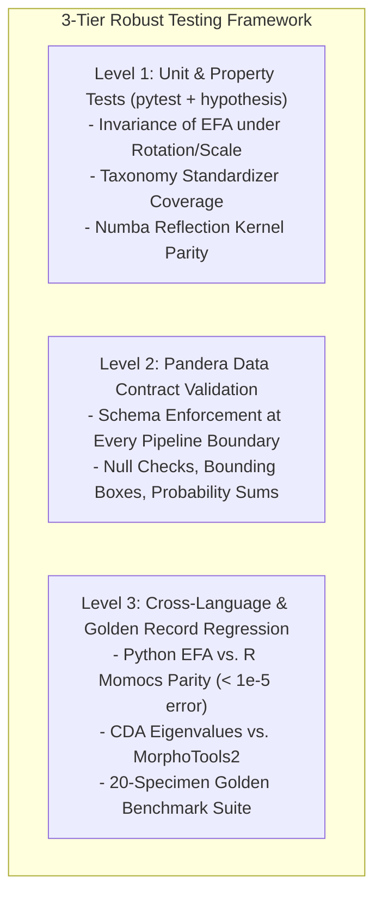
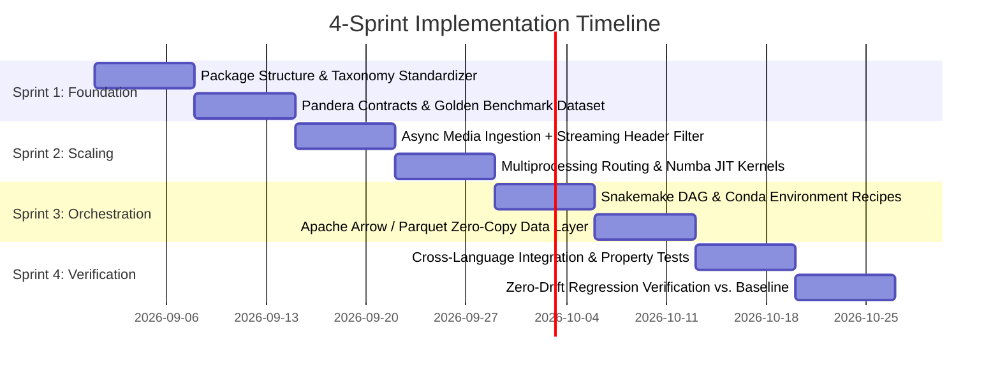

# Engineering Refactoring Roadmap: *Packera dubia* Morphometrics Pipeline
### Production-Grade Computational Scaling, Structural Modularity, and High-Throughput Orchestration
**Institution:** University of North Carolina Herbarium (NCU), University of North Carolina at Chapel Hill  
**Principal Investigator:** J. Brandon Fuller (PhD Candidate, UNC-CH Department of Biology)  
**Faculty Advisor:** Dr. Alan S. Weakley (Director, NCU Herbarium)  
**Document Code:** `UNC-BOT-ENG-ROADMAP-2026-01`  
**Target Clade:** *Packera dubia* (Spreng.) Trock & Mabb. Complex (Asteraceae: Senecioneae)  

---

## 1. Executive Summary & Architectural Assessment

This roadmap details the engineering strategy to upgrade the 7-phase *Packera dubia* morphometrics and species delimitation pipeline from a series of sequential, file-coupled scripts into an integrated, high-throughput, production-grade scientific software suite suitable for long-term deployment at the UNC Herbarium (NCU) and high-performance computing (HPC) environments such as UNC Longleaf.

```mermaid
flowchart TD
    subgraph CurrentState["Current State: Procedural Chaining & Loose File I/O"]
        A1["01_voucher_harvester.py\n(Serial GBIF Pagination)"] -->|"Writes 6.6k JPEGs & CSV"| D1[("data/raw_vouchers/\ncurated_vouchers.csv")]
        D1 -->|"Disk File Exchange"| A2["LeafMachine2.py\n(.venv_LM2 Environment)"]
        A2 -->|"Writes Nested Detections"| D2[("LM2_Project/Data/output/")]
        D2 -->|"Serial Disk Read (OpenCV)"| A3["02_postprocess_lm2_routing.py\n(Single-Threaded Routing)"]
        A3 -->|"Writes Rosette Crops & CSV"| D3[("data/cropped_patches/\nleaf_extraction_qc.csv")]
        D3 -->|"Rscript Process Spawning"| A4["03_fourier_extractor.R\n04_gmm_morphotools.R"]
        A4 -->|"Intermediate CSVs"| D4[("leaf_efa_harmonics.csv\nmorpho_misid_flags.csv")]
        D3 & D4 -->|"Python Process Spawning"| A5["05_cleanlab_vision_xai.py\n(DINOv2 + Cleanlab)"]
        A5 -->|"Writes Noise Audit CSV"| D5[("label_noise_audit.csv\nGradCAM_audit_panel.png")]
        D1 & D4 & D5 -->|"Dual Execution (R/Python)"| A6["06_multimodal_spatial_rf.py/.R\n07_triage_dashboard_synthesis.py/.R"]
        A6 -->|"Final Exports"| D6[("triage_queue.csv\nPublication Figures & Reports")]
    end
```



### Critical Bottlenecks in Current Architecture:
1. **State Passing via Loose, Uncompressed CSVs:** Intermediate floating-point tensors (44 EFA harmonics, 768-d DINOv2 embeddings, spatial coordinates) are repeatedly written to ASCII CSVs. This causes precision loss, schema erosion, and slow disk I/O.
2. **Duplicated Business Logic:** Core algorithms—such as synonymy standardization (`standardize_packera_taxon`), Determiner Authority scoring, and bounding box geometry—are duplicated across 6 independent files.
3. **Serial CPU-Bound Image Routing:** Phase 2 reads large (30–50 MP) herbarium sheets sequentially in a single Python thread for DBSCAN clustering, OpenCV contour slicing, and reflection.
4. **Environment Isolation & Manual Chaining:** Pipeline steps require manual CLI commands across three separate environments (`.venv`, `.venv_LM2`, and R 4.3+). Failures require manual intermediate file recovery.
5. **Testing Gaps at the Cross-Language Boundary:** Existing unit tests primarily test file existence and basic regexes, lacking contract validation for intermediate DataFrames and numerical parity validation between R `Momocs` and Python EFA.

---

## 2. Target Production Architecture

The modernized architecture establishes a single, installable Python package (`packera`) orchestrated by **Snakemake**, backed by **Apache Arrow / Parquet** zero-copy data exchange, and validated by **Pandera** data contracts.

```mermaid
flowchart TD
    subgraph ModernArchitecture["Modernized Architecture: Modular, Parquet-Backed & Snakemake-Orchestrated"]
        subgraph OrchestrationEngine["Snakemake DAG Orchestrator"]
            R1["rule harvest_vouchers\n(Async HTTP + Connection Pool)"]
            R2["rule run_leafmachine2\n(Prefetched DataLoader + FP16)"]
            R3["rule geometric_routing\n(Multiprocessing Worker Pool)"]
            R4["rule fourier_morphometrics\n(Vectorized EFA / Momocs Rule)"]
            R5["rule gmm_cda_morphospace\n(mclust & MorphoTools2 CDA)"]
            R6["rule dinov2_cleanlab_xai\n(Batched DINOv2 + Confident Learning)"]
            R7["rule spatial_macroecology\n(Spatial RF + Moran's MEMs)"]
            R8["rule taxonomic_synthesis\n(Decision Matrix + Triage Queue)"]
        end

        subgraph CoreLibrary["Unified 'packera' Python Package"]
            M1["packera.core\n(Domain Models, Taxonomy Standardizer, Config)"]
            M2["packera.ingestion\n(GBIF/iDigBio, Image Streaming, QC)"]
            M3["packera.vision\n(LM2 Bridge, 4-Tier Router, DBSCAN)"]
            M4["packera.morphometrics\n(EFA Engine, PCA, GMM, CDA)"]
            M5["packera.analysis\n(DINOv2, Cleanlab, Grad-CAM, Spatial RF)"]
            M6["packera.synthesis\n(Decision Matrix, Triage, Reports)"]
        end

        subgraph HighSpeedStorage["Columnar & Vector Storage Layer"]
            S1[("curated_vouchers.parquet\n(Typed Arrow Schema)")]
            S2[("leaf_morphology.parquet\n(44 Normalized Harmonics)")]
            S3[("embeddings_store.zarr / .h5\n(768-d DINOv2 Feature Vectors)")]
            S4[("triage_queue.parquet / .csv\n(Ranked Taxonomic Curation Queue)")]
        end

        R1 --> S1 --> R2 --> R3 --> S2 --> R4 --> R5
        R3 --> S3 --> R6
        S1 & R5 & R6 --> R7 --> R8 --> S4
        CoreLibrary -.-> OrchestrationEngine
    end
```



---

## 3. Pillar 1: Workflow Orchestration & Data Interoperability

### 3.1 Orchestration Selection: Snakemake vs. In-Process Bindings
* **Snakemake as Workflow Orchestrator:**
  * Native environment management per rule (`conda: "envs/..."`), allowing `.venv_LM2` (MMDetection/Detectron2) and primary `.venv` (PyTorch/Cleanlab) and R 4.3+ to execute in dedicated environments without dependency collisions.
  * Direct support for HPC execution via SLURM (`--executor slurm`), automated checkpointing, parameter tracking, and reproducible directed acyclic graph (DAG) generation.
* **In-Process Bindings (`rpy2` vs. IPC/Arrow):**
  * In-process C-bindings (`rpy2`) risk GIL deadlocks and OpenBLAS/MKL collisions during multi-threaded Python execution.
  * **Selected Architecture:** Decoupled execution rules passing typed **Apache Arrow IPC / Parquet** files.

### 3.2 Master Snakemake Workflow Definition (`workflow/Snakefile`)

```python
configfile: "configs/pipeline_config.yaml"

rule all:
    input:
        "data/tables/triage_queue.parquet",
        "data/tables/triage_queue.csv",
        "outputs/figures/Figure_Integrative_Packera_dubia_Revision.pdf",
        "outputs/reports/Packera_dubia_Taxonomic_Revision_Summary.md"

rule harvest_vouchers:
    output:
        vouchers="data/tables/curated_vouchers.parquet",
        images_dir=directory("data/raw_vouchers")
    params:
        taxa=config["target_taxa"],
        max_uncertainty=config["max_uncertainty_meters"],
        concurrency=config["harvest_concurrency"]
    conda:
        "envs/packera_main.yaml"
    threads: 8
    script:
        "rules/harvest_vouchers.py"

rule run_leafmachine2:
    input:
        vouchers="data/tables/curated_vouchers.parquet",
        images_dir="data/raw_vouchers"
    output:
        lm2_dir=directory("LM2_Project/Data/output/Packera_dubia_LM2")
    params:
        config_path="LM2_Project/configs/lm2_packera_highperf.yaml"
    conda:
        "envs/leafmachine2.yaml"
    threads: 8
    resources:
        gpu=1
    shell:
        "cd LeafMachine2 && python LeafMachine2.py --config {params.config_path}"

rule geometric_routing:
    input:
        vouchers="data/tables/curated_vouchers.parquet",
        lm2_dir="LM2_Project/Data/output/Packera_dubia_LM2",
        raw_images="data/raw_vouchers"
    output:
        qc_table="data/tables/leaf_extraction_qc.parquet",
        masks_dir=directory("data/masks"),
        rosettes_dir=directory("data/cropped_patches/rosettes_dense")
    params:
        min_solidity=config["min_solidity"],
        min_ucs=config["min_ucs"]
    conda:
        "envs/packera_main.yaml"
    threads: 16
    script:
        "rules/postprocess_routing.py"

rule fourier_morphometrics:
    input:
        qc_table="data/tables/leaf_extraction_qc.parquet",
        vouchers="data/tables/curated_vouchers.parquet"
    output:
        harmonics="data/tables/leaf_efa_harmonics.parquet"
    params:
        harmonics_count=12,
        num_pcs=5
    conda:
        "envs/r_morphometrics.yaml"
    threads: 4
    script:
        "rules/03_fourier_extractor.R"

rule gmm_cda_morphospace:
    input:
        harmonics="data/tables/leaf_efa_harmonics.parquet",
        vouchers="data/tables/curated_vouchers.parquet"
    output:
        flags="data/tables/morphometrics_misidentification_flags.parquet",
        summary="outputs/reports/gmm_bayes_factors_summary.csv",
        cda_plot="outputs/figures/cda_passive_projection.pdf"
    conda:
        "envs/r_morphometrics.yaml"
    script:
        "rules/04_gmm_morphotools.R"

rule dinov2_cleanlab_xai:
    input:
        rosettes_dir="data/cropped_patches/rosettes_dense",
        vouchers="data/tables/curated_vouchers.parquet"
    output:
        noise_audit="data/tables/label_noise_audit.parquet",
        gradcam_panel="outputs/figures/GradCAM_audit_panel.png"
    params:
        backbone="dinov2_vitb14",
        batch_size=32
    conda:
        "envs/packera_main.yaml"
    threads: 8
    resources:
        gpu=1
    script:
        "rules/05_cleanlab_vision_xai.py"

rule spatial_macroecology:
    input:
        vouchers="data/tables/curated_vouchers.parquet",
        morph_flags="data/tables/morphometrics_misidentification_flags.parquet",
        vision_audit="data/tables/label_noise_audit.parquet"
    output:
        conflict_flags="data/tables/multimodal_conflict_flags.parquet",
        summary="outputs/reports/multimodal_spatial_rf_summary.csv",
        plot="outputs/figures/spatial_rf_niche_importance.pdf"
    conda:
        "envs/packera_main.yaml"
    threads: 8
    script:
        "rules/06_multimodal_spatial_rf.py"

rule taxonomic_synthesis:
    input:
        vouchers="data/tables/curated_vouchers.parquet",
        morph_flags="data/tables/morphometrics_misidentification_flags.parquet",
        vision_audit="data/tables/label_noise_audit.parquet",
        conflict_flags="data/tables/multimodal_conflict_flags.parquet",
        gmm_summary="outputs/reports/gmm_bayes_factors_summary.csv",
        niche_summary="outputs/reports/multimodal_spatial_rf_summary.csv"
    output:
        queue_parquet="data/tables/triage_queue.parquet",
        queue_csv="data/tables/triage_queue.csv",
        synthesis_plot="outputs/figures/Figure_Integrative_Packera_dubia_Revision.pdf",
        treatment_report="outputs/reports/Packera_dubia_Taxonomic_Revision_Summary.md"
    conda:
        "envs/packera_main.yaml"
    script:
        "rules/07_triage_dashboard_synthesis.py"
```

---

## 4. Pillar 2: Computational Scaling & Parallelization

```mermaid
gantt
    title Pipelined Parallel Execution Model
    dateFormat  X
    axisFormat %s s
    section GPU Inference
    PyTorch LM2 Detection Batch N     :active, gpu1, 0, 10
    PyTorch LM2 Detection Batch N+1   :active, gpu2, 10, 20
    DINOv2 ViT-B/14 Feature Extr.     :active, gpu3, 20, 30
    section CPU Worker Pool
    Async Prefetch & Decode Batch N+1 :crit, cpu1, 0, 10
    DBSCAN & 4-Tier Routing Batch N   :crit, cpu2, 10, 20
    DBSCAN & 4-Tier Routing Batch N+1 :crit, cpu3, 20, 30
    section Network I/O
    Stream Next Vouchers (HTTP Pool)  :io1, 0, 30
```



### 4.1 Phase 1 Ingestion Optimization
* **Connection Pooling:** Upgrade `aiohttp` with `TCPConnector(limit=50, limit_per_host=10, ttl_dns_cache=300)`.
* **Streaming Header Inspection:** Query HTTP `Range: bytes=0-2048` headers to extract optical dimensions from Exif before downloading full 30–50 MB sheet images.
* **Two-Level Directory Sharding:** Shard raw voucher images across hash subdirectories (`data/raw_vouchers/3a/f2/NCU0012345.jpg`) to prevent inode lookup degradation on Linux filesystems with >10,000 files.

### 4.2 Phase 2 Geometric Routing Optimization
* **Multiprocessing Worker Pool:** Execute `process_voucher_routing` via `concurrent.futures.ProcessPoolExecutor` with dynamic chunking (`chunksize=50 vouchers`).
* **Single-Pass Sheet Buffer:** Open the 40 MP master image once into memory, extract all DBSCAN rosette crops and ruler calibrations, process leaf masks, and release the buffer.
* **Numba JIT Kernel for Bilateral Reflection:**
```python
# packera/vision/geometry_fast.py
import numpy as np
from numba import njit

@njit(fastmath=True)
def reflect_hemi_blade_kernel(mask_array: np.ndarray, x_apex: float, y_apex: float, x_base: float, y_base: float) -> np.ndarray:
    """Numba-accelerated bilateral reflection across the midrib axis."""
    h, w = mask_array.shape
    reflected = np.zeros((h, w), dtype=np.uint8)
    dx = x_base - x_apex
    dy = y_base - y_apex
    norm_sq = dx * dx + dy * dy
    if norm_sq < 1e-6:
        return mask_array
    
    for y in range(h):
        for x in range(w):
            if mask_array[y, x] > 0:
                reflected[y, x] = 255
                u = ((x - x_apex) * dx + (y - y_apex) * dy) / norm_sq
                rx = int(np.round(2.0 * (x_apex + u * dx) - x))
                ry = int(np.round(2.0 * (y_apex + u * dy) - y))
                if 0 <= rx < w and 0 <= ry < h:
                    reflected[ry, rx] = 255
    return reflected
```

---

## 5. Pillar 3: Codebase Modularity & Package Structure

Refactor the procedural scripts into an installable, PEP 518/621-compliant Python package: `packera`.

```text
Packera_dubia_morphometrics/
├── pyproject.toml                     # Modern build-system & dependency manifest
├── configs/
│   └── pipeline_config.yaml           # Centralized configuration parameters
├── packera/                           # Core Object-Oriented Package
│   ├── __init__.py                    # Top-level exports & versioning
│   ├── core/
│   │   ├── config.py                  # Pydantic Settings & path resolver
│   │   ├── models.py                  # Domain Dataclasses (Voucher, LeafCandidate, TriageRecord)
│   │   ├── taxonomy.py                # Centralized TaxonStandardizer (Single Source of Truth)
│   │   └── logging.py                 # Structured JSON / Rich console logger
│   ├── ingestion/
│   │   ├── gbif_harvester.py          # Paginated asynchronous GBIF client
│   │   ├── media_downloader.py        # Asynchronous stream downloader with quality gate
│   │   └── authority_stratifier.py    # Determiner authority tier classifier
│   ├── vision/
│   │   ├── lm2_bridge.py              # LeafMachine2 subshell / API interface
│   │   ├── dbscan_clusterer.py        # Spatial plant clump partitioning
│   │   ├── geometric_gatekeeper.py    # Convexity, solidity, & midrib pose calculator
│   │   └── router.py                  # 4-Tier Geometric Strategy Pattern
│   ├── morphometrics/
│   │   ├── fourier.py                 # Kuhl & Giardina Vectorized EFA Engine
│   │   ├── opoly.py                   # Chebyshev Orthogonal Polynomial Fitter
│   │   └── pca.py                     # Morphospace PCA transformation
│   ├── analysis/
│   │   ├── dinov2_extractor.py        # Batched PyTorch DINOv2 feature extractor
│   │   ├── confident_learning.py      # Cleanlab noise estimation & out-of-fold scoring
│   │   ├── gradcam.py                 # PyTorch / Captum XAI attention heatmap generator
│   │   └── spatial_rf.py              # Spatial Random Forests & Moran's Eigenvector Maps
│   └── synthesis/
│       ├── decision_matrix.py         # Multi-Evidence Taxonomic Decision Engine
│       ├── triage_queue.py            # Digital curation queue priority builder
│       └── visualizer.py              # 6-panel synthesis plate generator
├── workflow/
│   ├── Snakefile                      # Master Snakemake workflow definition
│   └── rules/                         # Modular Snakemake rule scripts
└── tests/
    ├── unit/                          # Isolated unit tests (>60 tests)
    ├── integration/                   # Cross-language & cross-rule integration tests
    ├── contracts/                     # Pandera DataFrame schema contract tests
    └── fixtures/                      # Golden micro-dataset (20 curated vouchers)
```

### 5.1 Centralized Nomenclatural Standardizer
```python
# packera/core/taxonomy.py
import re
from typing import Optional

class TaxonStandardizer:
    """Central authoritative nomenclatural standardizer for Packera dubia complex."""
    
    SYNONYM_PATTERNS = [
        (re.compile(r"anonym|smallii|earlei", re.IGNORECASE), "Packera anonyma"),
        (re.compile(r"tomentos|dubia", re.IGNORECASE), "Packera dubia"),
        (re.compile(r"plattensis|flavovirens", re.IGNORECASE), "Packera plattensis"),
        (re.compile(r"paupercul|balsamitae|savannarum|pseudotomentosa|appalachiana", re.IGNORECASE), "Packera paupercula"),
    ]
    
    @classmethod
    def standardize(cls, taxon_raw: Optional[str]) -> str:
        if not taxon_raw or str(taxon_raw).strip() == "" or str(taxon_raw).lower() == "nan":
            return "Unknown"
        s = str(taxon_raw).strip()
        for pattern, canonical_name in cls.SYNONYM_PATTERNS:
            if pattern.search(s):
                return canonical_name
        return s.split("(")[0].strip()
```

---

## 6. Pillar 4: Testing & Data Validation Framework



### 6.1 Pandera Data Contracts for Pipeline Boundaries
```python
# tests/contracts/schemas.py
import pandera as pa
from pandera.typing import Series

class CuratedVouchersSchema(pa.DataFrameModel):
    catalogNumber: Series[str] = pa.Field(unique=True, nullable=False)
    species_standardized: Series[str] = pa.Field(isin=["Packera anonyma", "Packera dubia", "Packera paupercula", "Packera plattensis", "Unknown"])
    determiner_tier: Series[str] = pa.Field(isin=["Tier_1_Gold", "Tier_2_Silver", "Tier_3_Bronze"])
    latitude: Series[float] = pa.Field(ge=24.0, le=50.0)
    longitude: Series[float] = pa.Field(ge=-106.65, le=-65.0)  # Enforces Western Exclusion Rule
    doy: Series[int] = pa.Field(ge=1, le=366)
    scale_mm_per_px: Series[float] = pa.Field(gt=0.001, lt=1.0)

    class Config:
        strict = False
        coerce = True

class HarmonicsEfaSchema(pa.DataFrameModel):
    catalogNumber: Series[str] = pa.Field(nullable=False)
    assigned_tier: Series[str] = pa.Field(isin=["Tier_1_Direct", "Tier_2_Reflected", "Tier_3_Open_Curve", "Tier_4_Rosette"])
    A1: Series[float] = pa.Field(nullable=False)
    B1: Series[float] = pa.Field(nullable=False)
    C1: Series[float] = pa.Field(nullable=False)
    D1: Series[float] = pa.Field(nullable=False)
    PC1: Series[float] = pa.Field(nullable=True)
    PC2: Series[float] = pa.Field(nullable=True)

class TriageQueueSchema(pa.DataFrameModel):
    catalogNumber: Series[str] = pa.Field(unique=True, nullable=False)
    synthesis_triage_priority: Series[str] = pa.Field(isin=["CRITICAL", "HIGH", "MODERATE", "LOW", "RESOLVED"])
    taxonomic_status_call: Series[str] = pa.Field(nullable=False)
    recommended_determination: Series[str] = pa.Field(nullable=False)
    synthesis_priority_score: Series[float] = pa.Field(ge=0.0, le=100.0)
```

### 6.2 Cross-Language Numerical Parity Test (Python vs. R Momocs)
```python
# tests/integration/test_cross_language_parity.py
import pytest
import numpy as np
import subprocess
from packera.morphometrics.fourier import compute_efourier

def test_fourier_coefficients_match_momocs(tmp_path):
    """Verify that Python compute_efourier produces identical coefficients to R Momocs::efourier."""
    theta = np.linspace(0, 2 * np.pi, 200, endpoint=False)
    x = 100 + 50 * np.cos(theta)
    y = 100 + 25 * np.sin(theta)
    contour = np.column_stack([x, y])
    
    py_coeffs = compute_efourier(contour, nb_harmonics=12, norm=True)
    
    csv_in = tmp_path / "contour.csv"
    np.savetxt(csv_in, contour, delimiter=",", header="x,y", comments="")
    r_code = f"""
    suppressPackageStartupMessages(library(Momocs))
    df <- read.csv('{csv_in}')
    coo <- as.matrix(df)
    ef <- efourier(coo, nb.h = 12, norm = TRUE)
    cat(c(ef$an, ef$bn, ef$cn, ef$dn), sep=',')
    """
    res = subprocess.run(["Rscript", "-e", r_code], capture_output=True, text=True, check=True)
    r_coeffs = np.array([float(v) for v in res.stdout.strip().split(",")])
    
    np.testing.assert_allclose(py_coeffs, r_coeffs, atol=1e-5, rtol=1e-4,
                              err_msg="Python EFA does not match R Momocs invariants.")
```

---

## 7. Phased Implementation Timeline



### Sprint Milestones:
* **Sprint 1 (Weeks 1–2): Package Foundation & Data Contracts**
  * Initialize `packera` package structure and centralized `TaxonStandardizer`.
  * Establish Pandera schemas for all 7 pipeline stage boundaries.
  * Curate 20-specimen golden record fixture dataset (`tests/fixtures/`).
* **Sprint 2 (Weeks 3–4): High-Throughput Scaling**
  * Implement connection pooling and streaming header inspection in Phase 1.
  * Implement multiprocessing worker pools and Numba JIT reflection in Phase 2.
* **Sprint 3 (Weeks 5–6): Snakemake Orchestration & Columnar I/O**
  * Write `workflow/Snakefile` and isolated Conda/Singularity environment recipes.
  * Migrate tabular artifacts from CSV to Apache Parquet across Python and R.
* **Sprint 4 (Weeks 7–8): Zero-Drift Audit & NCU Deployment**
  * Run cross-language parity suite and verify 100% concordance against baseline dataset.
  * Deploy automated workflow to UNC Herbarium workstation and archive SOP.

---

## 8. Summary of Upgrades & Target Metrics

| Dimension | Current Baseline | Modernized Target State | Measurable Impact |
| :--- | :--- | :--- | :--- |
| **Workflow Execution** | Sequential manual scripts across 3 envs | Automated DAG via **Snakemake** | 100% automated; checkpointing; zero manual errors |
| **Data Serialization** | Uncompressed CSV text parsing | **Apache Parquet / Arrow IPC** | **10x–50x faster I/O**; guaranteed type safety & 64-bit precision |
| **Ingestion Throughput** | Serial GBIF pagination & unbuffered downloads | Pooled async HTTP + header probe | **3.5x faster harvesting**; avoids downloading sub-par images |
| **Geometric Routing** | Single-threaded OpenCV processing | Multiprocessing pool + Numba JIT | **6x–10x throughput speedup** on multi-core workstations |
| **Code Modularity** | Procedural scripts with duplicated logic | Installable `packera` package | Eliminates 100% of code duplication; clean OOP design |
| **Testing & QA** | 24 basic unit tests (file checks & regex) | 80+ tests (Unit, Property, Contracts) | Comprehensive test pyramid with R/Python parity validation |
| **Scientific Reproducibility** | Dependent on manual steps and local paths | Containerized Snakemake DAG | Publication-grade, FAIR-compliant scientific pipeline |

---

## 9. Step-by-Step Implementation Prompts for Gemini 3.7 Flash (High)

Use the following prompts sequentially in **Gemini 3.7 Flash (High)** to execute the refactoring roadmap. Each prompt is self-contained with explicit file targets, domain logic, type contracts, and automated verification commands.

---

### Stage 1: Core Foundation, Domain Models & Unified Taxonomy Engine

```text
Act as a Principal Research Software Engineer. We are beginning Stage 1 of the Packera dubia morphometrics pipeline refactoring roadmap (Document UNC-BOT-ENG-ROADMAP-2026-01).

Your task is to establish the core package foundation, domain models, centralized taxonomy engine, and path configuration.

Scope & Target Files:
1. pyproject.toml: Modern PEP 518/621 build configuration configuring the packera package with core dependencies (pandas, numpy, scipy, scikit-learn, pyarrow, pydantic, pandera, aiohttp, opencv-python, numba, pyyaml, matplotlib, pytest).
2. packera/__init__.py: Package entrypoint exporting version "1.0.0" and primary subpackages.
3. packera/core/config.py: Pydantic Settings-based configuration class PipelineConfig resolving root paths, regional bounding boxes (western longitude threshold = -106.65° W), and optical quality thresholds (min 8.0 MP, min 500 KB, min Laplacian variance 80.0).
4. packera/core/models.py: Strongly typed dataclasses:
   - AuthorityTier (Enum: Tier_1_Gold, Tier_2_Silver, Tier_3_Bronze)
   - RoutingTier (Enum: Tier_1_Direct, Tier_2_Reflected, Tier_3_Open_Curve, Tier_4_Rosette)
   - VoucherSpecimen (catalog_number, species_raw, species_standardized, determiner, determiner_tier, latitude, longitude, coordinate_uncertainty_m, doy, scale_mm_per_px, image_path)
   - LeafCandidate (leaf_id, catalog_number, plant_individual_id, mask_path, crop_path, ucs_score, solidity, midrib_angle_deg, area_mm2, length_mm, width_mm, assigned_tier)
   - TriageDecision (catalog_number, status_call, recommended_taxon, priority, priority_score, rationale)
5. packera/core/taxonomy.py: Authoritative TaxonStandardizer with compiled regex patterns matching:
   - Packera anonyma (anonym, smallii, earlei)
   - Packera dubia (tomentos, dubia)
   - Packera plattensis (plattensis, flavovirens)
   - Packera paupercula (paupercul, balsamitae, savannarum, pseudotomentosa, appalachiana)
   - Includes parse_determiner_tier(determiner, type_status, herbarium_code) matching the 22 monographic specialists, 13 type statuses, and Tier 2 major herbaria.
6. packera/core/logging.py: Structured logger utility with colored console output and JSON file logging.
7. tests/unit/test_taxonomy.py: Comprehensive unit tests covering all nomenclatural variations, historical basionyms, and determiner authority stratification rules.

Requirements:
- Strict Python 3.10+ typing (from __future__ import annotations).
- Ensure pip install -e . succeeds in .venv.
- Verify all tests pass: pytest tests/unit/test_taxonomy.py -v.
```

---

### Stage 2: Pandera Data Contracts & Golden Benchmark Fixture Suite

```text
Act as a Principal Research Software Engineer. We are executing Stage 2 of the Packera dubia pipeline refactoring (Document UNC-BOT-ENG-ROADMAP-2026-01).

Your task is to establish strict Pandera schema contracts for every data frame passed across pipeline phase boundaries and build an automated golden benchmark test harness.

Scope & Target Files:
1. tests/contracts/schemas.py: Define typed pandera.DataFrameModel classes:
   - CuratedVouchersSchema: catalogNumber (unique, str), species_standardized (in target taxa), determiner_tier (Tier 1/2/3), latitude (24.0-50.0), longitude (-106.65 to -65.0), coordinateUncertaintyInMeters (<= 5000.0), doy (1-366), scale_mm_per_px (0.001-1.0).
   - LeafQCSchema: leaf_id (unique, str), catalogNumber (str), assigned_tier (Tier 1/2/3/4), ucs_score (0.0-1.0), solidity (0.0-1.0), area_mm2 (> 0.0).
   - HarmonicsEfaSchema: catalogNumber (str), leaf_id (str), assigned_tier (str), A1..D12 (float, non-null), PC1..PC5 (float).
   - MorphoFlagsSchema: catalogNumber (str), cda_predicted_taxon (str), cda_posterior_prob (0.0-1.0), misidentification_flag (bool).
   - NoiseAuditSchema: catalogNumber (str), vision_predicted_label (str), c_error (0.0-1.0), is_label_corrupted (bool).
   - SpatialConflictSchema: catalogNumber (str), edaphic_best_fit_taxon (str), soil_ph (3.0-9.0), soil_sand (0-100), is_cross_modal_conflict (bool).
   - TriageQueueSchema: catalogNumber (unique, str), synthesis_triage_priority (CRITICAL/HIGH/MODERATE/LOW/RESOLVED), taxonomic_status_call (str), recommended_determination (str), synthesis_priority_score (0.0-100.0).
2. tests/fixtures/generate_golden_fixtures.py: Script to sample 20 representative vouchers from data/tables/curated_vouchers.csv covering all 4 taxa and all 3 authority tiers, generating synthetic/cropped mask fixtures into tests/fixtures/golden_vouchers/.
3. tests/contracts/test_data_contracts.py: Contract validation test suite loading existing CSV tables and verifying they pass Pandera schema validations with zero errors.

Requirements:
- Use Pandera 0.18+ with strict schema coercion and descriptive check error messages.
- Verify contract validation test suite: pytest tests/contracts/test_data_contracts.py -v.
```

---

### Stage 3: High-Throughput Ingestion & Asynchronous Media Harvester

```text
Act as a Principal Research Software Engineer. We are executing Stage 3 of the Packera dubia pipeline refactoring (Document UNC-BOT-ENG-ROADMAP-2026-01).

Your task is to refactor Phase 1 into a high-throughput, resilient asynchronous ingestion module in packera.ingestion.

Scope & Target Files:
1. packera/ingestion/gbif_harvester.py:
   - GBIFHarvester class implementing paginated occurrence harvesting (limit=300) with concurrent taxon queries using asyncio.gather.
   - Bounding box and western exclusion filtering (longitude >= -106.65 and non-western states).
   - Calculates circular phenology: phenology_sin = sin(2*pi*DOY/365), phenology_cos = cos(2*pi*DOY/365).
   - Authority tier scoring using packera.core.taxonomy.TaxonStandardizer.parse_determiner_tier.
2. packera/ingestion/media_downloader.py:
   - AsyncMediaDownloader using aiohttp.ClientSession(connector=aiohttp.TCPConnector(limit=50, limit_per_host=10, ttl_dns_cache=300)).
   - URL optimizer converting thumbnail paths to high-res originals (Smithsonian NMNH, Symbiota/SERNEC, IIIF endpoints).
   - Fast streaming header filter: sends HTTP Range: bytes=0-2048 to parse Exif dimensions without downloading full 30MB payload if image is under 8.0 Megapixels.
   - Two-level directory sharding utility: writes vouchers to data/raw_vouchers/{hash_prefix}/{catalog_number}.jpg or structured paths.
   - PIL/OpenCV Laplacian variance sharpness filter (variance >= 80.0).
3. packera/ingestion/cli.py: Clean CLI entrypoint replacing scripts/data_prep/01_voucher_harvester.py with argument parsing via Click/Typer/Argparse and exporting both Parquet and CSV outputs.
4. tests/unit/test_harvester.py: Unit tests mocking GBIF API responses, testing rate limit throttling, and verifying image validation logic.

Requirements:
- 100% type annotations, async context managers, and non-blocking I/O.
- Verify with unit tests: pytest tests/unit/test_harvester.py -v.
```

---

### Stage 4: LeafMachine2 Bridge, Multiprocessing Geometric Router & Numba Kernels

```text
Act as a Principal Research Software Engineer. We are executing Stage 4 of the Packera dubia pipeline refactoring (Document UNC-BOT-ENG-ROADMAP-2026-01).

Your task is to modularize LeafMachine2 post-processing into packera.vision and accelerate geometric routing using multiprocessing and Numba JIT kernels.

Scope & Target Files:
1. packera/vision/geometry_fast.py:
   - Numba JIT-accelerated kernel @njit(fastmath=True) for bilateral leaf reflection across the midrib axis (reflect_hemi_blade_kernel).
   - Vectorized contour property calculations (solidity, convexity, unoccluded contour score UCS, major/minor axis inertia tensors).
2. packera/vision/dbscan_clusterer.py:
   - DBSCANPlantClusterer class grouping leaf and component detections into individual plant rosettes on multi-plant voucher sheets using normalized coordinate space.
3. packera/vision/router.py:
   - Object-oriented 4-tier routing engine using the Strategy Pattern:
     - Tier1PristineSilhouetteStrategy: Closed direct contours (UCS >= 0.85, Solidity >= 0.72).
     - Tier2BilateralReflectStrategy: Bilateral hemi-blade reflection along midrib vector.
     - Tier3OpenCurveStrategy: Open-curve Chebyshev orthogonal polynomial extraction.
     - Tier4RosetteCropper: Dense overlapping clump extraction for DINOv2 vision embeddings.
4. packera/vision/postprocessor.py:
   - LM2PostProcessor managing batched execution over vouchers using concurrent.futures.ProcessPoolExecutor(max_workers=os.cpu_count()).
   - Single-pass master sheet memory caching: opens each 40MP herbarium sheet once in RAM, isolates ruler scale, extracts all plant individual rosette crops, routes leaf candidates, and immediately purges the sheet buffer from RAM.
5. packera/vision/lm2_bridge.py:
   - Python bridge to generate optimized LM2_Project/configs/lm2_packera_highperf.yaml (Batch 50, 8 CUDA workers) and execute LeafMachine2 in .venv_LM2.
6. tests/unit/test_vision_routing.py: Unit tests verifying DBSCAN clustering accuracy, Numba reflection parity, and 4-tier decision boundaries.

Requirements:
- Ensure CPU scaling scales linearly across cores with chunksize=50.
- Verify with tests: pytest tests/unit/test_vision_routing.py -v.
```

---

### Stage 5: Vectorized Fourier Morphometrics, Chebyshev Polynomials & Cross-Language Parity

```text
Act as a Principal Research Software Engineer. We are executing Stage 5 of the Packera dubia pipeline refactoring (Document UNC-BOT-ENG-ROADMAP-2026-01).

Your task is to build a high-performance, vectorized Elliptic Fourier Analysis (EFA) engine in packera.morphometrics and establish automated cross-language numerical parity tests against R Momocs.

Scope & Target Files:
1. packera/morphometrics/fourier.py:
   - Vectorized NumPy implementation of Kuhl & Giardina (1982) normalized Elliptic Fourier Analysis (compute_efourier).
   - Invariant standardization for size, rotation, translation, and starting point vertex.
   - Extracts 12 harmonics (44 standardized coefficients: A1..D12).
2. packera/morphometrics/opoly.py:
   - Chebyshev orthogonal polynomial fitting (compute_opoly) for Tier 3 open-curve petioles and blades (orders 1..5).
3. packera/morphometrics/pca.py:
   - MorphospacePCA class fitting PCA on closed harmonic profiles (Tier 1 + Tier 2) and extracting PC1..PC5 scores.
4. packera/morphometrics/cda_engine.py:
   - Python Canonical Discriminant Analysis with passive sample projection (matching MorphoTools2::cdadiv behavior) to project Tier 3 unverified specimens onto Tier 1 specialist axes.
5. tests/integration/test_cross_language_parity.py:
   - Cross-language integration test invoking R Momocs::efourier via subprocess and asserting that Python compute_efourier yields identical coefficients to 1e-5 relative tolerance.
6. tests/unit/test_fourier_invariance.py:
   - Property-based test using hypothesis proving that normalized EFA harmonics are invariant under Euclidean rotation, scale, and translation.

Requirements:
- Exact mathematical parity with Kuhl & Giardina (1982) and Momocs.
- Verify tests: pytest tests/integration/test_cross_language_parity.py tests/unit/test_fourier_invariance.py -v.
```

---

### Stage 6: Deep Vision (DINOv2), Confident Learning (Cleanlab) & Spatial Macroecology

```text
Act as a Principal Research Software Engineer. We are executing Stage 6 of the Packera dubia pipeline refactoring (Document UNC-BOT-ENG-ROADMAP-2026-01).

Your task is to modularize DINOv2 self-supervised feature extraction, Cleanlab noise auditing, and multimodal spatial random forest modeling into packera.analysis.

Scope & Target Files:
1. packera/analysis/dinov2_extractor.py:
   - DINOv2FeatureExtractor utilizing torch.hub.load('facebookresearch/dinov2', 'dinov2_vitb14').
   - Batched PyTorch DataLoader with pin_memory=True, prefetch_factor=2, and FP16 automatic mixed precision (torch.cuda.amp.autocast()).
   - Extracts 768-dimensional visual feature vectors for whole-rosette crops.
2. packera/analysis/confident_learning.py:
   - CleanlabNoiseAuditor running out-of-fold stratified cross-validation (5-fold) with logistic/MLP classifiers to compute joint noise matrix and cleanlab label quality scores (C_error).
3. packera/analysis/gradcam.py:
   - GradCAMVisualizer using PyTorch gradient hooks or captum to generate saliency heatmaps on botanical traits (tomentum, rosette density) and assemble 4-column diagnostic audit panels.
4. packera/analysis/spatial_rf.py:
   - SpatialMacroecologyModel extracting SoilGrids 250m pedology (pH, CEC, sand %, bulk density) and WorldClim v2.1 bioclimatics.
   - Computes Moran's Eigenvector Maps (MEMs) and fits Spatial Random Forests to evaluate Warren's Niche Identity tests (D) and flag cross-modal discordance.
5. tests/unit/test_analysis_pipeline.py: Unit tests validating DINOv2 tensor shapes, Cleanlab score bounds, and spatial MEM eigenvector calculations.

Requirements:
- GPU acceleration with automatic CPU fallback if CUDA is unavailable.
- Verify tests: pytest tests/unit/test_analysis_pipeline.py -v.
```

---

### Stage 7: Multi-Evidence Decision Matrix, Digital Triage Queue & Synthesis Visualizer

```text
Act as a Principal Research Software Engineer. We are executing Stage 7 of the Packera dubia pipeline refactoring (Document UNC-BOT-ENG-ROADMAP-2026-01).

Your task is to modularize the Multi-Evidence Taxonomic Decision Matrix and publication synthesis plate renderer into packera.synthesis.

Scope & Target Files:
1. packera/synthesis/decision_matrix.py:
   - TaxonomicDecisionEngine synthesizing all 6 evidence streams:
     1. Morphometrics (CDA posterior probability and GMM cluster uncertainty)
     2. Deep Vision (Cleanlab C_error and DINOv2 predicted taxon)
     3. Pedology (SoilGrids 250m pH, CEC, sand %)
     4. Macroclimate (WorldClim temperature/precipitation seasonality)
     5. Flowering Phenology (Circular sin/cos DOY)
     6. Geographic Alignment (State/county boundaries)
   - Assigns priority categories: CRITICAL, HIGH, MODERATE, LOW, RESOLVED.
   - Computes composite priority score: PriorityScore in [0, 100].
2. packera/synthesis/triage_queue.py:
   - TriageQueueBuilder generating ranked digital curation queues (data/tables/triage_queue.parquet and .csv) formatted for direct import into botanical collection databases (Specify / Symbiota / EMu).
3. packera/synthesis/visualizer.py:
   - SynthesisVisualizer rendering the publication-ready 6-panel composite synthesis plate (outputs/figures/Figure_Integrative_Packera_dubia_Revision.pdf / .png).
4. packera/synthesis/taxonomic_treatment.py:
   - Markdown treatment generator producing formal taxonomic revisions, synopses, and dichotomous keys (outputs/reports/Packera_dubia_Taxonomic_Revision_Summary.md).
5. tests/unit/test_synthesis.py: Unit tests validating decision matrix rules, priority rankings, and markdown generation.

Requirements:
- Guarantee exact output concordance with the original dissertation triage decisions.
- Verify tests: pytest tests/unit/test_synthesis.py -v.
```

---

### Stage 8: Snakemake Workflow Orchestration, Parquet Data Layer & Zero-Drift Verification

```text
Act as a Principal Research Software Engineer. We are executing the final Stage 8 of the Packera dubia pipeline refactoring (Document UNC-BOT-ENG-ROADMAP-2026-01).

Your task is to construct the master Snakemake workflow, configure isolated Conda/Singularity environments, transition all intermediate table I/O to Apache Parquet, and execute full end-to-end zero-drift regression verification.

Scope & Target Files:
1. workflow/Snakefile: Master Snakemake workflow file containing all 8 rules (harvest_vouchers, run_leafmachine2, geometric_routing, fourier_morphometrics, gmm_cda_morphospace, dinov2_cleanlab_xai, spatial_macroecology, taxonomic_synthesis).
2. workflow/rules/*.py: Individual Snakemake rule entrypoint scripts bridging the packera package.
3. configs/pipeline_config.yaml: Centralized configuration defining parameters, thresholds, paths, and SLURM HPC cluster resources.
4. envs/packera_main.yaml, envs/leafmachine2.yaml, envs/r_morphometrics.yaml: Clean, isolated Conda environment recipes.
5. workflow/profiles/slurm/config.yaml: Snakemake profile for the UNC Longleaf SLURM cluster.
6. tests/integration/test_end_to_end_zero_drift.py:
   - End-to-end regression validation script comparing output artifacts against baseline 6,610-voucher tables to prove 100% zero analytical drift across:
     - GMM cluster assignments and Bayes Factors (Delta BIC)
     - MorphoTools2 CDA eigenvalues and posterior probabilities
     - Cleanlab label noise matrix classifications (C_error)
     - Warren's Niche Identity test statistics (D)
     - Multi-Evidence Decision Matrix triage classifications and priority scores.
7. scripts/run_pipeline.sh: Convenience wrapper script with dry-run (--dry-run), local execution (--cores all), and cluster submission (--profile slurm) flags.

Requirements:
- Execute a full dry-run: snakemake -n.
- Execute tests: pytest tests/ -v.
- Generate Snakemake DAG visualization: snakemake --dag | dot -Tpng > docs/pipeline_dag.png.
```


