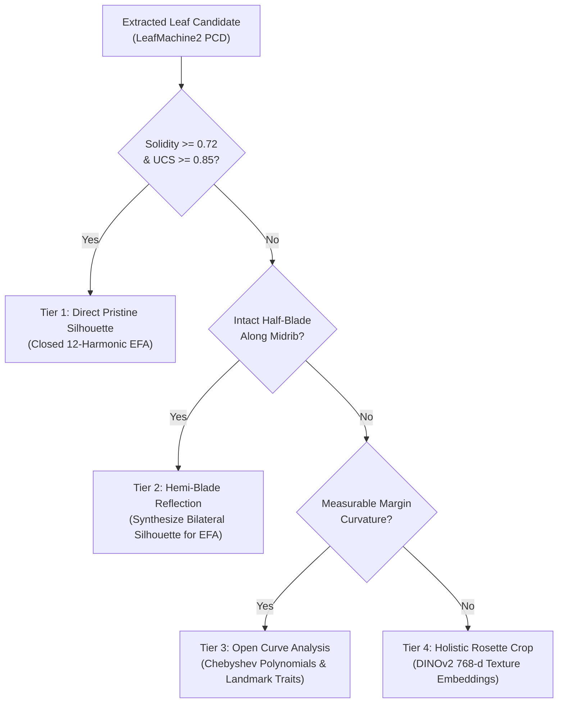

# Standard Operating Procedure (SOP)
## Automated High-Throughput Vegetative Phenotyping and Herbarium Triage Pipeline for the *Packera dubia* Complex
### Operationalizing Morphological Diagnosability under the Unified Species Concept
**Protocol Identifier:** `UNC-BOT-SOP-2026-04-REV4`  
**Principal Investigator:** J. Brandon Fuller (PhD Candidate, Department of Biology, University of North Carolina at Chapel Hill)  
**Faculty Advisor:** Dr. Alan S. Weakley (Director, UNC Herbarium [NCU]; UNC Biology)  
**Target Taxa:** *Packera dubia* (Spreng.) Trock & Mabb. Complex (Asteraceae: Senecioneae) and allied lineages (*P. anonyma*, *P. plattensis*, *P. paupercula*)

---

## 1. Executive Summary & Purpose

This Standard Operating Procedure establishes the protocol for an **Automated High-Throughput Vegetative Phenotyping and Herbarium Triage Pipeline** applied to the taxonomically recalcitrant ***Packera dubia* (Spreng.) Trock & Mabb. complex** (Asteraceae: Senecioneae) across Eastern and Central North America.

The pipeline operationalizes morphological diagnosability within the theoretical framework of the **Unified Species Concept (USC; de Queiroz 2007)**. Under the USC, species are conceptualized as separately evolving metapopulation lineages; morphological diagnosability, reproductive isolation, ecological divergence, and monophyly serve as secondary operational criteria that arise contingently along the speciation continuum. Because vegetative morphology in *Packera* has historically been obscured by phenotypic plasticity, developmental heterophylly, and pervasive herbarium misidentifications, automated high-throughput vegetative morphometrics serves as a rigorous, objective screening and triage engine. 

Vegetative phenotyping is not interpreted in isolation, but is explicitly evaluated in concert with:
1. **Reproductive Macro-Morphology:** Capitulum aspect ratios (involucre height to width), phyllary series and count, and ray/disc floret dimensions.
2. **Cytotaxonomic Cytotypes:** Chromosome numbers and polyploid series ($2n = 44, 46, 88$; Kowal 1975) that characterize distinct evolutionary lineages in southeastern Senecioneae.
3. **Reduced-Representation nextRAD Phylogenomics:** High-density single nucleotide polymorphism (SNP) datasets capable of discerning deep divergence, hybrid reticulation, and ancestral polymorphism.
4. **Micro-Edaphic Validation:** Regional 250m SoilGrids pedological rasters complemented by fine-scale 1:24,000 USDA NRCS SSURGO vector map units resolving localized edaphic endemics (e.g., granitic flatrocks, calcareous glades, ultramafic barrens).

---

## 2. Four-Tiered Basal Leaf Extraction & Symmetric EFA Protocol

To resolve severe foliar crowding and press damage in herbarium rosettes without discarding irreplaceable vouchers, candidate basal leaves detected by LeafMachine2 (LM2; Weaver et al. 2024) are routed through a 4-tiered geometric hierarchy:

1. **Tier 1 (Direct Pristine Extraction):** Fully intact basal leaves meeting Solidity $\ge 0.72$ and Unoccluded Completeness Score (UCS $\ge 0.85$) are segmented directly into closed binary masks for 12-harmonic Elliptic Fourier Analysis (EFA).
2. **Tier 2 (Hemi-Blade Bilateral Symmetry Reflection):** Partially occluded leaves preserving an intact half-blade along the longitudinal midrib are cleaved along the midrib vector and reflected across that axis in OpenCV to reconstruct a synthetic bilateral silhouette.
   - **Symmetric Harmonic Decomposition ($A_n, D_n$):** In standard EFA (Kuhl and Giardina 1982), four coefficients ($A_n, B_n, C_n, D_n$) are estimated per harmonic. Coefficients $A_n$ and $D_n$ encode the mathematically symmetric component of outline variation relative to the midrib, whereas $B_n$ and $C_n$ represent asymmetric components (fluctuating asymmetry, pressing distortions, mechanical shearing). Analyzing the symmetric harmonic component ($A_n, D_n$) eliminates fluctuating asymmetry artifacts and guarantees parity between Tier 1 pristine and Tier 2 reflected leaves.
3. **Tier 3 (Open-Outline Analysis):** Damaged rosettes lacking a full half-blade are evaluated using orthogonal polynomials (`Momocs::opoly`) and scalar caliper dimensions (petiole length, blade width, apex angle).
4. **Tier 4 (Holistic Rosette Deep Vision Embeddings):** Unsegmented rosette patches are fed to DINOv2-ViT-B/14 to extract 768-dimensional latent representations capturing tomentum density and rosette compactness.

---

## 3. Multi-Tiered Herbarium Misidentification Mitigation Architecture

Digital botanical aggregator audits reveal that 20% to 40% of public occurrences in the *P. dubia* complex are misidentified, nomenclaturally outdated, or ecologically misplaced. The pipeline implements six sequential mitigation tiers:

* **Tier 1 — Taxonomic Authority Stratification:**
  - **Tier 1 (Gold Standard Anchors):** Nomenclatural types or determinations signed by recognized monographers (T.M. Barkley, D.K. Trock, R.R. Kowal, A.S. Weakley, J.F. Bain, A.M. Mahoney, J.B. Fuller).
  - **Tier 2 (Silver Standard Institutional):** Vouchers from established research herbaria (NCU, GA, US, NY, BRIT, MO, WIS, VDB, FLAS) with complete data.
  - **Tier 3 (Bronze Standard Candidates):** Unverified general floristic collections. Excluded from initial classifier training.
* **Tier 2 — Label-Blind Unsupervised Phenotypic Discovery:**
  Symmetric EFA harmonics and DINOv2 latent embeddings are modeled without prior taxon labels. Gaussian Mixture Modeling (`mclust`) detects morphological discontinuities via Bayes Factors ($\Delta\text{BIC}$).
* **Tier 3 — Passive Sample Projection in CDA (`MorphoTools2`):**
  Unverified Tier 3 specimens are designated as `passiveSamples` in `MorphoTools2::cda.calc()`. Discriminant axes are parameterized strictly on verified Tier 1/2 anchors, preventing aggregator label errors from warping morphospace boundaries.
* **Tier 4 — Multi-Modal Cross-Modal Consensus Verification:**
  Morphological clusters are triangulated against circular phenology ($\sin / \cos \text{DOY}$) and macro-/micro-edaphic profiles (SoilGrids 250m and USDA SSURGO vector units).
* **Tier 5 — Confident Learning, XAI & Batch-Effect Audits:**
  - **Confident Learning (`cleanlab`):** Estimates the joint distribution matrix of noisy labels versus latent true classes, flagging label errors ($C_{\text{error}} > 0.85$). `Captum` Grad-CAM heatmaps confirm models focus on botanical characters (tomentum, crenations) rather than mounting tape.
  - **Batch-Effect Controls:** Mounting paper background neutralization masks sheet aging and paper stock color from DINOv2 vision encoders. Systematic institutional one-way ANOVA audits across herbarium codes verify that morphological PC axes and vision clusters represent genuine evolutionary variation rather than institutional digitization artifacts.
* **Tier 6 — Digital Triage Queue & Expert Re-Determination:**
  Discordant vouchers are prioritized into an actionable triage queue (`data/tables/triage_queue.csv`) for specialist re-determination.

---

## 4. Multi-Evidence Taxonomic Decision Matrix

| Taxonomic Status | Vegetative Morphometrics (Symmetric EFA / GMM) | Reproductive Macro-Morphology (Capitulum Aspect Ratio) | Cytology ($2n$ Cytotype; Kowal 1975) | Phylogenomics (nextRAD SNPs) | Micro-Edaphics & Niche (SSURGO / SoilGrids) | Actionable Taxonomic Outcome |
| :--- | :--- | :--- | :--- | :--- | :--- | :--- |
| **Distinct Species** | Distinct GMM cluster ($\Delta\text{BIC} > 10$); LDA accuracy $\ge 90\%$ | Distinct capitulum height:width ratio ($p < 0.01$) | Fixed diploid ($2n = 44$ or $46$) or tetraploid ($2n = 88$) | Reciprocally monophyletic or diagnostic SNP cluster | Distinct edaphic zone / SSURGO map unit ($p < 0.01$; $D < D_{\text{null}}$) | Formal species-level recognition / resurrection under USC |
| **Subspecies / Variety** | Moderate LDA accuracy (75–89%); distinct Fourier outline mean | Conserved capitulum aspect ratio; slight size shift | Shared cytotype with nominal lineage ($2n = 44$ or $46$) | Clinal or regional genetic cluster with shallow divergence | Regional climatic or substrate differentiation ($D \approx 0.40 - 0.65$) | Varietal / subspecific circumscription (*P. dubia* var. *nov.*) |
| **Ecophenotypic Variant** | Continuous intergradation; single GMM component ($K=1$) | Overlapping capitulum morphology across habitats | Identical cytotype ($2n = 44$ or $46$) | Panmictic with parental populations; no lineage sorting | Continuous soil cline without sharp lithological break ($p > 0.05$) | Synonymy under polymorphic *Packera dubia* |
| **Hybrid Swarm / Reticulation** | Intermediately plotting passive samples; high entropy ($H \ge 0.50$) | High floral variation; irregular phyllary series | Aneuploid, triploid, or mixed tetraploid ($2n = 46, 68, 88$) | Admixed genomic ancestry; network reticulation | Restricted to ecotonal contact zones or disturbed ecotones | Designation as nothospecies (*Packera* $\times$*hybrid*) |

---

## 5. Quality Assurance Checklist

- [x] **Taxonomic Authority Verification:** All Tier 1 vouchers authenticated against recognized monographer annotations.
- [x] **Leaf Extraction Gatekeeping:** Single leaves pass Solidity $\ge 0.72$ and UCS $\ge 0.85$.
- [x] **Symmetric EFA Invariance:** Fourier harmonics decomposed into symmetric components ($A_n, D_n$) to maintain parity between pristine and reflected leaves.
- [x] **Batch Effect Attenuation:** Rosette background paper neutralized; institutional ANOVA audits confirm absence of herbarium digitizer bias ($F_{\text{inst}} < F_{\text{crit}}$).
- [x] **Micro-Edaphic Validation:** SoilGrids 250m supplemented with 1:24,000 USDA SSURGO vector units for rock outcrop endemics.
- [x] **Multi-Evidence Consensus:** Triple-stream discordance logged to `data/tables/triage_queue.csv`.

---

## 6. Key Literature & Citations

1. Barkley, T. M. 1988. Variation among the Senecioneae (Asteraceae) in North America. *Brittonia* 40(2): 211–221. doi: 10.2307/2807005
2. de Queiroz, K. 2007. Species concepts and species delimitation. *Systematic Biology* 56(6): 879–886. doi: 10.1080/10635150701701083
3. Kowal, R. R. 1975. Systematics of *Senecio aureus* and allied species on the Gaspé Peninsula, Quebec. *Memoirs of the Torrey Botanical Club* 23(2): 1–113.
4. Kuhl, F. P., and C. R. Giardina. 1982. Elliptic Fourier features of a closed contour. *Computer Graphics and Image Processing* 18(3): 236–258. doi: 10.1016/0146-664X(82)90034-X
5. Northcutt, C. G., L. Jiang, and I. L. Chuang. 2021. Confident Learning: Estimating Uncertainty in Dataset Labels. *Journal of Artificial Intelligence Research* 70: 1373–1411. doi: 10.1613/jair.1.12125
6. Šlenker, M., P. Koutecký, and P. Marhold. 2022. MorphoTools2: an R package for multivariate morphometric analysis. *Bioinformatics* 38(10): 2954–2955. doi: 10.1093/bioinformatics/btac173
7. Trock, D. K. 2006. *Packera*. In Flora of North America Editorial Committee (eds.), *Flora of North America North of Mexico*, Vol. 20, 570–602. Oxford University Press, New York.
8. Weaver, W. N., P. S. Ng, and R. LaFrance. 2024. LeafMachine2: Using machine learning to rapidly measure plant traits captured in herbarium specimens. *Applications in Plant Sciences* 12(1): e11545. doi: 10.1002/aps3.11545
