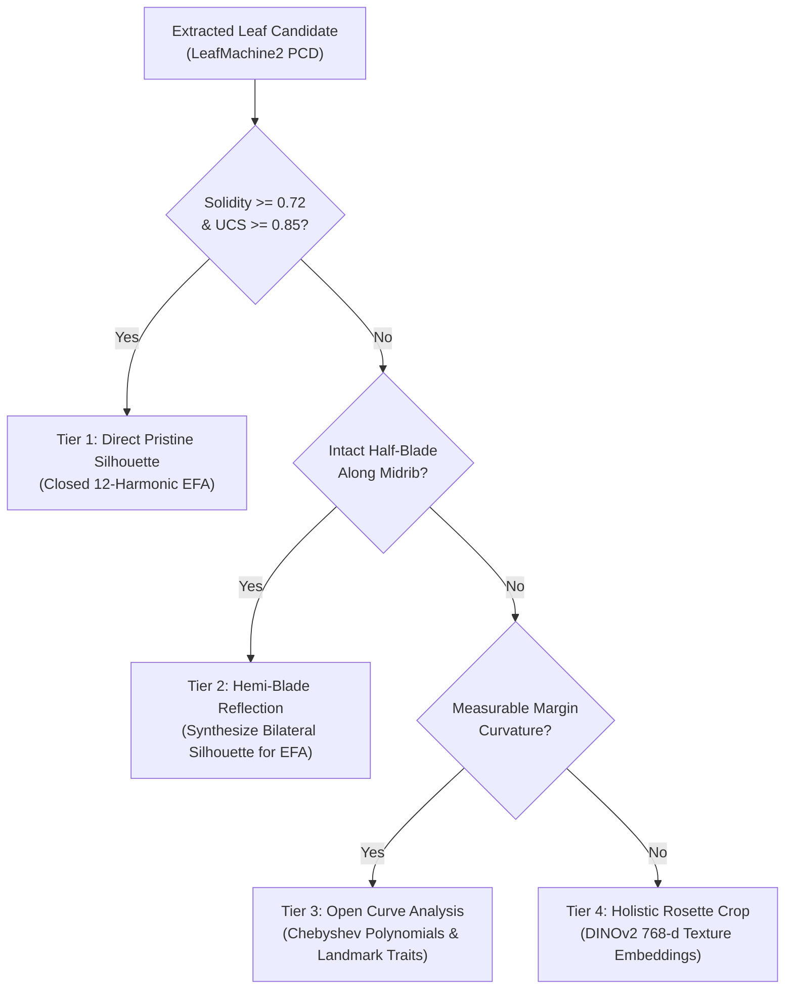

# Standard Operating Procedure (SOP)
## Robust Multimodal Morphometrics, Deep Vision, and Species Delimitation Pipeline for the *Packera dubia* Complex
**Protocol Identifier:** `UNC-BOT-SOP-2026-04-REV4`  
**Principal Investigator:** J. Brandon Fuller (PhD Candidate, Department of Biology, University of North Carolina at Chapel Hill)  
**Faculty Advisor:** Dr. Alan S. Weakley (Director, UNC Herbarium [NCU]; UNC Biology)  
**Target Taxa:** *Packera dubia* (Spreng.) Trock & Mabb. Complex (Asteraceae: Senecioneae) and allied lineages (*P. anonyma*, *P. plattensis*, *P. paupercula*)

---

## 1. Executive Summary & Purpose

This Standard Operating Procedure defines the end-to-end computational and statistical pipeline for the taxonomic revision of the ***Packera dubia* complex**.

The protocol integrates:
1. **Automated Organ Detection via LeafMachine2 (LM2)** (Weaver et al. 2024) with PointRend sub-pixel boundary refinement and automatic scale ruler isolation.
2. **Four-Tiered Basal Leaf Extraction & Bilateral Symmetry Reconstruction** to overcome overlapping foliar crowding.
3. **Six-Tiered Herbarium Misidentification Mitigation Architecture** to resolve label noise in digital aggregators (GBIF, iDigBio, SEINet).
4. **Label-Blind Morphometrics** via 12-harmonic Elliptic Fourier Analysis (`Momocs`) and Gaussian Mixture Modeling (`mclust`).
5. **Passive Sample Projection in Canonical Discriminant Analysis** (`MorphoTools2`) to prevent corrupt vouchers from biasing discriminant axes.
6. **Deep Vision Self-Supervised Embeddings & Confident Learning** (DINOv2-ViT-B/14 + `cleanlab` + `Captum` Grad-CAM).
7. **Macroecological Niche Modeling** incorporating SoilGrids 250m pedology, WorldClim v2.1 bioclimatics, and Moran's Eigenvector Maps (`spatialRF`).
8. **Multi-Evidence Taxonomic Decision Matrix & Digital Triage Queue** for targeted specialist re-determination.

---

## 2. Four-Tiered Basal Leaf Extraction Protocol

To resolve severe basal rosette overlap without discarding damaged vouchers, all candidate leaves from LeafMachine2 are routed through a 4-tiered geometric hierarchy:

1. **Tier 1 (Direct Pristine Extraction):** Intact basal leaves meeting Solidity $\ge 0.72$ and Unoccluded Completeness Score (UCS $\ge 0.85$) are segmented directly into closed binary masks for 12-harmonic EFA.
2. **Tier 2 (Hemi-Blade Bilateral Symmetry Reflection):** Partially occluded leaves with one pristine half-blade along the longitudinal midrib axis are isolated along the midrib line and reflected across the axis in OpenCV to construct a complete synthetic bilateral silhouette.
3. **Tier 3 (Open-Outline Analysis):** Heavily clustered rosettes where neither half-blade is complete are analyzed via open margin polynomials (`Momocs::opoly`) and scalar caliper measurements (petiole length, blade width, apex angle).
4. **Tier 4 (Dense-Rosette Deep Vision Embeddings):** Concurrently, the unsegmented, contextual basal rosette patch is processed directly by the DINOv2-ViT-B/14 vision transformer to extract 768-dimensional holistic phenotypic embeddings capturing tomentum density and foliar crowding.

---

## 3. Six-Tiered Herbarium Misidentification Mitigation Architecture

Botanical aggregator audits indicate that 20% to 40% of digital herbarium occurrence records suffer from misidentification, outdated nomenclature, or phenotypic confusion. The pipeline deploys six sequential mitigation tiers:

* **Tier 1 — Taxonomic Authority Stratification:**
  - **Tier 1 (Gold Standard Anchors):** Nomenclatural types or determinations signed by recognized *Packera* / Senecioneae monographers (T.M. Barkley, D.K. Trock, R.R. Kowal, A.S. Weakley, J.F. Bain, A.M. Mahoney, J.B. Fuller).
  - **Tier 2 (Silver Standard Institutional):** Curated vouchers from major research herbaria (NCU, GA, US, NY, BRIT, MO, WIS) with complete reproductive and vegetative structures.
  - **Tier 3 (Bronze Standard Candidates):** Unverified general floristic collections. Withheld from initial seed training.
* **Tier 2 — Label-Blind Unsupervised Phenotypic Discovery:**
  EFA harmonics and DINOv2 embeddings are modeled without prior labels. Gaussian Mixture Modeling (`mclust`) detects natural morphological clusters; label discordances against Tier 1 anchors are flagged automatically.
* **Tier 3 — Passive Sample Projection in CDA (`MorphoTools2`):**
  Unverified and candidate vouchers are designated as `passiveSamples` in `MorphoTools2::cda.calc()`. Canonical axes are computed strictly on verified Tier 1/2 anchors.
* **Tier 4 — Multi-Modal Cross-Modal Consensus Verification:**
  Triangulates morphology, circular phenological harmonics ($\sin / \cos \text{DOY}$), and pedological niche profiles (SoilGrids 250m: pH, CEC, sand fraction) to detect ecological anomalies.
* **Tier 5 — Confident Learning & Explainable AI (XAI):**
  Uses `cleanlab` to estimate the joint distribution matrix of noisy labels versus latent true classes, pruning label errors ($C_{\text{error}} > 0.85$). `Captum` Grad-CAM heatmaps confirm models focus on diagnostic botanical characters (arachnoid tomentum, marginal dentation) rather than mounting tape.
* **Tier 6 — Digital Triage Queue & Expert Re-Determination:**
  Discordant and high-entropy vouchers are exported to a prioritized triage queue (`data/tables/triage_queue.csv`) for specialist re-determination.

---

## 4. Multi-Evidence Taxonomic Decision Matrix

| Taxonomic Status | Morphometric Criterion (GMM / LDA) | Phenological Window | Edaphic / Pedological Niche (SoilGrids) | Warren's Niche Identity ($D$) | Actionable Taxonomic Outcome |
| :--- | :--- | :--- | :--- | :--- | :--- |
| **Distinct Species** | Distinct GMM cluster ($\Delta\text{BIC} > 10$); LDA accuracy $\ge 90\%$ | Significant non-overlapping flowering peak ($p < 0.01$) | Distinct geochemical adaptive zone ($p < 0.01$) | Rejection of Niche Identity ($D < D_{\text{null}}, p < 0.01$) | Formal species-level recognition / resurrection |
| **Subspecies / Variety** | Moderate LDA accuracy (75–89%); distinct Fourier outline mean | Overlapping flowering window across similar latitudes | Regional climatic differentiation with conserved edaphic preference | Moderate niche overlap ($D \approx 0.40 - 0.65$) | Varietal / subspecific circumscription (*P. dubia* var. *nov.*) |
| **Ecophenotypic Variant** | Continuous intergradation; single GMM component ($K=1$) | Continuous cline correlated with latitude/elevation | Generalist or continuous soil cline | Niche identity cannot be rejected ($p > 0.05$) | Synonymy under polymorphic *Packera dubia* |
| **Hybrid Swarm / Reticulation** | Passive samples plotting intermediately on Can1; high classification entropy ($H \ge 0.50$) | Broad, bimodal flowering window overlapping parental taxa | Restricted to ecotonal contact zones or disturbed boundaries | Intermediate overlapping envelope | Designation as nothospecies (*Packera* $\times$*hybrid*) |

---

## 5. Quality Assurance Checklist

- [x] **Determiner Tier Verification:** All Tier 1 vouchers verified against monographer patterns.
- [x] **Leaf Extraction Gatekeeping:** Single leaves pass Solidity $\ge 0.72$ and UCS $\ge 0.85$.
- [x] **DBSCAN Clustering:** Centroids partitioned into distinct `plant_individual_id` clusters.
- [x] **Ruler Calibration:** Scale factors verified for physical millimeter conversion ($0.0423 \pm 0.015\,\text{mm/px}$).
- [x] **Label Noise Threshold:** Confident Learning threshold set to $C_{\text{error}} \ge 0.85$.
- [x] **Multi-Evidence Consensus:** Triple-stream discordance logged to `data/tables/triage_queue.csv`.
