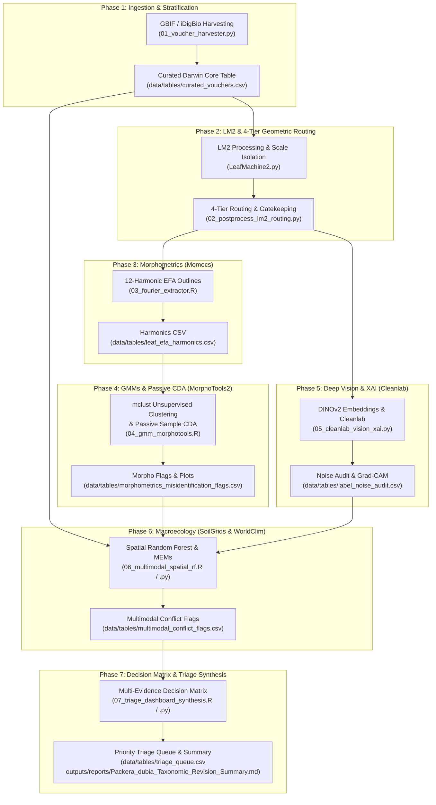

# Operational Workflow Guide: End-to-End Species Delimitation & Morphometrics Pipeline
### *Packera dubia* (Spreng.) Trock & Mabb. Complex (Asteraceae: Senecioneae)
**University of North Carolina at Chapel Hill Herbarium (NCU)**  
**Author:** J. Brandon Fuller (PhD Candidate, UNC-CH Department of Biology)  
**Advisor:** Dr. Alan S. Weakley (Director, NCU Herbarium)

---

## 📋 Table of Contents

1. [Environment & Setup](#1-environment--setup)
   - [A. Primary Python Pipeline Environment (`.venv`)](#a-primary-python-pipeline-environment-venv)
   - [B. LeafMachine2 Dedicated Virtual Environment (`.venv_LM2`)](#b-leafmachine2-dedicated-virtual-environment-venv_lm2)
   - [C. R Statistical Computing Environment](#c-r-statistical-computing-environment)
   - [D. Large File & Storage Architecture](#d-large-file--storage-architecture)
2. [Seven-Phase Pipeline Overview](#2-seven-phase-pipeline-overview)
3. [Phase 1: Voucher Ingestion & Authority Stratification](#phase-1-voucher-ingestion--authority-stratification)
4. [Phase 2: LeafMachine2 Organ Detection & Geometric Routing](#phase-2-leafmachine2-organ-detection--geometric-routing)
   - [2.0 Track A: SAM 2 Assisted Botanical Annotation & Model Fine-Tuning](#20-track-a-sam-2-assisted-botanical-annotation--model-fine-tuning)
   - [2.1 LM2 Configuration](#21-lm2-configuration)
   - [2.2 Execute LeafMachine2](#22-execute-leafmachine2)
   - [2.3 Post-Processing, DBSCAN Clustering & 4-Tier Routing](#23-post-processing-dbscan-clustering--4-tier-routing)
5. [Phase 3: Label-Blind Elliptic Fourier Analysis (EFA)](#phase-3-label-blind-elliptic-fourier-analysis-efa)
6. [Phase 4: GMM Clustering & MorphoTools2 Passive Sample CDA](#phase-4-gmm-clustering--morphotools2-passive-sample-cda)
7. [Phase 5: DINOv2 Deep Vision Embeddings & Cleanlab XAI](#phase-5-dinov2-deep-vision-embeddings--cleanlab-xai)
8. [Phase 6: Multi-Modal Spatial Random Forests & Niche Modeling](#phase-6-multi-modal-spatial-random-forests--niche-modeling)
9. [Phase 7: Multi-Evidence Synthesis & Digital Triage Queue](#phase-7-multi-evidence-synthesis--digital-triage-queue)
10. [Automated Test Suite Verification](#10-automated-test-suite-verification)
11. [Troubleshooting & Quality Control Checklist](#11-troubleshooting--quality-control-checklist)

---

## 1. Environment & Setup

The pipeline operates across two dedicated Python environments and an R statistical environment:

### A. Primary Python Pipeline Environment (`.venv`)
Used for voucher harvesting, post-processing, DINOv2 embeddings, Cleanlab XAI, and Python spatial/triage synthesis:
```bash
# Activate existing primary venv
source .venv/bin/activate

# Or install dependencies from requirements.txt
pip install -r requirements.txt
```

### B. LeafMachine2 Dedicated Virtual Environment (`.venv_LM2`)
LeafMachine2 requires specific PyTorch, Torchvision, and MMDetection dependencies. Use the provided installation script:
```bash
bash setup_leafmachine2.sh
```

> [!TIP]
> **Automated Multi-Environment Orchestration:**
> You do **not** need to manually switch or activate `.venv_LM2` in your shell when executing Phase 2. The unified runner `main.py` includes an automatic Python interpreter resolver (`get_lm2_python_executable()`) that checks for `.venv_LM2/bin/python` (Linux/macOS) or `.venv_LM2/Scripts/python.exe` (Windows). When invoking `python main.py segment` or `python main.py run-all` from your primary `.venv`, `main.py` automatically routes execution to the dedicated `.venv_LM2` interpreter, streams diagnostics to the console and logger, and catches non-zero exit codes to halt subsequent phases on failure.

### C. R Statistical Computing Environment
Requires R $\ge 4.3.0$ with `Momocs`, `MorphoTools2`, `mclust`, `spatialRF`, `terra`, and `tidyverse`:
```R
install.packages(c("Momocs", "mclust", "terra", "tidyverse", "sf", "ggplot2", "patchwork", "gridExtra", "optparse", "remotes"))
remotes::install_github(c("V-Z/MorphoTools2", "danlwarren/ENMTools", "blasbenito/spatialRF"))
```

### D. Large File & Storage Architecture

To maintain a lean, reproducible codebase and comply with Git repository storage best practices, bulky binary checkpoints and heavy raster/specimen data are excluded from version control via `.gitignore`:
- **Model Checkpoints (`models/*.pth`, `models/*.pt`, `models/*.bin`):** Deep learning weights (such as `lm2_packera_pcd_finetuned.pth`, ~425 MB) are excluded to prevent repository bloat. Checkpoints are automatically retrieved and integrity-verified on demand via [`scripts/core/artifact_manager.py`](file:///home/brandon/Packera_dubia_morphometrics/scripts/core/artifact_manager.py).
- **Raw Specimen Imagery (`data/raw_vouchers/*.jpg`):** The production dataset comprises 6,610 high-resolution voucher sheets (>25 GB). Specimen images are downloaded directly to local storage during Phase 1 (`python main.py harvest --download-images`).

#### Reproducing Dissertation Analyses: Downloading Rasters & Model Weights
Researchers reproducing the dissertation results without re-harvesting large image repositories or re-training detector models can retrieve all upstream assets from open scientific repositories:

1. **Fine-Tuned Model Weights:**
   Automatically acquired upon running `python main.py segment` or manually pre-cached via:
   ```bash
   python main.py download-weights
   ```
   Checkpoints are archived on GitHub Releases (`v1.0-weights`) and Zenodo (DOI: `10.5281/zenodo.xxxxxx`), with integrity validated via SHA256 hashing.

2. **Pre-Computed Environmental Rasters (`data/environmental/`):**
   Phase 6 (Macroecological Niche Modeling) utilizes 30-arcsecond WorldClim 2.1 bioclimatic rasters and SoilGrids 250m pedological layers (pH in H2O, CEC, sand/clay percentages). A pre-clipped GeoTIFF raster package covering the southeastern and midwestern United States study region is deposited on Zenodo:
   ```bash
   # Create target environmental directory
   mkdir -p data/environmental

   # Download and unpack the Zenodo environmental raster archive
   tar -xzvf packera_environmental_rasters.tar.gz -C data/environmental/
   ```

3. **Pre-Extracted Contour Coordinate Matrices:**
   To reproduce the morphological analyses (Phases 3–4) directly without running deep segmentation on raw sheets, standardized 2D contour coordinate matrices (`data/contours/`) and curated Darwin Core voucher tables (`data/tables/curated_vouchers.csv`) can be unpacked directly from Zenodo.

#### Academic Data Availability Statement
For dissertation methods sections and peer-reviewed publication reproduction:
> *"Model weights, extracted 2D contour coordinate matrices, and environmental rasters are persistently deposited on Zenodo under DOI: 10.5281/zenodo.xxxxxx."*

---

## 2. Seven-Phase Pipeline Overview



---

## Phase 1: Voucher Ingestion & Authority Stratification

- **Script:** [`scripts/data_prep/01_voucher_harvester.py`](file:///home/brandon/Packera_dubia_morphometrics/scripts/data_prep/01_voucher_harvester.py)
- **Environment:** `.venv`
- **Purpose:** Harvests digital occurrences from GBIF/iDigBio, enforces geographic bounding filters (excluding states west of Texas/Oklahoma), calculates circular flowering phenology ($\sin / \cos \text{DOY}$), scores Determiner Authority into Tiers 1–3, and downloads high-resolution specimen images.

```bash
source .venv/bin/activate
python scripts/data_prep/01_voucher_harvester.py \
    --taxa "Packera dubia" "Packera tomentosa" "Senecio tomentosus" "Packera anonyma" "Packera plattensis" "Packera paupercula" \
    --max-uncertainty 5000 \
    --max-records-per-taxon 5000 \
    --exclude-western \
    --download-images \
    --concurrency 15 \
    --output-csv data/tables/curated_vouchers.csv \
    --log-file outputs/reports/voucher_ingestion_summary.log
```

**Key Outputs:**
- `data/raw_vouchers/*.jpg`: High-resolution herbarium sheet imagery (6,610 vouchers).
- `data/tables/curated_vouchers.csv`: Darwin Core metadata with `determiner_tier` and `phenology_radians`.

---

## Phase 2: LeafMachine2 Organ Detection & Geometric Routing

> [!NOTE]
> Physical image staging via `prepare_lm2_dataset.py` has been archived to `scripts/_archive/data_prep/prepare_lm2_dataset.py`. The modern pipeline script [`scripts/pipeline/02_segment_and_extract.py`](file:///home/brandon/Packera_dubia_morphometrics/scripts/pipeline/02_segment_and_extract.py) reads directly from `data/raw_vouchers/` via paths defined in `data/tables/curated_vouchers.csv`, eliminating redundant symlink copying and disk overhead.

### 2.0 Track A: SAM 2 Assisted Botanical Annotation & Model Fine-Tuning
- **Script:** [`scripts/annotation_and_training/annotate_with_sam2.py`](file:///home/brandon/Packera_dubia_morphometrics/scripts/annotation_and_training/annotate_with_sam2.py)
- **Environment:** `.venv` (with CUDA and Segment Anything 2 installed)
- **Reference Manual:** [`docs/SAM2_Precision_Botanical_Annotation_Guide.txt`](file:///home/brandon/Packera_dubia_morphometrics/docs/SAM2_Precision_Botanical_Annotation_Guide.txt)
- **Purpose:** Produces millimeter-accurate instance segmentation masks of basal leaf blades, petioles, cauline organs, and roots across dried herbarium specimens. Uses SAM 2 Hiera Large with cursor-centered viewport navigation, multimask proposal cycling (`Tab`), boundary contour inspection (`o`), hold-to-peek bare pixels (`v`), two-click knife slicing (`k`), and morphological margin tuning (`+`/`-`).

```bash
# Launch interactive SAM 2 botanical annotator GUI
source .venv/bin/activate
python scripts/annotation_and_training/annotate_with_sam2.py \
    --images-dir data/raw_vouchers \
    --output-dir data/raw_annotations \
    --output-coco data/annotations/packera_train_coco.json

# (Optional) Recompile standardized COCO JSON from masks in headless mode:
python scripts/annotation_and_training/annotate_with_sam2.py \
    --export-coco \
    --masks-dir data/raw_annotations/masks \
    --images-dir data/raw_vouchers \
    --output-coco data/annotations/packera_train_coco.json \
    --val-split 0.15
```

#### Command-Line Arguments:
| Argument | Type | Default | Description |
| :--- | :--- | :--- | :--- |
| `--images-dir` | Path | `data/raw_vouchers` | Directory of high-resolution voucher scans. |
| `--output-dir` | Path | `data/raw_annotations` | Target directory for polygon text files and PNG masks. |
| `--output-coco` | Path | `data/annotations/packera_train_coco.json` | Incremental/compiled standardized COCO JSON output. |
| `--single-image` | Path | `None` | Target a single voucher image file for focused editing. |
| `--checkpoint` | Path | `models/checkpoints/sam2_hiera_large.pt` | SAM 2 model weights checkpoint. |
| `--config` | String | `sam2_hiera_l.yaml` | Model configuration YAML file. |
| `--export-coco` | Flag | `False` | Compile COCO annotations directly from existing mask directory without GUI. |
| `--masks-dir` | Path | `data/raw_annotations/masks` | Source masks folder for `--export-coco`. |
| `--val-split` | Float | `0.0` | Validation partition fraction for train/val COCO split. |

#### Hotkey Reference & Control Matrix:
| Category | Control / Key | Action & Botanical Context |
| :--- | :--- | :--- |
| **Navigation** | **Mouse Wheel** | Smooth cursor-centered zoom in / out ($1.0\times$ to $16.0\times$). |
| | **Middle-Click Drag** | Pan viewport across high-resolution voucher sheet. |
| | **`Space` + Left-Drag** | Alternative viewport pan. |
| | **`f`** | Fit full herbarium voucher to window ($1.0\times$). |
| **Segmentation** | **Left-Click** | Place positive prompt point (green marker). |
| | **Right-Click** | Place negative exclusion point (red marker). |
| | **Shift + Left-Drag** | Bounding box prompt constraint. |
| | **`Tab`** | Cycle 3 SAM 2 candidate granularities (sub-lobe vs. blade vs. clump). |
| | **`k`** | Two-click knife tool to sever petiole bases from caudex tissue. |
| | **`+` / `-`** | 1-pixel binary dilation / erosion for tomentum margin tuning. |
| | **`p`** | Toggle polygon lasso mode (Left-Click points, Enter to finalize). |
| **Inspection** | **`o`** | Toggle mask fill vs. 1-px boundary contour line (inspect crenations). |
| | **Hold `v`** | Hold-to-peek: Temporarily hide overlays to view bare pixels. |
| | **`[` / `]`** | Adjust mask overlay alpha transparency ($0.10$ to $0.90$). |
| **Commit & Session**| **`0`–`6`** | Instant botanical class commit (`0`: blade, `1`: petiole, `2`: cauline leaf, `3`: cauline stem, `4`: root, `5`: rosette clump, `6`: capitulum). |
| | **`u`** | Undo last committed instance on current sheet. |
| | **`c`** | Clear active candidate prompts and bounding box. |
| | **`n` / `b`** | Save and advance to Next (`n`) or return to Previous (`b`) voucher sheet. |
| | **`Enter`** | Finalize polygon lasso OR save sheet annotations and advance. |
| | **`q` / `Esc`** | Save current sheet annotations and quit safely. |

#### Downstream Fine-Tuning:
Once 50–100 vouchers are annotated, fine-tune LeafMachine2's PointRend Plant Component Detector (PCD):
```bash
python scripts/annotation_and_training/finetune_lm2_pcd.py \
    --coco-annotations data/annotations/packera_train_coco.json \
    --epochs 30 \
    --output-weights models/lm2_packera_pcd_finetuned.pth
```

---

### 2.1 LM2 Configuration
- **Script:** [`scripts/vision/configure_leafmachine2.py`](file:///home/brandon/Packera_dubia_morphometrics/scripts/vision/configure_leafmachine2.py)
- **Environment:** `.venv`

```bash
# Generate high-performance LM2 configuration (Batch 50, 8 CUDA workers)
python scripts/vision/configure_leafmachine2.py --update-main-config
```

### 2.2 Execute LeafMachine2
- **Unified Pipeline Runner:** `python main.py segment` (automatically resolves `.venv_LM2` and executes segmentation)
- **Script (Direct):** [`scripts/pipeline/02_segment_and_extract.py`](file:///home/brandon/Packera_dubia_morphometrics/scripts/pipeline/02_segment_and_extract.py) / [`LeafMachine2/LeafMachine2.py`](file:///home/brandon/Packera_dubia_morphometrics/LeafMachine2/LeafMachine2.py)
- **Environment:** Automatically resolved to `.venv_LM2` by `main.py`

```bash
# Recommended: Orchestrated directly from primary .venv
python main.py segment --weights models/lm2_packera_pcd_finetuned.pth

# Manual fallback (standalone):
source .venv_LM2/bin/activate
cd LeafMachine2
python LeafMachine2.py
cd ..
```


### 2.3 Post-Processing, DBSCAN Clustering & 4-Tier Routing
- **Script:** [`scripts/vision/02_postprocess_lm2_routing.py`](file:///home/brandon/Packera_dubia_morphometrics/scripts/vision/02_postprocess_lm2_routing.py)
- **Environment:** `.venv`

```bash
source .venv/bin/activate
python scripts/vision/02_postprocess_lm2_routing.py \
    --lm2-dir LM2_Project/Data/output/Packera_dubia_LM2/ \
    --vouchers data/tables/curated_vouchers.csv \
    --raw-images data/raw_vouchers/ \
    --output-dir data/ \
    --min-solidity 0.72 \
    --min-ucs 0.85
```

**Key Outputs:**
- `data/cropped_patches/rosettes_dense/`: Whole-rosette contextual crops for DINOv2.
- `data/tables/leaf_extraction_qc.csv`: Morphological routing log for all extracted leaves.

---

## Phase 3: Label-Blind Elliptic Fourier Analysis (EFA)

- **Script:** [`scripts/morphometrics/03_fourier_extractor.R`](file:///home/brandon/Packera_dubia_morphometrics/scripts/morphometrics/03_fourier_extractor.R)
- **Environment:** R 4.3+
- **Purpose:** Extracts closed contour coordinates from LM2 leaf masks, fits 12 harmonics of Elliptic Fourier Analysis via `Momocs`, normalizes for translation/rotation/scale, and exports harmonic coefficients ($A_n, B_n, C_n, D_n$).

```bash
Rscript scripts/morphometrics/03_fourier_extractor.R \
    --input LM2_Project/Data/output/Packera_dubia_LM2/ \
    --harmonics 12 \
    --output data/tables/leaf_efa_harmonics.csv
```

**Key Outputs:**
- `data/tables/leaf_efa_harmonics.csv`: 44 standardized harmonic coefficients per leaf outline.

---

## Phase 4: GMM Clustering & MorphoTools2 Passive Sample CDA

- **Script:** [`scripts/morphometrics/04_gmm_morphotools.R`](file:///home/brandon/Packera_dubia_morphometrics/scripts/morphometrics/04_gmm_morphotools.R)
- **Environment:** R 4.3+
- **Purpose:** Models unsupervised clusters using Gaussian Mixture Models (`mclust`), computes Bayes Factors ($\Delta \text{BIC}$) to test for natural discontinuities, and projects unverified Tier 3 specimens passively into Canonical Discriminant Analysis space via `MorphoTools2`.

```bash
Rscript scripts/morphometrics/04_gmm_morphotools.R \
    --metadata data/tables/curated_vouchers.csv \
    --harmonics data/tables/leaf_efa_harmonics.csv \
    --output-flags data/tables/morphometrics_misidentification_flags.csv \
    --output-plot outputs/figures/cda_passive_projection.pdf \
    --output-summary outputs/reports/gmm_bayes_factors_summary.csv
```

**Key Outputs:**
- `data/tables/morphometrics_misidentification_flags.csv`: CDA predicted taxa, posterior probabilities, and discordance flags.
- `outputs/figures/cda_passive_projection.pdf` / `.png`: Publication-grade CDA biplot.
- `outputs/reports/gmm_bayes_factors_summary.csv`: Model selection table across $K=1 \dots 6$ components.

---

## Phase 5: DINOv2 Deep Vision Embeddings & Cleanlab XAI

- **Script:** [`scripts/analysis/05_cleanlab_vision_xai.py`](file:///home/brandon/Packera_dubia_morphometrics/scripts/analysis/05_cleanlab_vision_xai.py)
- **Environment:** `.venv`
- **Purpose:** Extracts self-supervised 768-dimensional visual feature vectors via DINOv2-ViT-B/14 from dense rosette crops, computes joint noise matrices via `cleanlab.filter.find_label_issues()`, and generates Grad-CAM saliency heatmaps.

```bash
source .venv/bin/activate
python scripts/analysis/05_cleanlab_vision_xai.py \
    --rosette-dir data/cropped_patches/rosettes_dense \
    --vouchers-csv data/tables/curated_vouchers.csv \
    --output-csv data/tables/label_noise_audit.csv \
    --output-figure outputs/figures/GradCAM_audit_panel.png \
    --cleanlab-threshold 0.85 \
    --backbone dinov2_vitb14 \
    --batch-size 32 \
    --n-splits 5
```

**Key Outputs:**
- `data/tables/label_noise_audit.csv`: Cleanlab label error probabilities ($C_{\text{error}}$) and predicted labels.
- `outputs/figures/GradCAM_audit_panel.png`: 4-column visual explanation panel displaying original rosettes, DINOv2 attention maps, and Grad-CAM heatmaps.

---

## Phase 6: Multi-Modal Spatial Random Forests & Niche Modeling

Available in both **R** (via `spatialRF` / `terra`) and **Python** (via `scipy` / `scikit-learn`):

### R Execution:
```bash
Rscript scripts/analysis/06_multimodal_spatial_rf.R \
    --vouchers data/tables/curated_vouchers.csv \
    --morphometrics data/tables/morphometrics_misidentification_flags.csv \
    --vision-audit data/tables/label_noise_audit.csv \
    --env-dir data/environmental/ \
    --output-flags data/tables/multimodal_conflict_flags.csv \
    --output-plot outputs/figures/spatial_rf_niche_importance.pdf \
    --output-summary outputs/reports/multimodal_spatial_rf_summary.csv
```

### Python Execution:
```bash
source .venv/bin/activate
python scripts/analysis/06_multimodal_spatial_rf.py \
    --vouchers data/tables/curated_vouchers.csv \
    --morphometrics data/tables/morphometrics_misidentification_flags.csv \
    --vision-audit data/tables/label_noise_audit.csv \
    --env-dir data/environmental/ \
    --output-flags data/tables/multimodal_conflict_flags.csv \
    --output-plot outputs/figures/spatial_rf_niche_importance.pdf \
    --output-summary outputs/reports/multimodal_spatial_rf_summary.csv
```

**Key Outputs:**
- `data/tables/multimodal_conflict_flags.csv`: Cross-modal consensus classifications.
- `outputs/figures/spatial_rf_niche_importance.pdf` / `.png`: Variable importance and Moran's Eigenvector Maps.
- `outputs/reports/multimodal_spatial_rf_summary.csv`: Warren's Niche Identity test statistics ($D$).

---

## Phase 7: Multi-Evidence Synthesis & Digital Triage Queue

- **Scripts:** [`scripts/analysis/07_triage_dashboard_synthesis.R`](file:///home/brandon/Packera_dubia_morphometrics/scripts/analysis/07_triage_dashboard_synthesis.R) / [`07_triage_dashboard_synthesis.py`](file:///home/brandon/Packera_dubia_morphometrics/scripts/analysis/07_triage_dashboard_synthesis.py)
- **Purpose:** Synthesizes morphology, vision, pedology, phenology, and geographic evidence streams through the Multi-Evidence Taxonomic Decision Matrix, generates a ranked herbarium triage queue, and produces publication synthesis plates and taxonomic revision reports.

### R Execution:
```bash
Rscript scripts/analysis/07_triage_dashboard_synthesis.R \
    --vouchers data/tables/curated_vouchers.csv \
    --morphometrics data/tables/morphometrics_misidentification_flags.csv \
    --vision-audit data/tables/label_noise_audit.csv \
    --multimodal-flags data/tables/multimodal_conflict_flags.csv \
    --gmm-summary outputs/reports/gmm_bayes_factors_summary.csv \
    --niche-summary outputs/reports/multimodal_spatial_rf_summary.csv \
    --output-queue data/tables/triage_queue.csv \
    --output-plot outputs/figures/Figure_Integrative_Packera_dubia_Revision.pdf \
    --output-report outputs/reports/Packera_dubia_Taxonomic_Revision_Summary.md
```

### Python Execution:
```bash
source .venv/bin/activate
python scripts/analysis/07_triage_dashboard_synthesis.py \
    --vouchers data/tables/curated_vouchers.csv \
    --morphometrics data/tables/morphometrics_misidentification_flags.csv \
    --vision-audit data/tables/label_noise_audit.csv \
    --multimodal-flags data/tables/multimodal_conflict_flags.csv \
    --gmm-summary outputs/reports/gmm_bayes_factors_summary.csv \
    --niche-summary outputs/reports/multimodal_spatial_rf_summary.csv \
    --output-queue data/tables/triage_queue.csv \
    --output-plot outputs/figures/Figure_Integrative_Packera_dubia_Revision.pdf \
    --output-report outputs/reports/Packera_dubia_Taxonomic_Revision_Summary.md
```

**Key Outputs:**
- `data/tables/triage_queue.csv`: Ranked digital triage queue with priority scores and recommended determinations.
- `outputs/figures/Figure_Integrative_Packera_dubia_Revision.pdf` / `.png`: Comprehensive 6-panel synthesis plate.
- `outputs/reports/Packera_dubia_Taxonomic_Revision_Summary.md`: Formal taxonomic treatment and dichotomous key.

---

## 10. Automated Test Suite Verification

Run the full automated test suite across all 6 test modules:
```bash
source .venv/bin/activate
python -m unittest discover -s scripts/tests
```

**Test Modules:**
1. `test_voucher_harvester.py`: Verifies GBIF querying, Darwin Core parsing, and Western US state exclusion.
2. `test_postprocess_lm2_routing.py`: Verifies DBSCAN spatial clustering and geometric gatekeeper metrics.
3. `test_gmm_morphotools.py`: Verifies EFA harmonics extraction, GMM clustering, and MorphoTools2 CDA.
4. `test_cleanlab_vision_xai.py`: Verifies DINOv2 feature extraction, Cleanlab noise auditing, and Grad-CAM generation.
5. `test_multimodal_spatial_rf.py`: Verifies SoilGrids/WorldClim feature extraction and cross-modal consensus flags.
6. `test_triage_dashboard_synthesis.py`: Verifies the taxonomic decision matrix and triage queue generator.

---

## 11. Troubleshooting & Quality Control Checklist

| Symptom | Cause | Resolution |
|:---|:---|:---|
| `ModuleNotFoundError: No module named 'pandas'` | Inactive virtual environment | Activate `.venv`: `source .venv/bin/activate` |
| `CUDA out of memory` during LM2 | Batch size too high for GPU VRAM | Run `configure_leafmachine2.py --batch-size 25` |
| Low leaf segmentation quality | Heavy foliar overlap or decayed sheet | Verify that 4-tier routing sent leaves to Tier 2 (reflected) or Tier 4 (rosette embeddings) |
| Missing edaphic values for specimens | Coordinate situated offshore or in water body | Pipeline automatically imputes nearest regional mean from SoilGrids 250m |
| Inconsistent species synonymy | Historical basionym in aggregator record | All scripts use centralized standardizer `standardize_packera_taxon()` |
